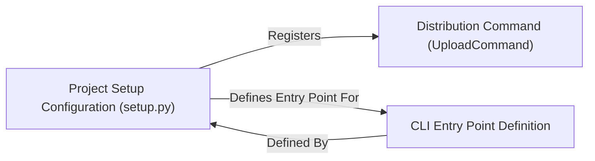

## Details

The `nsfw_model` project's distribution and command-line interface are centrally managed by the `Project Setup Configuration (setup.py)`. This configuration file acts as the primary orchestrator, responsible for registering the `Distribution Command (UploadCommand)`, which automates the release process by handling build artifacts, package generation, and PyPI uploads. Concurrently, `setup.py` also defines and registers the `CLI Entry Point Definition`, ensuring that the `nsfw_detector` command is correctly linked to the core prediction functionality, making the toolkit readily accessible via the command line. This setup establishes `setup.py` as the foundational component that configures and enables both the project's distribution pipeline and its user-facing command-line interface.

### Project Setup Configuration (setup.py)
This component represents the foundational configuration for the `nsfw_model` project's packaging and distribution. It defines essential project metadata (e.g., name, version, author), specifies external dependencies, outlines the package structure, and registers custom `setuptools` commands and console script entry points. It serves as the central blueprint for how the ML toolkit is built and prepared for distribution.

**Related Classes/Methods**: _None_

### Distribution Command (UploadCommand)
A custom `setuptools` command, `UploadCommand`, is responsible for automating the critical steps of the release pipeline. Its responsibilities include cleaning previous build artifacts, generating source and wheel distributions, securely uploading these packages to PyPI using `twine`, and managing Git tags to mark specific release versions.

**Related Classes/Methods**: _None_

### CLI Entry Point Definition
This component specifically handles the definition and registration of the command-line interface (CLI) entry points within the `setup.py` configuration. It ensures that the `nsfw_detector` command is correctly linked to the `nsfw_detector.predict:main` function, making the toolkit's prediction functionality accessible and runnable from the command line after installation.

**Related Classes/Methods**: _None_

### [FAQ](https://github.com/CodeBoarding/GeneratedOnBoardings/tree/main?tab=readme-ov-file#faq)