```mermaid
graph LR
    Model_Training_Pipeline["Model Training Pipeline"]
    General_Inference_Engine["General Inference Engine"]
    TF1_Inference_Adapter["TF1 Inference Adapter"]
    Project_Setup_Distribution["Project Setup & Distribution"]
    External_User_Application["External User/Application"]
    Model_Training_Pipeline -- "Deploys Model Assets" --> General_Inference_Engine
    Model_Training_Pipeline -- "Deploys TF1 Model Assets" --> TF1_Inference_Adapter
    External_User_Application -- "Requests Classification" --> General_Inference_Engine
    General_Inference_Engine -- "Returns Classification" --> External_User_Application
    External_User_Application -- "Requests TF1 Classification" --> TF1_Inference_Adapter
    TF1_Inference_Adapter -- "Returns TF1 Classification" --> External_User_Application
    Project_Setup_Distribution -- "Packages & Releases" --> Model_Training_Pipeline
    Project_Setup_Distribution -- "Packages & Releases" --> General_Inference_Engine
    Project_Setup_Distribution -- "Packages & Releases" --> TF1_Inference_Adapter
    click Model_Training_Pipeline href "https://github.com/CodeBoarding/GeneratedOnBoardings/blob/main/nsfw_model/Model_Training_Pipeline.md" "Details"
    click Project_Setup_Distribution href "https://github.com/CodeBoarding/GeneratedOnBoardings/blob/main/nsfw_model/Project_Setup_Distribution.md" "Details"
```

## Details

The `nsfw_model` project is structured around a core machine learning pipeline for NSFW image classification. It comprises a `Model Training Pipeline` responsible for data preparation, model training, and evaluation, culminating in the deployment of trained models. These models are then consumed by two distinct inference engines: the `General Inference Engine` for modern TensorFlow 2.x environments and the `TF1 Inference Adapter` for backward compatibility with TensorFlow 1.x Keras. An `External User/Application` interacts with these inference engines to obtain classification results. The entire system's packaging, release, and deployment are managed by the `Project Setup & Distribution` component, ensuring the toolkit's availability and version control.

### Model Training Pipeline [[Expand]](./Model_Training_Pipeline.md)
Orchestrates the end-to-end process of training the NSFW classification model, including data preparation, model construction, training execution, evaluation, and exporting trained models.

**Related Classes/Methods**:

- <a href="https://github.com/GantMan/nsfw_model/blob/master/training/make_nsfw_model.py#L237-L306" target="_blank" rel="noopener noreferrer">`training.make_nsfw_model.main`:237-306</a>

### General Inference Engine
Provides the primary interface for performing NSFW image classification using models trained and exported in TensorFlow 2.x compatible formats.

**Related Classes/Methods**:

- <a href="https://github.com/GantMan/nsfw_model/blob/master/nsfw_detector/predict.py#L91-L116" target="_blank" rel="noopener noreferrer">`nsfw_detector.predict.main`:91-116</a>

### TF1 Inference Adapter
A specialized component for NSFW image classification within legacy TensorFlow 1.x Keras environments, ensuring backward compatibility.

**Related Classes/Methods**:

- <a href="https://github.com/GantMan/nsfw_model/blob/master/tf1/nsfw_detector/keras_predict.py#L46-L83" target="_blank" rel="noopener noreferrer">`tf1.nsfw_detector.keras_predict.predict`:46-83</a>

### Project Setup & Distribution [[Expand]](./Project_Setup_Distribution.md)
Manages the packaging, release, and deployment aspects of the entire ML toolkit, including building distributions and managing version control.

**Related Classes/Methods**:

- <a href="https://github.com/GantMan/nsfw_model/blob/master/setup.py" target="_blank" rel="noopener noreferrer">`setup.UploadCommand.run`</a>

### External User/Application
Represents any external system, developer, or end-user application that interacts with the deployed NSFW classification models to initiate requests and consume prediction results.

**Related Classes/Methods**:

- <a href="https://github.com/GantMan/nsfw_model/blob/master/nsfw_detector/predict.py#L91-L116" target="_blank" rel="noopener noreferrer">`nsfw_detector.predict.main`:91-116</a>
- <a href="https://github.com/GantMan/nsfw_model/blob/master/tf1/nsfw_detector/keras_predict.py#L46-L83" target="_blank" rel="noopener noreferrer">`tf1.nsfw_detector.keras_predict.predict`:46-83</a>

### [FAQ](https://github.com/CodeBoarding/GeneratedOnBoardings/tree/main?tab=readme-ov-file#faq)