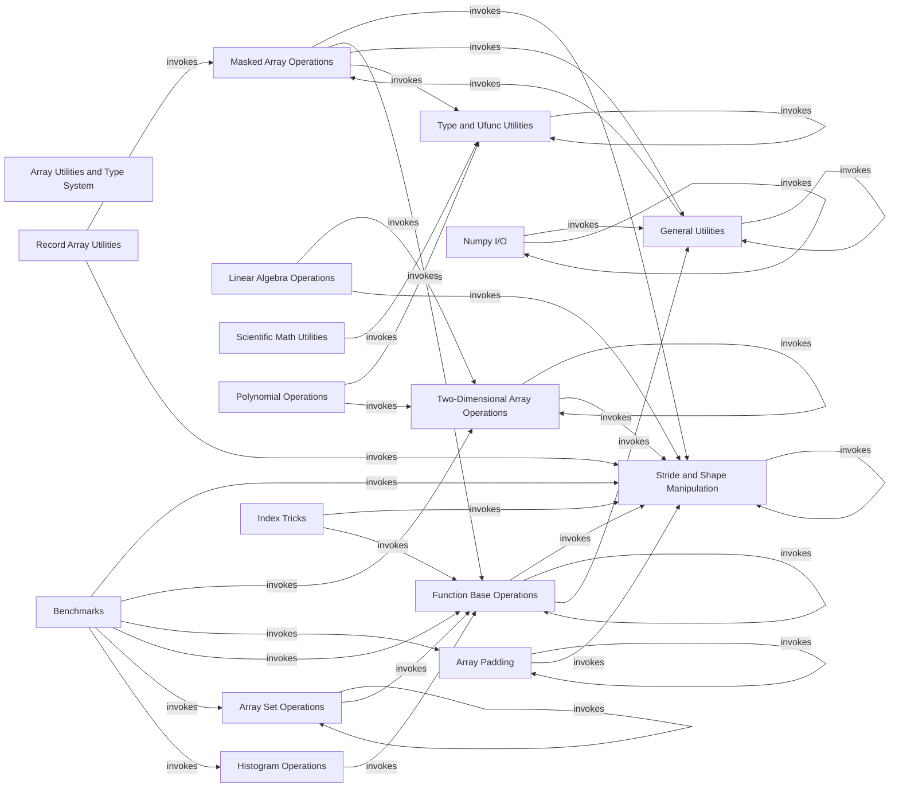

## Component Details

This overview details the structure and interactions of various NumPy components, focusing on array utilities, type handling, mathematical operations, I/O, and performance benchmarks. The core purpose is to illustrate how different modules within NumPy collaborate to provide a comprehensive array manipulation and numerical computing environment.

### Array Utilities and Type System
This component provides essential utilities for inspecting and manipulating array types, handling non-finite numbers (NaN, Inf), and performing advanced memory-efficient array views through stride manipulation and broadcasting.

**Related Classes/Methods**:

- `numpy.numpy.lib._type_check_impl` (full file reference)
- `numpy.numpy.lib._stride_tricks_impl` (full file reference)
- `numpy.numpy.lib._nanfunctions_impl` (full file reference)

### Masked Array Operations
Handles operations specific to masked arrays, including statistical functions like average and median, and core masked array functionalities.

**Related Classes/Methods**:

- <a href="https://github.com/numpy/numpy/blob/master/numpy/ma/extras.py#L568-L733" target="_blank" rel="noopener noreferrer">`numpy.numpy.ma.extras:average` (568:733)</a>
- <a href="https://github.com/numpy/numpy/blob/master/numpy/ma/extras.py#L736-L811" target="_blank" rel="noopener noreferrer">`numpy.numpy.ma.extras:median` (736:811)</a>
- <a href="https://github.com/numpy/numpy/blob/master/numpy/ma/extras.py#L814-L896" target="_blank" rel="noopener noreferrer">`numpy.numpy.ma.extras:_median` (814:896)</a>
- <a href="https://github.com/numpy/numpy/blob/master/numpy/ma/core.py#L5480-L5553" target="_blank" rel="noopener noreferrer">`numpy.numpy.ma.core.MaskedArray:var` (5480:5553)</a>
- <a href="https://github.com/numpy/numpy/blob/master/numpy/ma/core.py#L1474-L1525" target="_blank" rel="noopener noreferrer">`numpy.ma.core.getmaskarray` (1474:1525)</a>
- <a href="https://github.com/numpy/numpy/blob/master/numpy/ma/core.py#L6686-L6735" target="_blank" rel="noopener noreferrer">`numpy.ma.core.isMaskedArray` (6686:6735)</a>

### Linear Algebra Operations
Provides core linear algebra routines such as QR decomposition, Singular Value Decomposition (SVD), and matrix power.

**Related Classes/Methods**:

- <a href="https://github.com/numpy/numpy/blob/master/numpy/linalg/_linalg.py#L987-L1186" target="_blank" rel="noopener noreferrer">`numpy.numpy.linalg._linalg:qr` (987:1186)</a>
- <a href="https://github.com/numpy/numpy/blob/master/numpy/linalg/_linalg.py#L1690-L1874" target="_blank" rel="noopener noreferrer">`numpy.numpy.linalg._linalg:svd` (1690:1874)</a>
- <a href="https://github.com/numpy/numpy/blob/master/numpy/linalg/_linalg.py#L678-L790" target="_blank" rel="noopener noreferrer">`numpy.numpy.linalg._linalg:matrix_power` (678:790)</a>

### Type and Ufunc Utilities
Contains functions for checking array types (real, complex), converting types, handling NaNs, and dispatching ufunc-like operations.

**Related Classes/Methods**:

- <a href="https://github.com/numpy/numpy/blob/master/numpy/lib/_type_check_impl.py#L214-L267" target="_blank" rel="noopener noreferrer">`numpy.numpy.lib._type_check_impl:isreal` (214:267)</a>
- <a href="https://github.com/numpy/numpy/blob/master/numpy/lib/_type_check_impl.py#L313-L359" target="_blank" rel="noopener noreferrer">`numpy.numpy.lib._type_check_impl:isrealobj` (313:359)</a>
- <a href="https://github.com/numpy/numpy/blob/master/numpy/lib/_type_check_impl.py#L374-L481" target="_blank" rel="noopener noreferrer">`numpy.numpy.lib._type_check_impl:nan_to_num` (374:481)</a>
- <a href="https://github.com/numpy/numpy/blob/master/numpy/lib/_type_check_impl.py#L490-L545" target="_blank" rel="noopener noreferrer">`numpy.numpy.lib._type_check_impl:real_if_close` (490:545)</a>
- <a href="https://github.com/numpy/numpy/blob/master/numpy/lib/_type_check_impl.py#L647-L699" target="_blank" rel="noopener noreferrer">`numpy.numpy.lib._type_check_impl:common_type` (647:699)</a>
- <a href="https://github.com/numpy/numpy/blob/master/numpy/lib/_type_check_impl.py#L132-L168" target="_blank" rel="noopener noreferrer">`numpy.numpy.lib._type_check_impl.imag` (132:168)</a>
- <a href="https://github.com/numpy/numpy/blob/master/numpy/lib/_type_check_impl.py#L271-L309" target="_blank" rel="noopener noreferrer">`numpy.numpy.lib._type_check_impl.iscomplexobj` (271:309)</a>
- <a href="https://github.com/numpy/numpy/blob/master/numpy/lib/_type_check_impl.py#L363-L366" target="_blank" rel="noopener noreferrer">`numpy.numpy.lib._type_check_impl._getmaxmin` (363:366)</a>
- <a href="https://github.com/numpy/numpy/blob/master/numpy/lib/_type_check_impl.py#L176-L210" target="_blank" rel="noopener noreferrer">`numpy.numpy.lib._type_check_impl.iscomplex` (176:210)</a>
- <a href="https://github.com/numpy/numpy/blob/master/numpy/lib/_type_check_impl.py#L85-L124" target="_blank" rel="noopener noreferrer">`numpy.numpy.lib._type_check_impl.real` (85:124)</a>
- <a href="https://github.com/numpy/numpy/blob/master/numpy/lib/_type_check_impl.py#L26-L77" target="_blank" rel="noopener noreferrer">`numpy.numpy.lib._type_check_impl.mintypecode` (26:77)</a>
- <a href="https://github.com/numpy/numpy/blob/master/numpy/_core/getlimits.py#L386-L637" target="_blank" rel="noopener noreferrer">`numpy._core.getlimits.finfo` (386:637)</a>
- <a href="https://github.com/numpy/numpy/blob/master/numpy/_core/overrides.py#L107-L172" target="_blank" rel="noopener noreferrer">`numpy._core.overrides.array_function_dispatch` (107:172)</a>

### Record Array Utilities
Provides utilities for working with record arrays, such as merging and converting between structured and unstructured arrays.

**Related Classes/Methods**:

- <a href="https://github.com/numpy/numpy/blob/master/numpy/lib/recfunctions.py#L364-L497" target="_blank" rel="noopener noreferrer">`numpy.numpy.lib.recfunctions:merge_arrays` (364:497)</a>
- <a href="https://github.com/numpy/numpy/blob/master/numpy/lib/recfunctions.py#L940-L1067" target="_blank" rel="noopener noreferrer">`numpy.numpy.lib.recfunctions:structured_to_unstructured` (940:1067)</a>
- <a href="https://github.com/numpy/numpy/blob/master/numpy/lib/recfunctions.py#L890-L932" target="_blank" rel="noopener noreferrer">`numpy.numpy.lib.recfunctions._common_stride` (890:932)</a>

### Scientific Math Utilities
Implements mathematical functions with specific handling for real and complex numbers, often used in scientific computing.

**Related Classes/Methods**:

- <a href="https://github.com/numpy/numpy/blob/master/numpy/lib/_scimath_impl.py#L96-L122" target="_blank" rel="noopener noreferrer">`numpy.numpy.lib._scimath_impl:_fix_real_lt_zero` (96:122)</a>
- <a href="https://github.com/numpy/numpy/blob/master/numpy/lib/_scimath_impl.py#L153-L178" target="_blank" rel="noopener noreferrer">`numpy.numpy.lib._scimath_impl:_fix_real_abs_gt_1` (153:178)</a>

### Polynomial Operations
Offers functions for polynomial manipulation, including constructing polynomials from roots and fitting polynomials to data.

**Related Classes/Methods**:

- <a href="https://github.com/numpy/numpy/blob/master/numpy/lib/_polynomial_impl.py#L41-L163" target="_blank" rel="noopener noreferrer">`numpy.numpy.lib._polynomial_impl:poly` (41:163)</a>
- <a href="https://github.com/numpy/numpy/blob/master/numpy/lib/_polynomial_impl.py#L459-L704" target="_blank" rel="noopener noreferrer">`numpy.numpy.lib._polynomial_impl:polyfit` (459:704)</a>
- <a href="https://github.com/numpy/numpy/blob/master/numpy/lib/_polynomial_impl.py#L1289-L1340" target="_blank" rel="noopener noreferrer">`numpy.numpy.lib._polynomial_impl.poly1d:__str__` (1289:1340)</a>

### General Utilities
Contains miscellaneous utility functions, including deprecation decorators and information retrieval.

**Related Classes/Methods**:

- <a href="https://github.com/numpy/numpy/blob/master/numpy/lib/_utils_impl.py#L138-L185" target="_blank" rel="noopener noreferrer">`numpy.numpy.lib._utils_impl:_Deprecate:__call__` (138:185)</a>
- <a href="https://github.com/numpy/numpy/blob/master/numpy/lib/_utils_impl.py#L202-L264" target="_blank" rel="noopener noreferrer">`numpy.numpy.lib._utils_impl:deprecate` (202:264)</a>
- <a href="https://github.com/numpy/numpy/blob/master/numpy/lib/_utils_impl.py#L267-L305" target="_blank" rel="noopener noreferrer">`numpy.numpy.lib._utils_impl:deprecate_with_doc` (267:305)</a>
- <a href="https://github.com/numpy/numpy/blob/master/numpy/lib/_utils_impl.py#L417-L575" target="_blank" rel="noopener noreferrer">`numpy.numpy.lib._utils_impl:info` (417:575)</a>
- <a href="https://github.com/numpy/numpy/blob/master/numpy/lib/_utils_impl.py#L645-L685" target="_blank" rel="noopener noreferrer">`numpy.numpy.lib._utils_impl:_median_nancheck` (645:685)</a>
- <a href="https://github.com/numpy/numpy/blob/master/numpy/lib/_utils_impl.py#L719-L779" target="_blank" rel="noopener noreferrer">`numpy.numpy.lib._utils_impl:drop_metadata` (719:779)</a>
- <a href="https://github.com/numpy/numpy/blob/master/numpy/lib/_utils_impl.py#L188-L199" target="_blank" rel="noopener noreferrer">`numpy.numpy.lib._utils_impl._get_indent` (188:199)</a>
- <a href="https://github.com/numpy/numpy/blob/master/numpy/lib/_utils_impl.py#L362-L413" target="_blank" rel="noopener noreferrer">`numpy.numpy.lib._utils_impl._info` (362:413)</a>

### Stride and Shape Manipulation
Provides functions for manipulating array strides and shapes, including creating views with different strides, broadcasting, and expanding dimensions.

**Related Classes/Methods**:

- <a href="https://github.com/numpy/numpy/blob/master/numpy/lib/_stride_tricks_impl.py#L38-L111" target="_blank" rel="noopener noreferrer">`numpy.numpy.lib._stride_tricks_impl:as_strided` (38:111)</a>
- <a href="https://github.com/numpy/numpy/blob/master/numpy/lib/_stride_tricks_impl.py#L122-L337" target="_blank" rel="noopener noreferrer">`numpy.numpy.lib._stride_tricks_impl:sliding_window_view` (122:337)</a>
- <a href="https://github.com/numpy/numpy/blob/master/numpy/lib/_stride_tricks_impl.py#L340-L360" target="_blank" rel="noopener noreferrer">`numpy.numpy.lib._stride_tricks_impl:_broadcast_to` (340:360)</a>
- <a href="https://github.com/numpy/numpy/blob/master/numpy/lib/_stride_tricks_impl.py#L368-L410" target="_blank" rel="noopener noreferrer">`numpy.numpy.lib._stride_tricks_impl:broadcast_to` (368:410)</a>
- <a href="https://github.com/numpy/numpy/blob/master/numpy/lib/_stride_tricks_impl.py#L413-L427" target="_blank" rel="noopener noreferrer">`numpy.numpy.lib._stride_tricks_impl:_broadcast_shape` (413:427)</a>
- <a href="https://github.com/numpy/numpy/blob/master/numpy/lib/_stride_tricks_impl.py#L434-L474" target="_blank" rel="noopener noreferrer">`numpy.numpy.lib._stride_tricks_impl:broadcast_shapes` (434:474)</a>
- <a href="https://github.com/numpy/numpy/blob/master/numpy/lib/_stride_tricks_impl.py#L482-L549" target="_blank" rel="noopener noreferrer">`numpy.numpy.lib._stride_tricks_impl:broadcast_arrays` (482:549)</a>
- <a href="https://github.com/numpy/numpy/blob/master/numpy/lib/_stride_tricks_impl.py#L14-L21" target="_blank" rel="noopener noreferrer">`numpy.numpy.lib._stride_tricks_impl.DummyArray` (14:21)</a>
- <a href="https://github.com/numpy/numpy/blob/master/numpy/lib/_stride_tricks_impl.py#L24-L34" target="_blank" rel="noopener noreferrer">`numpy.numpy.lib._stride_tricks_impl._maybe_view_as_subclass` (24:34)</a>
- <a href="https://github.com/numpy/numpy/blob/master/numpy/lib/_shape_base_impl.py#L62-L182" target="_blank" rel="noopener noreferrer">`numpy.numpy.lib._shape_base_impl:take_along_axis` (62:182)</a>
- <a href="https://github.com/numpy/numpy/blob/master/numpy/lib/_shape_base_impl.py#L190-L274" target="_blank" rel="noopener noreferrer">`numpy.numpy.lib._shape_base_impl:put_along_axis` (190:274)</a>
- <a href="https://github.com/numpy/numpy/blob/master/numpy/lib/_shape_base_impl.py#L427-L511" target="_blank" rel="noopener noreferrer">`numpy.numpy.lib._shape_base_impl:apply_over_axes` (427:511)</a>
- <a href="https://github.com/numpy/numpy/blob/master/numpy/lib/_shape_base_impl.py#L519-L605" target="_blank" rel="noopener noreferrer">`numpy.numpy.lib._shape_base_impl:expand_dims` (519:605)</a>
- <a href="https://github.com/numpy/numpy/blob/master/numpy/lib/_shape_base_impl.py#L34-L54" target="_blank" rel="noopener noreferrer">`numpy.numpy.lib._shape_base_impl._make_along_axis_idx` (34:54)</a>
- <a href="https://github.com/numpy/numpy/blob/master/numpy/lib/_shape_base_impl.py#L1093-L1204" target="_blank" rel="noopener noreferrer">`numpy.numpy.lib._shape_base_impl.kron` (1093:1204)</a>
- <a href="https://github.com/numpy/numpy/blob/master/numpy/_core/numeric.py#L1421-L1475" target="_blank" rel="noopener noreferrer">`numpy._core.numeric.normalize_axis_tuple` (1421:1475)</a>
- <a href="https://github.com/numpy/numpy/blob/master/numpy/_core/numeric.py#L1780-L1878" target="_blank" rel="noopener noreferrer">`numpy._core.numeric.indices` (1780:1878)</a>
- <a href="https://github.com/numpy/numpy/blob/master/numpy/_core/function_base.py#L27-L187" target="_blank" rel="noopener noreferrer">`numpy._core.function_base.linspace` (27:187)</a>

### Function Base Operations
Contains fundamental array manipulation and statistical functions, such as average, selection, difference, median, and quantiles.

**Related Classes/Methods**:

- <a href="https://github.com/numpy/numpy/blob/master/numpy/lib/_function_base_impl.py#L435-L595" target="_blank" rel="noopener noreferrer">`numpy.numpy.lib._function_base_impl:average` (435:595)</a>
- <a href="https://github.com/numpy/numpy/blob/master/numpy/lib/_function_base_impl.py#L805-L909" target="_blank" rel="noopener noreferrer">`numpy.numpy.lib._function_base_impl:select` (805:909)</a>
- <a href="https://github.com/numpy/numpy/blob/master/numpy/lib/_function_base_impl.py#L1392-L1520" target="_blank" rel="noopener noreferrer">`numpy.numpy.lib._function_base_impl:diff` (1392:1520)</a>
- <a href="https://github.com/numpy/numpy/blob/master/numpy/lib/_function_base_impl.py#L2632-L2690" target="_blank" rel="noopener noreferrer">`numpy.numpy.lib._function_base_impl.vectorize:_vectorize_call_with_signature` (2632:2690)</a>
- <a href="https://github.com/numpy/numpy/blob/master/numpy/lib/_function_base_impl.py#L3935-L4020" target="_blank" rel="noopener noreferrer">`numpy.numpy.lib._function_base_impl:median` (3935:4020)</a>
- <a href="https://github.com/numpy/numpy/blob/master/numpy/lib/_function_base_impl.py#L4023-L4076" target="_blank" rel="noopener noreferrer">`numpy.numpy.lib._function_base_impl:_median` (4023:4076)</a>
- <a href="https://github.com/numpy/numpy/blob/master/numpy/lib/_function_base_impl.py#L4086-L4291" target="_blank" rel="noopener noreferrer">`numpy.numpy.lib._function_base_impl:percentile` (4086:4291)</a>
- <a href="https://github.com/numpy/numpy/blob/master/numpy/lib/_function_base_impl.py#L4301-L4555" target="_blank" rel="noopener noreferrer">`numpy.numpy.lib._function_base_impl:quantile` (4301:4555)</a>
- <a href="https://github.com/numpy/numpy/blob/master/numpy/lib/_function_base_impl.py#L4558-L4575" target="_blank" rel="noopener noreferrer">`numpy.numpy.lib._function_base_impl:_quantile_unchecked` (4558:4575)</a>
- <a href="https://github.com/numpy/numpy/blob/master/numpy/lib/_function_base_impl.py#L4713-L4748" target="_blank" rel="noopener noreferrer">`numpy.numpy.lib._function_base_impl:_quantile_ureduce_func` (4713:4748)</a>
- <a href="https://github.com/numpy/numpy/blob/master/numpy/lib/_function_base_impl.py#L4786-L4967" target="_blank" rel="noopener noreferrer">`numpy.numpy.lib._function_base_impl:_quantile` (4786:4967)</a>
- <a href="https://github.com/numpy/numpy/blob/master/numpy/lib/_function_base_impl.py#L3855-L3926" target="_blank" rel="noopener noreferrer">`numpy.numpy.lib._function_base_impl:_ureduce` (3855:3926)</a>
- <a href="https://github.com/numpy/numpy/blob/master/numpy/lib/_function_base_impl.py#L1912-L2006" target="_blank" rel="noopener noreferrer">`numpy.numpy.lib._function_base_impl.trim_zeros` (1912:2006)</a>

### Histogram Operations
Provides functions for computing histograms, including binning strategies and multi-dimensional histograms.

**Related Classes/Methods**:

- <a href="https://github.com/numpy/numpy/blob/master/numpy/lib/_histograms_impl.py#L100-L119" target="_blank" rel="noopener noreferrer">`numpy.numpy.lib._histograms_impl:_hist_bin_scott` (100:119)</a>
- <a href="https://github.com/numpy/numpy/blob/master/numpy/lib/_histograms_impl.py#L200-L227" target="_blank" rel="noopener noreferrer">`numpy.numpy.lib._histograms_impl:_hist_bin_fd` (200:227)</a>
- <a href="https://github.com/numpy/numpy/blob/master/numpy/lib/_histograms_impl.py#L686-L899" target="_blank" rel="noopener noreferrer">`numpy.numpy.lib._histograms_impl.histogram` (686:899)</a>
- <a href="https://github.com/numpy/numpy/blob/master/numpy/lib/_histograms_impl.py#L914-L1085" target="_blank" rel="noopener noreferrer">`numpy.numpy.lib._histograms_impl.histogramdd` (914:1085)</a>

### Two-Dimensional Array Operations
Implements operations specific to two-dimensional arrays, such as creating triangular matrices, extracting diagonals, and finding indices for triangular parts.

**Related Classes/Methods**:

- <a href="https://github.com/numpy/numpy/blob/master/numpy/lib/_twodim_base_impl.py#L391-L444" target="_blank" rel="noopener noreferrer">`numpy.numpy.lib._twodim_base_impl:tri` (391:444)</a>
- <a href="https://github.com/numpy/numpy/blob/master/numpy/lib/_twodim_base_impl.py#L455-L507" target="_blank" rel="noopener noreferrer">`numpy.numpy.lib._twodim_base_impl:tril` (455:507)</a>
- <a href="https://github.com/numpy/numpy/blob/master/numpy/lib/_twodim_base_impl.py#L511-L552" target="_blank" rel="noopener noreferrer">`numpy.numpy.lib._twodim_base_impl:triu` (511:552)</a>
- <a href="https://github.com/numpy/numpy/blob/master/numpy/lib/_twodim_base_impl.py#L908-L989" target="_blank" rel="noopener noreferrer">`numpy.numpy.lib._twodim_base_impl:tril_indices` (908:989)</a>
- <a href="https://github.com/numpy/numpy/blob/master/numpy/lib/_twodim_base_impl.py#L1055-L1138" target="_blank" rel="noopener noreferrer">`numpy.numpy.lib._twodim_base_impl:triu_indices` (1055:1138)</a>
- <a href="https://github.com/numpy/numpy/blob/master/numpy/lib/_twodim_base_impl.py#L47-L55" target="_blank" rel="noopener noreferrer">`numpy.numpy.lib._twodim_base_impl:_min_int` (47:55)</a>
- <a href="https://github.com/numpy/numpy/blob/master/numpy/lib/_twodim_base_impl.py#L178-L248" target="_blank" rel="noopener noreferrer">`numpy.lib._twodim_base_impl.eye` (178:248)</a>
- <a href="https://github.com/numpy/numpy/blob/master/numpy/lib/_twodim_base_impl.py#L561-L647" target="_blank" rel="noopener noreferrer">`numpy.lib._twodim_base_impl.vander` (561:647)</a>
- <a href="https://github.com/numpy/numpy/blob/master/numpy/lib/_twodim_base_impl.py#L259-L328" target="_blank" rel="noopener noreferrer">`numpy.lib._twodim_base_impl.diag` (259:328)</a>
- <a href="https://github.com/numpy/numpy/blob/master/numpy/lib/_twodim_base_impl.py#L332-L386" target="_blank" rel="noopener noreferrer">`numpy.lib._twodim_base_impl.diagflat` (332:386)</a>

### Array Padding
Offers functionalities for padding arrays with various modes and widths.

**Related Classes/Methods**:

- <a href="https://github.com/numpy/numpy/blob/master/numpy/lib/_arraypad_impl.py#L185-L226" target="_blank" rel="noopener noreferrer">`numpy.numpy.lib._arraypad_impl:_get_linear_ramps` (185:226)</a>
- <a href="https://github.com/numpy/numpy/blob/master/numpy/lib/_arraypad_impl.py#L545-L890" target="_blank" rel="noopener noreferrer">`numpy.numpy.lib._arraypad_impl:pad` (545:890)</a>
- <a href="https://github.com/numpy/numpy/blob/master/numpy/lib/_arraypad_impl.py#L153-L182" target="_blank" rel="noopener noreferrer">`numpy.numpy.lib._arraypad_impl:_get_edges` (153:182)</a>

### Numpy I/O
Handles input/output operations for NumPy arrays, including loading data from text files and parsing structured data.

**Related Classes/Methods**:

- <a href="https://github.com/numpy/numpy/blob/master/numpy/lib/_format_impl.py#L251-L307" target="_blank" rel="noopener noreferrer">`numpy.numpy.lib._format_impl:dtype_to_descr` (251:307)</a>
- <a href="https://github.com/numpy/numpy/blob/master/numpy/lib/_npyio_impl.py#L1133-L1402" target="_blank" rel="noopener noreferrer">`numpy.numpy.lib._npyio_impl:loadtxt` (1133:1402)</a>
- <a href="https://github.com/numpy/numpy/blob/master/numpy/lib/_npyio_impl.py#L1750-L2497" target="_blank" rel="noopener noreferrer">`numpy.numpy.lib._npyio_impl:genfromtxt` (1750:2497)</a>
- <a href="https://github.com/numpy/numpy/blob/master/numpy/lib/_npyio_impl.py#L874-L1128" target="_blank" rel="noopener noreferrer">`numpy.numpy.lib._npyio_impl:_read` (874:1128)</a>
- <a href="https://github.com/numpy/numpy/blob/master/numpy/lib/_iotools.py#L133-L226" target="_blank" rel="noopener noreferrer">`numpy.numpy.lib._iotools.LineSplitter` (133:226)</a>
- <a href="https://github.com/numpy/numpy/blob/master/numpy/lib/_iotools.py#L229-L383" target="_blank" rel="noopener noreferrer">`numpy.numpy.lib._iotools.NameValidator` (229:383)</a>
- <a href="https://github.com/numpy/numpy/blob/master/numpy/lib/_iotools.py#L452-L821" target="_blank" rel="noopener noreferrer">`numpy.numpy.lib._iotools.StringConverter` (452:821)</a>
- <a href="https://github.com/numpy/numpy/blob/master/numpy/lib/_iotools.py#L85-L130" target="_blank" rel="noopener noreferrer">`numpy.numpy.lib._iotools.flatten_dtype` (85:130)</a>

### Array Set Operations
Provides functions for performing set-like operations on arrays, such as finding unique elements, intersections, unions, and differences.

**Related Classes/Methods**:

- <a href="https://github.com/numpy/numpy/blob/master/numpy/lib/_arraysetops_impl.py#L146-L345" target="_blank" rel="noopener noreferrer">`numpy.numpy.lib._arraysetops_impl:unique` (146:345)</a>
- <a href="https://github.com/numpy/numpy/blob/master/numpy/lib/_arraysetops_impl.py#L348-L411" target="_blank" rel="noopener noreferrer">`numpy.numpy.lib._arraysetops_impl:_unique1d` (348:411)</a>
- <a href="https://github.com/numpy/numpy/blob/master/numpy/lib/_arraysetops_impl.py#L664-L752" target="_blank" rel="noopener noreferrer">`numpy.numpy.lib._arraysetops_impl:intersect1d` (664:752)</a>
- <a href="https://github.com/numpy/numpy/blob/master/numpy/lib/_arraysetops_impl.py#L760-L800" target="_blank" rel="noopener noreferrer">`numpy.numpy.lib._arraysetops_impl:setxor1d` (760:800)</a>
- <a href="https://github.com/numpy/numpy/blob/master/numpy/lib/_arraysetops_impl.py#L809-L905" target="_blank" rel="noopener noreferrer">`numpy.numpy.lib._arraysetops_impl:in1d` (809:905)</a>
- <a href="https://github.com/numpy/numpy/blob/master/numpy/lib/_arraysetops_impl.py#L1061-L1178" target="_blank" rel="noopener noreferrer">`numpy.numpy.lib._arraysetops_impl:isin` (1061:1178)</a>
- <a href="https://github.com/numpy/numpy/blob/master/numpy/lib/_arraysetops_impl.py#L1186-L1215" target="_blank" rel="noopener noreferrer">`numpy.numpy.lib._arraysetops_impl:union1d` (1186:1215)</a>
- <a href="https://github.com/numpy/numpy/blob/master/numpy/lib/_arraysetops_impl.py#L1223-L1260" target="_blank" rel="noopener noreferrer">`numpy.numpy.lib._arraysetops_impl:setdiff1d` (1223:1260)</a>

### Index Tricks
Contains advanced indexing utilities for creating grids, iterating over N-dimensional indices, and filling diagonals.

**Related Classes/Methods**:

- <a href="https://github.com/numpy/numpy/blob/master/numpy/lib/_index_tricks_impl.py#L147-L209" target="_blank" rel="noopener noreferrer">`numpy.numpy.lib._index_tricks_impl.nd_grid:__getitem__` (147:209)</a>
- <a href="https://github.com/numpy/numpy/blob/master/numpy/lib/_index_tricks_impl.py#L344-L443" target="_blank" rel="noopener noreferrer">`numpy.numpy.lib._index_tricks_impl.AxisConcatenator:__getitem__` (344:443)</a>
- <a href="https://github.com/numpy/numpy/blob/master/numpy/lib/_index_tricks_impl.py#L688-L694" target="_blank" rel="noopener noreferrer">`numpy.numpy.lib._index_tricks_impl.ndindex:__init__` (688:694)</a>
- <a href="https://github.com/numpy/numpy/blob/master/numpy/lib/_index_tricks_impl.py#L814-L942" target="_blank" rel="noopener noreferrer">`numpy.numpy.lib._index_tricks_impl:fill_diagonal` (814:942)</a>
- <a href="https://github.com/numpy/numpy/blob/master/numpy/lib/_index_tricks_impl.py#L1017-L1067" target="_blank" rel="noopener noreferrer">`numpy.numpy.lib._index_tricks_impl:diag_indices_from` (1017:1067)</a>

### Benchmarks
Contains various benchmark tests for different NumPy functionalities, used for performance measurement and optimization.

**Related Classes/Methods**:

- <a href="https://github.com/numpy/numpy/blob/master/benchmarks/benchmarks/bench_core.py#L60-L61" target="_blank" rel="noopener noreferrer">`numpy.benchmarks.benchmarks.bench_core.Core:time_dstack_l` (60:61)</a>
- <a href="https://github.com/numpy/numpy/blob/master/benchmarks/benchmarks/bench_core.py#L78-L79" target="_blank" rel="noopener noreferrer">`numpy.benchmarks.benchmarks.bench_core.Core:time_eye_100` (78:79)</a>
- <a href="https://github.com/numpy/numpy/blob/master/benchmarks/benchmarks/bench_core.py#L90-L91" target="_blank" rel="noopener noreferrer">`numpy.benchmarks.benchmarks.bench_core.Core:time_diag_l100` (90:91)</a>
- <a href="https://github.com/numpy/numpy/blob/master/benchmarks/benchmarks/bench_core.py#L93-L94" target="_blank" rel="noopener noreferrer">`numpy.benchmarks.benchmarks.bench_core.Core:time_diagflat_l100` (93:94)</a>
- <a href="https://github.com/numpy/numpy/blob/master/benchmarks/benchmarks/bench_core.py#L96-L97" target="_blank" rel="noopener noreferrer">`numpy.benchmarks.benchmarks.bench_core.Core:time_diagflat_l50_l50` (96:97)</a>
- <a href="https://github.com/numpy/numpy/blob/master/benchmarks/benchmarks/bench_core.py#L99-L100" target="_blank" rel="noopener noreferrer">`numpy.benchmarks.benchmarks.bench_core.Core:time_triu_l10x10` (99:100)</a>
- <a href="https://github.com/numpy/numpy/blob/master/benchmarks/benchmarks/bench_core.py#L102-L103" target="_blank" rel="noopener noreferrer">`numpy.benchmarks.benchmarks.bench_core.Core:time_tril_l10x10` (102:103)</a>
- <a href="https://github.com/numpy/numpy/blob/master/benchmarks/benchmarks/bench_core.py#L105-L106" target="_blank" rel="noopener noreferrer">`numpy.benchmarks.benchmarks.bench_core.Core:time_triu_indices_500` (105:106)</a>
- <a href="https://github.com/numpy/numpy/blob/master/benchmarks/benchmarks/bench_core.py#L108-L109" target="_blank" rel="noopener noreferrer">`numpy.benchmarks.benchmarks.bench_core.Core:time_tril_indices_500` (108:109)</a>
- `numpy.benchmarks.bench_lib.Pad:time_pad` (full file reference)
- `numpy.benchmarks.bench_lib.Nan:time_nanmedian` (full file reference)
- `numpy.benchmarks.bench_lib.Nan:time_nanquantile` (full file reference)
- `numpy.benchmarks.bench_lib.Nan:time_nanpercentile` (full file reference)
- `numpy.benchmarks.bench_lib.Unique:time_unique_values` (full file reference)
- `numpy.benchmarks.bench_lib.Unique:time_unique_counts` (full file reference)
- `numpy.benchmarks.bench_lib.Unique:time_unique_inverse` (full file reference)
- `numpy.benchmarks.bench_lib.Unique:time_unique_all` (full file reference)
- `numpy.benchmarks.bench_lib.Isin:time_isin` (full file reference)
- `numpy.benchmarks.bench_manipulate.BroadcastArrays:time_broadcast_arrays` (full file reference)
- `numpy.benchmarks.bench_manipulate.BroadcastArraysTo:time_broadcast_to` (full file reference)
- `numpy.benchmarks.bench_manipulate.DimsManipulations:time_expand_dims` (full file reference)
- `numpy.benchmarks.bench_manipulate.DimsManipulations:time_expand_dims_neg` (full file reference)
- `numpy.benchmarks.bench_shape_base.Kron:time_arr_kron` (full file reference)
- `numpy.benchmarks.bench_shape_base.Kron:time_scalar_kron` (full file reference)
- `numpy.benchmarks.bench_shape_base.Kron:time_mat_kron` (full file reference)
- `numpy.benchmarks.bench_trim_zeros.TrimZeros:time_trim_zeros` (full file reference)
- `numpy.benchmarks.bench_function_base.Histogram1D:time_full_coverage` (full file reference)
- `numpy.benchmarks.bench_function_base.Histogram1D:time_small_coverage` (full file reference)
- `numpy.benchmarks.bench_function_base.Histogram1D:time_fine_binning` (full file reference)
- `numpy.benchmarks.bench_function_base.Histogram2D:time_full_coverage` (full file reference)
- `numpy.benchmarks.bench_function_base.Histogram2D:time_small_coverage` (full file reference)
- `numpy.benchmarks.bench_function_base.Histogram2D:time_fine_binning` (full file reference)
- `numpy.benchmarks.bench_function_base.Median:time_even` (full file reference)
- `numpy.benchmarks.bench_function_base.Median:time_odd` (full file reference)
- `numpy.benchmarks.bench_function_base.Median:time_even_inplace` (full file reference)
- `numpy.benchmarks.bench_function_base.Median:time_odd_inplace` (full file reference)
- `numpy.benchmarks.bench_function_base.Median:time_even_small` (full file reference)
- `numpy.benchmarks.bench_function_base.Median:time_odd_small` (full file reference)
- `numpy.benchmarks.bench_function_base.Median:time_tall` (full file reference)
- `numpy.benchmarks.bench_function_base.Median:time_wide` (full file reference)
- `numpy.benchmarks.bench_function_base.Percentile:time_quartile` (full file reference)
- `numpy.benchmarks.bench_function_base.Percentile:time_percentile` (full file reference)
- `numpy.benchmarks.bench_function_base.Percentile:time_percentile_small` (full file reference)
- `numpy.benchmarks.bench_function_base.Select:time_select` (full file reference)
- `numpy.benchmarks.bench_function_base.Select:time_select_larger` (full file reference)

### [FAQ](https://github.com/CodeBoarding/GeneratedOnBoardings/tree/main?tab=readme-ov-file#faq)