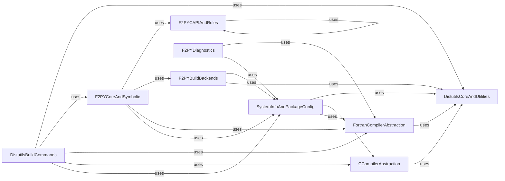

## Component Details

This component provides NumPy's custom build system, extending standard Python distutils to compile C, C++, and Fortran extensions. It includes F2PY, a tool for generating Python interfaces to Fortran code, facilitating the integration of high-performance Fortran routines into NumPy.

### DistutilsCoreAndUtilities
Provides fundamental utilities and core functionalities for the NumPy build system, including general-purpose helpers, command execution, logging, and template processing.

**Related Classes/Methods**:

- <a href="https://github.com/numpy/numpy/blob/master/numpy/distutils/core.py#L1-L150" target="_blank" rel="noopener noreferrer">`numpy.numpy.distutils.core` (1:150)</a>
- `numpy.numpy.distutils.misc_util` (full file reference)
- <a href="https://github.com/numpy/numpy/blob/master/numpy/distutils/exec_command.py#L177-L250" target="_blank" rel="noopener noreferrer">`numpy.numpy.distutils.exec_command` (177:250)</a>
- `numpy.numpy.distutils.conv_template` (full file reference)
- `numpy.numpy.distutils.from_template` (full file reference)
- `numpy.numpy.distutils.log` (full file reference)
- `numpy.numpy.distutils.line_endings` (full file reference)

### CCompilerAbstraction
Manages the interaction with various C compilers, including Microsoft Visual C++, MinGW32, and Unix-like compilers, and handles compiler-specific optimizations.

**Related Classes/Methods**:

- `numpy.numpy.distutils.msvc9compiler` (full file reference)
- `numpy.numpy.distutils.ccompiler` (full file reference)
- `numpy.numpy.distutils.mingw32ccompiler` (full file reference)
- `numpy.numpy.distutils.ccompiler_opt` (full file reference)
- `numpy.numpy.distutils.unixccompiler` (full file reference)
- `numpy.numpy.distutils.msvccompiler` (full file reference)

### FortranCompilerAbstraction
Provides a unified interface for interacting with various Fortran compilers, including Intel, GNU, NAG, Vast, ARM, Absoft, HPUX, Sun, MIPS, PGroup, and IBM compilers, handling their specific flags and environment configurations.

**Related Classes/Methods**:

- `numpy.numpy.distutils.fcompiler` (full file reference)
- `numpy.numpy.distutils.fcompiler.intel` (full file reference)
- `numpy.numpy.distutils.fcompiler.gnu` (full file reference)
- `numpy.numpy.distutils.fcompiler.nag` (full file reference)
- `numpy.numpy.distutils.fcompiler.vast` (full file reference)
- `numpy.numpy.distutils.fcompiler.environment` (full file reference)
- `numpy.numpy.distutils.fcompiler.arm` (full file reference)
- `numpy.numpy.distutils.fcompiler.absoft` (full file reference)
- `numpy.numpy.distutils.fcompiler.hpux` (full file reference)
- `numpy.numpy.distutils.fcompiler.sun` (full file reference)
- `numpy.numpy.distutils.fcompiler.mips` (full file reference)
- `numpy.numpy.distutils.fcompiler.pg` (full file reference)
- `numpy.numpy.distutils.fcompiler.ibm` (full file reference)

### SystemInfoAndPackageConfig
Responsible for gathering system-specific information, detecting available external libraries (like BLAS, LAPACK, FFTW, MKL), and managing NumPy package configuration.

**Related Classes/Methods**:

- `numpy.numpy.distutils.cpuinfo` (full file reference)
- `numpy.numpy.distutils.npy_pkg_config` (full file reference)
- <a href="https://github.com/numpy/numpy/blob/master/numpy/distutils/system_info.py#L706-L1079" target="_blank" rel="noopener noreferrer">`numpy.numpy.distutils.system_info` (706:1079)</a>

### DistutilsBuildCommands
Implements the various build commands used by NumPy's distutils, such as building source, installing libraries, configuring compilers, and building extensions.

**Related Classes/Methods**:

- <a href="https://github.com/numpy/numpy/blob/master/numpy/distutils/command/sdist.py#L9-L27" target="_blank" rel="noopener noreferrer">`numpy.numpy.distutils.command.sdist` (9:27)</a>
- <a href="https://github.com/numpy/numpy/blob/master/numpy/distutils/command/build_src.py#L38-L716" target="_blank" rel="noopener noreferrer">`numpy.numpy.distutils.command.build_src` (38:716)</a>
- <a href="https://github.com/numpy/numpy/blob/master/numpy/distutils/command/install_clib.py#L6-L40" target="_blank" rel="noopener noreferrer">`numpy.numpy.distutils.command.install_clib` (6:40)</a>
- <a href="https://github.com/numpy/numpy/blob/master/numpy/distutils/command/install.py#L12-L79" target="_blank" rel="noopener noreferrer">`numpy.numpy.distutils.command.install` (12:79)</a>
- <a href="https://github.com/numpy/numpy/blob/master/numpy/distutils/command/build_scripts.py#L8-L49" target="_blank" rel="noopener noreferrer">`numpy.numpy.distutils.command.build_scripts` (8:49)</a>
- `numpy.numpy.distutils.command.config_compiler` (full file reference)
- <a href="https://github.com/numpy/numpy/blob/master/numpy/distutils/command/build_py.py#L4-L28" target="_blank" rel="noopener noreferrer">`numpy.numpy.distutils.command.build_py` (4:28)</a>
- <a href="https://github.com/numpy/numpy/blob/master/numpy/distutils/command/config.py#L31-L499" target="_blank" rel="noopener noreferrer">`numpy.numpy.distutils.command.config` (31:499)</a>
- <a href="https://github.com/numpy/numpy/blob/master/numpy/distutils/command/build_clib.py#L26-L469" target="_blank" rel="noopener noreferrer">`numpy.numpy.distutils.command.build_clib` (26:469)</a>
- <a href="https://github.com/numpy/numpy/blob/master/numpy/distutils/command/build_ext.py#L24-L752" target="_blank" rel="noopener noreferrer">`numpy.numpy.distutils.command.build_ext` (24:752)</a>

### F2PYCoreAndSymbolic
Handles the core parsing and analysis of Fortran source code, including symbolic expression manipulation and overall F2PY execution flow.

**Related Classes/Methods**:

- <a href="https://github.com/numpy/numpy/blob/master/numpy/f2py/crackfortran.py#L3485-L3499" target="_blank" rel="noopener noreferrer">`numpy.numpy.f2py.crackfortran` (3485:3499)</a>
- `numpy.numpy.f2py.symbolic` (full file reference)
- <a href="https://github.com/numpy/numpy/blob/master/numpy/f2py/f2py2e.py#L1-L400" target="_blank" rel="noopener noreferrer">`numpy.numpy.f2py.f2py2e` (1:400)</a>

### F2PYCAPIAndRules
Manages the generation of the C-API for Fortran code, applies various rules for Fortran constructs (common blocks, modules, callbacks, use statements), and handles auxiliary functions for F2PY.

**Related Classes/Methods**:

- `numpy.numpy.f2py._src_pyf` (full file reference)
- `numpy.numpy.f2py.cfuncs` (full file reference)
- `numpy.numpy.f2py.rules` (full file reference)
- `numpy.numpy.f2py.capi_maps` (full file reference)
- `numpy.numpy.f2py.func2subr` (full file reference)
- `numpy.numpy.f2py.f90mod_rules` (full file reference)
- `numpy.numpy.f2py.cb_rules` (full file reference)
- `numpy.numpy.f2py.use_rules` (full file reference)
- `numpy.numpy.f2py.auxfuncs` (full file reference)
- `numpy.numpy.f2py.common_rules` (full file reference)

### F2PYBuildBackends
Provides integration with different build systems for F2PY, specifically Distutils and Meson, to facilitate the compilation process.

**Related Classes/Methods**:

- `numpy.numpy.f2py._backends._distutils` (full file reference)
- `numpy.numpy.f2py._backends._meson` (full file reference)

### F2PYDiagnostics
Offers diagnostic tools for F2PY, such as showing available Fortran compilers and CPU information.

**Related Classes/Methods**:

- `numpy.numpy.f2py.diagnose` (full file reference)
- `numpy.numpy.f2py:__getattr__` (full file reference)

### [FAQ](https://github.com/CodeBoarding/GeneratedOnBoardings/tree/main?tab=readme-ov-file#faq)