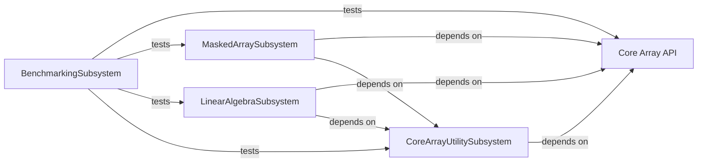

## Component Details

The Core Array API component in NumPy provides the foundational elements for array manipulation and numerical operations. It encompasses array creation, basic element-wise operations, shape manipulation, and the underlying C-level array implementation. This component serves as the bedrock for most other NumPy functionalities, offering a high-level interface for common numerical tasks. It interacts closely with the `CoreArrayUtilitySubsystem` for extended array functionalities and is a dependency for `MaskedArraySubsystem` and `LinearAlgebraSubsystem`. The `BenchmarkingSubsystem` tests the performance of this core component.

### Core Array API
This component provides the fundamental building blocks for NumPy arrays, including array creation, basic element-wise operations, shape manipulation, and the underlying C-level array implementation. It forms the bedrock upon which most other NumPy functionalities are built, offering a high-level interface for common numerical operations.

**Related Classes/Methods**:

- <a href="https://github.com/numpy/numpy/blob/master/numpy/_core/multiarray.py#L1-L208" target="_blank" rel="noopener noreferrer">`numpy._core.multiarray` (1:208)</a>
- <a href="https://github.com/numpy/numpy/blob/master/numpy/_core/numeric.py#L1-L1000" target="_blank" rel="noopener noreferrer">`numpy._core.numeric` (1:1000)</a>

### CoreArrayUtilitySubsystem
This is a foundational subsystem of NumPy, extending the Core Array API by providing a wider range of array utility functions, including data type management, numerical limits, array printing functionalities, and various array manipulation functions like reshaping, stacking, and element-wise operations. It also includes functions for handling structured arrays (records) and string operations on arrays.

**Related Classes/Methods**:

- `numpy._core._methods` (full file reference)
- `numpy._core.records` (full file reference)
- `numpy._core._internal` (full file reference)
- `numpy._core.fromnumeric` (full file reference)
- `numpy._core.getlimits` (full file reference)
- `numpy._core._machar` (full file reference)
- `numpy._core.arrayprint` (full file reference)
- `numpy._core.shape_base` (full file reference)
- `numpy.core.function_base` (full file reference)
- `numpy.core.numerictypes` (full file reference)
- `numpy.core.einsumfunc` (full file reference)
- `numpy.core.strings` (full file reference)
- `numpy.core.defchararray` (full file reference)
- `numpy._core._ufunc_config` (full file reference)
- `numpy.exceptions` (full file reference)
- `numpy.lib._polynomial_impl` (full file reference)
- `numpy.lib._stride_tricks_impl` (full file reference)

### MaskedArraySubsystem
This subsystem provides functionalities for handling masked arrays, which are arrays that may have missing or invalid entries. It includes operations for creating, manipulating, and performing calculations on masked arrays, as well as utilities for record arrays with masking capabilities.

**Related Classes/Methods**:

- `numpy.ma.extras` (full file reference)
- `numpy.ma.mrecords` (full file reference)
- `numpy.ma.core` (full file reference)

### LinearAlgebraSubsystem
This subsystem provides a comprehensive set of linear algebra operations, including solving linear equations, matrix inversion, eigenvalue decomposition, singular value decomposition, and various matrix norms. It forms the backbone for numerical computations involving matrices and vectors.

**Related Classes/Methods**:

- `numpy.linalg._linalg` (full file reference)

### BenchmarkingSubsystem
This subsystem contains various benchmark tests designed to measure the performance of different NumPy functionalities, including core array operations, ufuncs, reductions, clipping, array creation, linear algebra routines, array manipulation, shape-related operations, string operations, and masked array operations.

**Related Classes/Methods**:

- `numpy.benchmarks.benchmarks.bench_core` (full file reference)
- `numpy.benchmarks.benchmarks.bench_ufunc` (full file reference)
- `numpy.benchmarks.benchmarks.bench_reduce` (full file reference)
- `numpy.benchmarks.benchmarks.bench_clip` (full file reference)
- `numpy.benchmarks.benchmarks.bench_creation` (full file reference)
- `numpy.benchmarks.benchmarks.bench_lib` (full file reference)
- `numpy.benchmarks.benchmarks.bench_linalg` (full file reference)
- `numpy.benchmarks.benchmarks.bench_manipulate` (full file reference)
- `numpy.benchmarks.benchmarks.bench_shape_base` (full file reference)
- `numpy.benchmarks.benchmarks.bench_strings` (full file reference)
- `numpy.benchmarks.benchmarks.bench_app` (full file reference)
- `numpy.benchmarks.benchmarks.bench_itemselection` (full file reference)
- `numpy.benchmarks.benchmarks.bench_indexing` (full file reference)
- `numpy.benchmarks.benchmarks.bench_records` (full file reference)
- `numpy.benchmarks.benchmarks.bench_ma` (full file reference)
- `numpy.benchmarks.benchmarks.bench_overrides` (full file reference)

### [FAQ](https://github.com/CodeBoarding/GeneratedOnBoardings/tree/main?tab=readme-ov-file#faq)