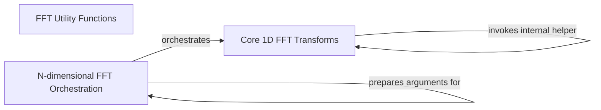

## Component Details

This module provides a comprehensive set of Fast Fourier Transform (FFT) and related functions for signal processing, encompassing 1D, 2D, and N-dimensional FFTs. It includes utility functions for frequency manipulation and leverages optimized C implementations for efficient computation. The core functionality is divided into components for 1D transforms, N-dimensional orchestration, and helper functions for frequency spectrum manipulation.

### FFT Utility Functions
This component provides helper functions for manipulating frequency spectra and generating frequency arrays. It includes `fftshift` and `ifftshift` for shifting the zero-frequency component, and `fftfreq` and `rfftfreq` for generating discrete Fourier Transform sample frequencies. These functions often interact with core NumPy array manipulation routines like `roll`.

**Related Classes/Methods**:

- <a href="https://github.com/numpy/numpy/blob/master/numpy/fft/_helper.py#L20-L74" target="_blank" rel="noopener noreferrer">`numpy.fft._helper:fftshift` (20:74)</a>
- <a href="https://github.com/numpy/numpy/blob/master/numpy/fft/_helper.py#L78-L122" target="_blank" rel="noopener noreferrer">`numpy.fft._helper:ifftshift` (78:122)</a>
- <a href="https://github.com/numpy/numpy/blob/master/numpy/fft/_helper.py#L126-L177" target="_blank" rel="noopener noreferrer">`numpy.fft._helper:fftfreq` (126:177)</a>
- <a href="https://github.com/numpy/numpy/blob/master/numpy/fft/_helper.py#L181-L235" target="_blank" rel="noopener noreferrer">`numpy.fft._helper:rfftfreq` (181:235)</a>

### Core 1D FFT Transforms
This component implements the fundamental one-dimensional Discrete Fourier Transform (DFT) operations. It includes forward and inverse transforms for complex (`fft`, `ifft`), real (`rfft`, `irfft`), and Hermitian-symmetric (`hfft`, `ihfft`) input signals. The internal `_raw_fft` function handles the core transformation logic, including normalization and dispatching to low-level ufuncs.

**Related Classes/Methods**:

- <a href="https://github.com/numpy/numpy/blob/master/numpy/fft/_pocketfft.py#L58-L101" target="_blank" rel="noopener noreferrer">`numpy.fft._pocketfft:_raw_fft` (58:101)</a>
- <a href="https://github.com/numpy/numpy/blob/master/numpy/fft/_pocketfft.py#L121-L216" target="_blank" rel="noopener noreferrer">`numpy.fft._pocketfft:fft` (121:216)</a>
- <a href="https://github.com/numpy/numpy/blob/master/numpy/fft/_pocketfft.py#L220-L321" target="_blank" rel="noopener noreferrer">`numpy.fft._pocketfft:ifft` (220:321)</a>
- <a href="https://github.com/numpy/numpy/blob/master/numpy/fft/_pocketfft.py#L325-L418" target="_blank" rel="noopener noreferrer">`numpy.fft._pocketfft:rfft` (325:418)</a>
- <a href="https://github.com/numpy/numpy/blob/master/numpy/fft/_pocketfft.py#L422-L526" target="_blank" rel="noopener noreferrer">`numpy.fft._pocketfft:irfft` (422:526)</a>
- <a href="https://github.com/numpy/numpy/blob/master/numpy/fft/_pocketfft.py#L530-L629" target="_blank" rel="noopener noreferrer">`numpy.fft._pocketfft:hfft` (530:629)</a>
- <a href="https://github.com/numpy/numpy/blob/master/numpy/fft/_pocketfft.py#L633-L701" target="_blank" rel="noopener noreferrer">`numpy.fft._pocketfft:ihfft` (633:701)</a>
- <a href="https://github.com/numpy/numpy/blob/master/numpy/fft/_pocketfft.py#L108-L113" target="_blank" rel="noopener noreferrer">`numpy.fft._pocketfft:_swap_direction` (108:113)</a>

### N-dimensional FFT Orchestration
This component manages and orchestrates N-dimensional Discrete Fourier Transforms by iteratively applying one-dimensional transforms along specified axes. It includes functions for general N-dimensional transforms (`fftn`, `ifftn`, `rfftn`, `irfftn`) and specialized 2D transforms (`fft2`, `ifft2`, `rfft2`, `irfft2`). The `_cook_nd_args` function is crucial for preparing and validating input arguments for these multi-dimensional operations.

**Related Classes/Methods**:

- <a href="https://github.com/numpy/numpy/blob/master/numpy/fft/_pocketfft.py#L704-L738" target="_blank" rel="noopener noreferrer">`numpy.fft._pocketfft:_cook_nd_args` (704:738)</a>
- <a href="https://github.com/numpy/numpy/blob/master/numpy/fft/_pocketfft.py#L741-L748" target="_blank" rel="noopener noreferrer">`numpy.fft._pocketfft:_raw_fftnd` (741:748)</a>
- <a href="https://github.com/numpy/numpy/blob/master/numpy/fft/_pocketfft.py#L756-L884" target="_blank" rel="noopener noreferrer">`numpy.fft._pocketfft:fftn` (756:884)</a>
- <a href="https://github.com/numpy/numpy/blob/master/numpy/fft/_pocketfft.py#L888-L1016" target="_blank" rel="noopener noreferrer">`numpy.fft._pocketfft:ifftn` (888:1016)</a>
- <a href="https://github.com/numpy/numpy/blob/master/numpy/fft/_pocketfft.py#L1020-L1141" target="_blank" rel="noopener noreferrer">`numpy.fft._pocketfft:fft2` (1020:1141)</a>
- <a href="https://github.com/numpy/numpy/blob/master/numpy/fft/_pocketfft.py#L1145-L1263" target="_blank" rel="noopener noreferrer">`numpy.fft._pocketfft:ifft2` (1145:1263)</a>
- <a href="https://github.com/numpy/numpy/blob/master/numpy/fft/_pocketfft.py#L1267-L1390" target="_blank" rel="noopener noreferrer">`numpy.fft._pocketfft:rfftn` (1267:1390)</a>
- <a href="https://github.com/numpy/numpy/blob/master/numpy/fft/_pocketfft.py#L1394-L1470" target="_blank" rel="noopener noreferrer">`numpy.fft._pocketfft:rfft2` (1394:1470)</a>
- <a href="https://github.com/numpy/numpy/blob/master/numpy/fft/_pocketfft.py#L1474-L1609" target="_blank" rel="noopener noreferrer">`numpy.fft._pocketfft:irfftn` (1474:1609)</a>
- <a href="https://github.com/numpy/numpy/blob/master/numpy/fft/_pocketfft.py#L1613-L1693" target="_blank" rel="noopener noreferrer">`numpy.fft._pocketfft:irfft2` (1613:1693)</a>

### [FAQ](https://github.com/CodeBoarding/GeneratedOnBoardings/tree/main?tab=readme-ov-file#faq)