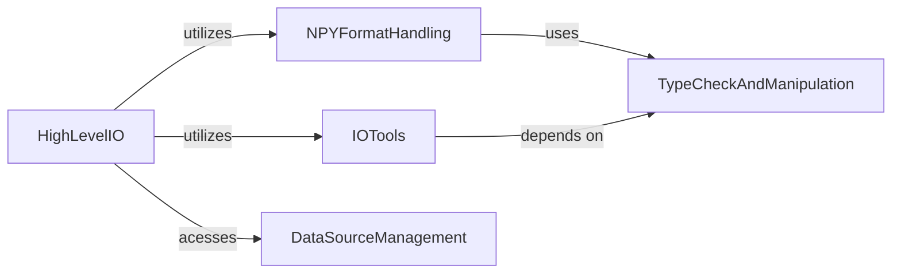

## Component Details

This graph describes the `I/O and Data Persistence` subsystem, which is responsible for managing the reading and writing of array data to and from various file formats, including NumPy's native binary formats (.npy, .npz) and common text formats. It encompasses functionalities for data source management, text parsing, and low-level type checking and manipulation, providing a comprehensive solution for data input and output within NumPy.

### TypeCheckAndManipulation
This component provides utilities for checking and manipulating data types, including identifying complex or real numbers, converting NaNs and infinities, and determining common types for arrays. It handles the low-level details of numerical type introspection and modification.

**Related Classes/Methods**:

- <a href="https://github.com/numpy/numpy/blob/master/numpy/lib/_type_check_impl.py#L363-L366" target="_blank" rel="noopener noreferrer">`numpy.numpy.lib._type_check_impl:_getmaxmin` (363:366)</a>
- <a href="https://github.com/numpy/numpy/blob/master/numpy/lib/_type_check_impl.py#L374-L481" target="_blank" rel="noopener noreferrer">`numpy.numpy.lib._type_check_impl:nan_to_num` (374:481)</a>
- <a href="https://github.com/numpy/numpy/blob/master/numpy/lib/_type_check_impl.py#L85-L124" target="_blank" rel="noopener noreferrer">`numpy.numpy.lib._type_check_impl:real` (85:124)</a>
- <a href="https://github.com/numpy/numpy/blob/master/numpy/lib/_type_check_impl.py#L132-L168" target="_blank" rel="noopener noreferrer">`numpy.numpy.lib._type_check_impl:imag` (132:168)</a>
- <a href="https://github.com/numpy/numpy/blob/master/numpy/lib/_type_check_impl.py#L176-L210" target="_blank" rel="noopener noreferrer">`numpy.numpy.lib._type_check_impl:iscomplex` (176:210)</a>
- <a href="https://github.com/numpy/numpy/blob/master/numpy/lib/_type_check_impl.py#L214-L267" target="_blank" rel="noopener noreferrer">`numpy.numpy.lib._type_check_impl:isreal` (214:267)</a>
- <a href="https://github.com/numpy/numpy/blob/master/numpy/lib/_type_check_impl.py#L271-L309" target="_blank" rel="noopener noreferrer">`numpy.numpy.lib._type_check_impl:iscomplexobj` (271:309)</a>
- <a href="https://github.com/numpy/numpy/blob/master/numpy/lib/_type_check_impl.py#L313-L359" target="_blank" rel="noopener noreferrer">`numpy.numpy.lib._type_check_impl:isrealobj` (313:359)</a>
- <a href="https://github.com/numpy/numpy/blob/master/numpy/lib/_type_check_impl.py#L575-L625" target="_blank" rel="noopener noreferrer">`numpy.numpy.lib._type_check_impl:typename` (575:625)</a>
- <a href="https://github.com/numpy/numpy/blob/master/numpy/lib/_type_check_impl.py#L26-L77" target="_blank" rel="noopener noreferrer">`numpy.numpy.lib._type_check_impl:mintypecode` (26:77)</a>
- <a href="https://github.com/numpy/numpy/blob/master/numpy/lib/_type_check_impl.py#L647-L699" target="_blank" rel="noopener noreferrer">`numpy.numpy.lib._type_check_impl:common_type` (647:699)</a>

### IOTools
This component offers various tools for input/output operations, primarily focused on parsing and formatting text-based data. It includes functionalities for splitting lines, validating names, and converting strings to appropriate data types, essential for reading structured text files.

**Related Classes/Methods**:

- <a href="https://github.com/numpy/numpy/blob/master/numpy/lib/_iotools.py#L85-L130" target="_blank" rel="noopener noreferrer">`numpy.numpy.lib._iotools:flatten_dtype` (85:130)</a>
- <a href="https://github.com/numpy/numpy/blob/master/numpy/lib/_iotools.py#L133-L226" target="_blank" rel="noopener noreferrer">`numpy.numpy.lib._iotools.LineSplitter` (133:226)</a>
- <a href="https://github.com/numpy/numpy/blob/master/numpy/lib/_iotools.py#L229-L383" target="_blank" rel="noopener noreferrer">`numpy.numpy.lib._iotools.NameValidator` (229:383)</a>
- <a href="https://github.com/numpy/numpy/blob/master/numpy/lib/_iotools.py#L452-L821" target="_blank" rel="noopener noreferrer">`numpy.numpy.lib._iotools.StringConverter` (452:821)</a>
- <a href="https://github.com/numpy/numpy/blob/master/numpy/lib/_iotools.py#L824-L900" target="_blank" rel="noopener noreferrer">`numpy.numpy.lib._iotools:easy_dtype` (824:900)</a>
- <a href="https://github.com/numpy/numpy/blob/master/numpy/lib/_iotools.py#L386-L420" target="_blank" rel="noopener noreferrer">`numpy.numpy.lib._iotools:str2bool` (386:420)</a>
- <a href="https://github.com/numpy/numpy/blob/master/numpy/lib/_iotools.py#L431-L436" target="_blank" rel="noopener noreferrer">`numpy.numpy.lib._iotools:ConverterLockError` (431:436)</a>
- <a href="https://github.com/numpy/numpy/blob/master/numpy/lib/_iotools.py#L423-L428" target="_blank" rel="noopener noreferrer">`numpy.numpy.lib._iotools:ConverterError` (423:428)</a>
- <a href="https://github.com/numpy/numpy/blob/master/numpy/lib/_iotools.py#L13-L35" target="_blank" rel="noopener noreferrer">`numpy.numpy.lib._iotools:_decode_line` (13:35)</a>
- <a href="https://github.com/numpy/numpy/blob/master/numpy/lib/_iotools.py#L38-L46" target="_blank" rel="noopener noreferrer">`numpy.numpy.lib._iotools:_is_string_like` (38:46)</a>
- <a href="https://github.com/numpy/numpy/blob/master/numpy/lib/_iotools.py#L60-L82" target="_blank" rel="noopener noreferrer">`numpy.numpy.lib._iotools:has_nested_fields` (60:82)</a>

### NPYFormatHandling
This component manages the serialization and deserialization of NumPy arrays in the native .npy and .npz binary formats. It handles the low-level details of array header creation, reading, and writing, as well as memory-mapped file operations.

**Related Classes/Methods**:

- <a href="https://github.com/numpy/numpy/blob/master/numpy/lib/_format_impl.py#L206-L226" target="_blank" rel="noopener noreferrer">`numpy.numpy.lib._format_impl:magic` (206:226)</a>
- <a href="https://github.com/numpy/numpy/blob/master/numpy/lib/_format_impl.py#L230-L247" target="_blank" rel="noopener noreferrer">`numpy.numpy.lib._format_impl:read_magic` (230:247)</a>
- <a href="https://github.com/numpy/numpy/blob/master/numpy/lib/_format_impl.py#L251-L307" target="_blank" rel="noopener noreferrer">`numpy.numpy.lib._format_impl:dtype_to_descr` (251:307)</a>
- <a href="https://github.com/numpy/numpy/blob/master/numpy/lib/_format_impl.py#L311-L365" target="_blank" rel="noopener noreferrer">`numpy.numpy.lib._format_impl:descr_to_dtype` (311:365)</a>
- <a href="https://github.com/numpy/numpy/blob/master/numpy/lib/_format_impl.py#L369-L394" target="_blank" rel="noopener noreferrer">`numpy.numpy.lib._format_impl:header_data_from_array_1_0` (369:394)</a>
- <a href="https://github.com/numpy/numpy/blob/master/numpy/lib/_format_impl.py#L397-L418" target="_blank" rel="noopener noreferrer">`numpy.numpy.lib._format_impl:_wrap_header` (397:418)</a>
- <a href="https://github.com/numpy/numpy/blob/master/numpy/lib/_format_impl.py#L421-L442" target="_blank" rel="noopener noreferrer">`numpy.numpy.lib._format_impl:_wrap_header_guess_version` (421:442)</a>
- <a href="https://github.com/numpy/numpy/blob/master/numpy/lib/_format_impl.py#L445-L478" target="_blank" rel="noopener noreferrer">`numpy.numpy.lib._format_impl:_write_array_header` (445:478)</a>
- <a href="https://github.com/numpy/numpy/blob/master/numpy/lib/_format_impl.py#L482-L492" target="_blank" rel="noopener noreferrer">`numpy.numpy.lib._format_impl:write_array_header_1_0` (482:492)</a>
- <a href="https://github.com/numpy/numpy/blob/master/numpy/lib/_format_impl.py#L496-L507" target="_blank" rel="noopener noreferrer">`numpy.numpy.lib._format_impl:write_array_header_2_0` (496:507)</a>
- <a href="https://github.com/numpy/numpy/blob/master/numpy/lib/_format_impl.py#L511-L545" target="_blank" rel="noopener noreferrer">`numpy.numpy.lib._format_impl:read_array_header_1_0` (511:545)</a>
- <a href="https://github.com/numpy/numpy/blob/master/numpy/lib/_format_impl.py#L549-L583" target="_blank" rel="noopener noreferrer">`numpy.numpy.lib._format_impl:read_array_header_2_0` (549:583)</a>
- <a href="https://github.com/numpy/numpy/blob/master/numpy/lib/_format_impl.py#L621-L699" target="_blank" rel="noopener noreferrer">`numpy.numpy.lib._format_impl:_read_array_header` (621:699)</a>
- <a href="https://github.com/numpy/numpy/blob/master/numpy/lib/_format_impl.py#L703-L777" target="_blank" rel="noopener noreferrer">`numpy.numpy.lib._format_impl:write_array` (703:777)</a>
- <a href="https://github.com/numpy/numpy/blob/master/numpy/lib/_format_impl.py#L781-L887" target="_blank" rel="noopener noreferrer">`numpy.numpy.lib._format_impl:read_array` (781:887)</a>
- <a href="https://github.com/numpy/numpy/blob/master/numpy/lib/_format_impl.py#L891-L995" target="_blank" rel="noopener noreferrer">`numpy.numpy.lib._format_impl:open_memmap` (891:995)</a>
- <a href="https://github.com/numpy/numpy/blob/master/numpy/lib/_format_impl.py#L1027-L1036" target="_blank" rel="noopener noreferrer">`numpy.numpy.lib._format_impl:isfileobj` (1027:1036)</a>
- <a href="https://github.com/numpy/numpy/blob/master/numpy/lib/_format_impl.py#L998-L1023" target="_blank" rel="noopener noreferrer">`numpy.numpy.lib._format_impl:_read_bytes` (998:1023)</a>
- <a href="https://github.com/numpy/numpy/blob/master/numpy/lib/_format_impl.py#L586-L618" target="_blank" rel="noopener noreferrer">`numpy.numpy.lib._format_impl:_filter_header` (586:618)</a>
- <a href="https://github.com/numpy/numpy/blob/master/numpy/lib/_format_impl.py#L199-L202" target="_blank" rel="noopener noreferrer">`numpy.numpy.lib._format_impl:_check_version` (199:202)</a>

### HighLevelIO
This component provides user-facing functions for loading and saving data to and from various file formats, including text files (loadtxt, savetxt) and NumPy's binary formats (load, save, savez). It acts as an abstraction layer over the underlying format-specific handling.

**Related Classes/Methods**:

- <a href="https://github.com/numpy/numpy/blob/master/numpy/lib/_npyio_impl.py#L116-L308" target="_blank" rel="noopener noreferrer">`numpy.numpy.lib._npyio_impl.NpzFile` (116:308)</a>
- <a href="https://github.com/numpy/numpy/blob/master/numpy/lib/_npyio_impl.py#L312-L497" target="_blank" rel="noopener noreferrer">`numpy.numpy.lib._npyio_impl:load` (312:497)</a>
- <a href="https://github.com/numpy/numpy/blob/master/numpy/lib/_npyio_impl.py#L505-L585" target="_blank" rel="noopener noreferrer">`numpy.numpy.lib._npyio_impl:save` (505:585)</a>
- <a href="https://github.com/numpy/numpy/blob/master/numpy/lib/_npyio_impl.py#L594-L686" target="_blank" rel="noopener noreferrer">`numpy.numpy.lib._npyio_impl:savez` (594:686)</a>
- <a href="https://github.com/numpy/numpy/blob/master/numpy/lib/_npyio_impl.py#L695-L766" target="_blank" rel="noopener noreferrer">`numpy.numpy.lib._npyio_impl:savez_compressed` (695:766)</a>
- <a href="https://github.com/numpy/numpy/blob/master/numpy/lib/_npyio_impl.py#L769-L803" target="_blank" rel="noopener noreferrer">`numpy.numpy.lib._npyio_impl:_savez` (769:803)</a>
- <a href="https://github.com/numpy/numpy/blob/master/numpy/lib/_npyio_impl.py#L816-L836" target="_blank" rel="noopener noreferrer">`numpy.numpy.lib._npyio_impl:_ensure_ndmin_ndarray` (816:836)</a>
- <a href="https://github.com/numpy/numpy/blob/master/numpy/lib/_npyio_impl.py#L874-L1128" target="_blank" rel="noopener noreferrer">`numpy.numpy.lib._npyio_impl:_read` (874:1128)</a>
- <a href="https://github.com/numpy/numpy/blob/master/numpy/lib/_npyio_impl.py#L1133-L1402" target="_blank" rel="noopener noreferrer">`numpy.numpy.lib._npyio_impl:loadtxt` (1133:1402)</a>
- <a href="https://github.com/numpy/numpy/blob/master/numpy/lib/_npyio_impl.py#L1415-L1643" target="_blank" rel="noopener noreferrer">`numpy.numpy.lib._npyio_impl:savetxt` (1415:1643)</a>
- <a href="https://github.com/numpy/numpy/blob/master/numpy/lib/_npyio_impl.py#L1647-L1740" target="_blank" rel="noopener noreferrer">`numpy.numpy.lib._npyio_impl:fromregex` (1647:1740)</a>
- <a href="https://github.com/numpy/numpy/blob/master/numpy/lib/_npyio_impl.py#L1750-L2497" target="_blank" rel="noopener noreferrer">`numpy.numpy.lib._npyio_impl:genfromtxt` (1750:2497)</a>
- <a href="https://github.com/numpy/numpy/blob/master/numpy/lib/_npyio_impl.py#L2503-L2545" target="_blank" rel="noopener noreferrer">`numpy.numpy.lib._npyio_impl:recfromtxt` (2503:2545)</a>
- <a href="https://github.com/numpy/numpy/blob/master/numpy/lib/_npyio_impl.py#L2548-L2596" target="_blank" rel="noopener noreferrer">`numpy.numpy.lib._npyio_impl:recfromcsv` (2548:2596)</a>
- <a href="https://github.com/numpy/numpy/blob/master/numpy/lib/_npyio_impl.py#L100-L112" target="_blank" rel="noopener noreferrer">`numpy.numpy.lib._npyio_impl:zipfile_factory` (100:112)</a>
- <a href="https://github.com/numpy/numpy/blob/master/numpy/lib/_npyio_impl.py#L50-L97" target="_blank" rel="noopener noreferrer">`numpy.numpy.lib._npyio_impl:BagObj` (50:97)</a>
- <a href="https://github.com/numpy/numpy/blob/master/numpy/lib/_npyio_impl.py#L806-L814" target="_blank" rel="noopener noreferrer">`numpy.numpy.lib._npyio_impl:_ensure_ndmin_ndarray_check_param` (806:814)</a>
- <a href="https://github.com/numpy/numpy/blob/master/numpy/lib/_npyio_impl.py#L843-L849" target="_blank" rel="noopener noreferrer">`numpy.numpy.lib._npyio_impl:_check_nonneg_int` (843:849)</a>
- <a href="https://github.com/numpy/numpy/blob/master/numpy/lib/_npyio_impl.py#L852-L867" target="_blank" rel="noopener noreferrer">`numpy.numpy.lib._npyio_impl:_preprocess_comments` (852:867)</a>
- <a href="https://github.com/numpy/numpy/blob/master/numpy/lib/_npyio_impl.py#L1527-L1558" target="_blank" rel="noopener noreferrer">`numpy.numpy.lib._npyio_impl.savetxt.WriteWrap` (1527:1558)</a>

### DataSourceManagement
This component handles the abstraction of data sources, allowing uniform access to local files, URLs, and potentially compressed archives. It provides functionalities for opening files, checking their existence, and managing file paths and caching mechanisms.

**Related Classes/Methods**:

- <a href="https://github.com/numpy/numpy/blob/master/numpy/lib/_datasource.py#L72-L149" target="_blank" rel="noopener noreferrer">`numpy.numpy.lib._datasource._FileOpeners` (72:149)</a>
- <a href="https://github.com/numpy/numpy/blob/master/numpy/lib/_datasource.py#L154-L192" target="_blank" rel="noopener noreferrer">`numpy.numpy.lib._datasource:open` (154:192)</a>
- <a href="https://github.com/numpy/numpy/blob/master/numpy/lib/_datasource.py#L196-L529" target="_blank" rel="noopener noreferrer">`numpy.numpy.lib._datasource.DataSource` (196:529)</a>
- <a href="https://github.com/numpy/numpy/blob/master/numpy/lib/_datasource.py#L532-L700" target="_blank" rel="noopener noreferrer">`numpy.numpy.lib._datasource.Repository` (532:700)</a>
- <a href="https://github.com/numpy/numpy/blob/master/numpy/lib/_datasource.py#L10-L10" target="_blank" rel="noopener noreferrer">`numpy.numpy.lib._datasource:_iszip` (10:10)</a>
- <a href="https://github.com/numpy/numpy/blob/master/numpy/lib/_datasource.py#L10-L10" target="_blank" rel="noopener noreferrer">`numpy.numpy.lib._datasource:_splitzipext` (10:10)</a>
- <a href="https://github.com/numpy/numpy/blob/master/numpy/lib/_datasource.py#L10-L10" target="_blank" rel="noopener noreferrer">`numpy.numpy.lib._datasource:_possible_names` (10:10)</a>
- <a href="https://github.com/numpy/numpy/blob/master/numpy/lib/_datasource.py#L10-L10" target="_blank" rel="noopener noreferrer">`numpy.numpy.lib._datasource:_cache` (10:10)</a>
- <a href="https://github.com/numpy/numpy/blob/master/numpy/lib/_datasource.py#L10-L10" target="_blank" rel="noopener noreferrer">`numpy.numpy.lib._datasource:_findfile` (10:10)</a>
- <a href="https://github.com/numpy/numpy/blob/master/numpy/lib/_datasource.py#L10-L10" target="_blank" rel="noopener noreferrer">`numpy.numpy.lib._datasource:abspath` (10:10)</a>
- <a href="https://github.com/numpy/numpy/blob/master/numpy/lib/_datasource.py#L10-L10" target="_blank" rel="noopener noreferrer">`numpy.numpy.lib._datasource:exists` (10:10)</a>
- <a href="https://github.com/numpy/numpy/blob/master/numpy/lib/_datasource.py#L10-L10" target="_blank" rel="noopener noreferrer">`numpy.numpy.lib._datasource:_sanitize_relative_path` (10:10)</a>
- <a href="https://github.com/numpy/numpy/blob/master/numpy/lib/_datasource.py#L10-L10" target="_blank" rel="noopener noreferrer">`numpy.numpy.lib._datasource:_isurl` (10:10)</a>
- <a href="https://github.com/numpy/numpy/blob/master/numpy/lib/_datasource.py#L10-L10" target="_blank" rel="noopener noreferrer">`numpy.numpy.lib._datasource:_iswritemode` (10:10)</a>
- <a href="https://github.com/numpy/numpy/blob/master/numpy/lib/_datasource.py#L10-L10" target="_blank" rel="noopener noreferrer">`numpy.numpy.lib._datasource:_fullpath` (10:10)</a>

### [FAQ](https://github.com/CodeBoarding/GeneratedOnBoardings/tree/main?tab=readme-ov-file#faq)