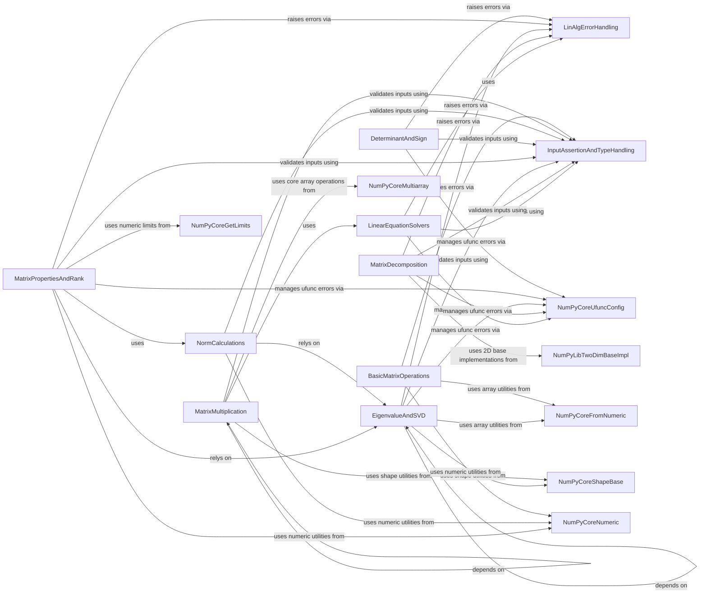

## Component Details

This component, `Linear Algebra Module`, provides a comprehensive suite of linear algebra functionalities within NumPy. It encompasses core operations like matrix decompositions (Cholesky, SVD, QR), solving linear equations, eigenvalue and eigenvector computations, and various matrix and vector norms. The module is designed for performance, leveraging optimized underlying libraries, and ensures input validity and proper error handling. Its purpose is to offer a robust and efficient set of tools for numerical linear algebra, integrating seamlessly with NumPy's array structures.

### LinAlgErrorHandling
This component is responsible for defining and raising specific linear algebra errors, such as those related to singular matrices, non-positive definite matrices, or convergence issues in eigenvalue and SVD computations. It centralizes error reporting for various linear algebra routines.

**Related Classes/Methods**:

- <a href="https://github.com/numpy/numpy/blob/master/numpy/linalg/_linalg.py#L133-L159" target="_blank" rel="noopener noreferrer">`numpy.linalg._linalg.LinAlgError` (133:159)</a>
- <a href="https://github.com/numpy/numpy/blob/master/numpy/linalg/_linalg.py#L162-L163" target="_blank" rel="noopener noreferrer">`numpy.linalg._linalg._raise_linalgerror_singular` (162:163)</a>
- <a href="https://github.com/numpy/numpy/blob/master/numpy/linalg/_linalg.py#L165-L166" target="_blank" rel="noopener noreferrer">`numpy.linalg._linalg._raise_linalgerror_nonposdef` (165:166)</a>
- <a href="https://github.com/numpy/numpy/blob/master/numpy/linalg/_linalg.py#L168-L169" target="_blank" rel="noopener noreferrer">`numpy.linalg._linalg._raise_linalgerror_eigenvalues_nonconvergence` (168:169)</a>
- <a href="https://github.com/numpy/numpy/blob/master/numpy/linalg/_linalg.py#L171-L172" target="_blank" rel="noopener noreferrer">`numpy.linalg._linalg._raise_linalgerror_svd_nonconvergence` (171:172)</a>
- <a href="https://github.com/numpy/numpy/blob/master/numpy/linalg/_linalg.py#L174-L175" target="_blank" rel="noopener noreferrer">`numpy.linalg._linalg._raise_linalgerror_lstsq` (174:175)</a>
- <a href="https://github.com/numpy/numpy/blob/master/numpy/linalg/_linalg.py#L177-L179" target="_blank" rel="noopener noreferrer">`numpy.linalg._linalg._raise_linalgerror_qr` (177:179)</a>

### InputAssertionAndTypeHandling
This component provides utility functions for validating input array properties, such as dimensionality (e.g., 2D, stacked 2D, square), finiteness of elements, and handling common type conversions (e.g., complex vs. real types). It ensures that inputs to linear algebra functions meet the necessary criteria before computation.

**Related Classes/Methods**:

- <a href="https://github.com/numpy/numpy/blob/master/numpy/linalg/_linalg.py#L244-L248" target="_blank" rel="noopener noreferrer">`numpy.linalg._linalg._assert_2d` (244:248)</a>
- <a href="https://github.com/numpy/numpy/blob/master/numpy/linalg/_linalg.py#L250-L254" target="_blank" rel="noopener noreferrer">`numpy.linalg._linalg._assert_stacked_2d` (250:254)</a>
- <a href="https://github.com/numpy/numpy/blob/master/numpy/linalg/_linalg.py#L256-L264" target="_blank" rel="noopener noreferrer">`numpy.linalg._linalg._assert_stacked_square` (256:264)</a>
- <a href="https://github.com/numpy/numpy/blob/master/numpy/linalg/_linalg.py#L266-L269" target="_blank" rel="noopener noreferrer">`numpy.linalg._linalg._assert_finite` (266:269)</a>
- <a href="https://github.com/numpy/numpy/blob/master/numpy/linalg/_linalg.py#L271-L273" target="_blank" rel="noopener noreferrer">`numpy.linalg._linalg._is_empty_2d` (271:273)</a>
- <a href="https://github.com/numpy/numpy/blob/master/numpy/linalg/_linalg.py#L207-L228" target="_blank" rel="noopener noreferrer">`numpy.linalg._linalg._commonType` (207:228)</a>
- <a href="https://github.com/numpy/numpy/blob/master/numpy/linalg/_linalg.py#L187-L188" target="_blank" rel="noopener noreferrer">`numpy.linalg._linalg.isComplexType` (187:188)</a>
- <a href="https://github.com/numpy/numpy/blob/master/numpy/linalg/_linalg.py#L201-L202" target="_blank" rel="noopener noreferrer">`numpy.linalg._linalg._realType` (201:202)</a>
- <a href="https://github.com/numpy/numpy/blob/master/numpy/linalg/_linalg.py#L204-L205" target="_blank" rel="noopener noreferrer">`numpy.linalg._linalg._complexType` (204:205)</a>
- <a href="https://github.com/numpy/numpy/blob/master/numpy/linalg/_linalg.py#L182-L185" target="_blank" rel="noopener noreferrer">`numpy.linalg._linalg._makearray` (182:185)</a>
- <a href="https://github.com/numpy/numpy/blob/master/numpy/linalg/_linalg.py#L231-L241" target="_blank" rel="noopener noreferrer">`numpy.linalg._linalg._to_native_byte_order` (231:241)</a>

### LinearEquationSolvers
This component offers functions for solving systems of linear equations, computing the inverse of a matrix, and performing least squares solutions. These operations are fundamental to many scientific and engineering applications.

**Related Classes/Methods**:

- <a href="https://github.com/numpy/numpy/blob/master/numpy/linalg/_linalg.py#L300-L375" target="_blank" rel="noopener noreferrer">`numpy.linalg._linalg.tensorsolve` (300:375)</a>
- <a href="https://github.com/numpy/numpy/blob/master/numpy/linalg/_linalg.py#L383-L473" target="_blank" rel="noopener noreferrer">`numpy.linalg._linalg.solve` (383:473)</a>
- <a href="https://github.com/numpy/numpy/blob/master/numpy/linalg/_linalg.py#L558-L670" target="_blank" rel="noopener noreferrer">`numpy.linalg._linalg.inv` (558:670)</a>
- <a href="https://github.com/numpy/numpy/blob/master/numpy/linalg/_linalg.py#L2442-L2587" target="_blank" rel="noopener noreferrer">`numpy.linalg._linalg.lstsq` (2442:2587)</a>

### MatrixDecomposition
This component provides methods for decomposing matrices into simpler forms, specifically Cholesky decomposition for positive-definite matrices and QR decomposition for general matrices. These decompositions are often intermediate steps in solving other linear algebra problems.

**Related Classes/Methods**:

- <a href="https://github.com/numpy/numpy/blob/master/numpy/linalg/_linalg.py#L800-L898" target="_blank" rel="noopener noreferrer">`numpy.linalg._linalg.cholesky` (800:898)</a>
- <a href="https://github.com/numpy/numpy/blob/master/numpy/linalg/_linalg.py#L987-L1186" target="_blank" rel="noopener noreferrer">`numpy.linalg._linalg.qr` (987:1186)</a>

### EigenvalueAndSVD
This component is dedicated to computing eigenvalues, eigenvectors, and singular value decompositions (SVD) of matrices. These operations are crucial for understanding matrix properties, dimensionality reduction, and solving various optimization problems.

**Related Classes/Methods**:

- <a href="https://github.com/numpy/numpy/blob/master/numpy/linalg/_linalg.py#L1192-L1279" target="_blank" rel="noopener noreferrer">`numpy.linalg._linalg.eigvals` (1192:1279)</a>
- <a href="https://github.com/numpy/numpy/blob/master/numpy/linalg/_linalg.py#L1287-L1377" target="_blank" rel="noopener noreferrer">`numpy.linalg._linalg.eigvalsh` (1287:1377)</a>
- <a href="https://github.com/numpy/numpy/blob/master/numpy/linalg/_linalg.py#L1384-L1533" target="_blank" rel="noopener noreferrer">`numpy.linalg._linalg.eig` (1384:1533)</a>
- <a href="https://github.com/numpy/numpy/blob/master/numpy/linalg/_linalg.py#L1537-L1680" target="_blank" rel="noopener noreferrer">`numpy.linalg._linalg.eigh` (1537:1680)</a>
- <a href="https://github.com/numpy/numpy/blob/master/numpy/linalg/_linalg.py#L1690-L1874" target="_blank" rel="noopener noreferrer">`numpy.linalg._linalg.svd` (1690:1874)</a>
- <a href="https://github.com/numpy/numpy/blob/master/numpy/linalg/_linalg.py#L1882-L1928" target="_blank" rel="noopener noreferrer">`numpy.linalg._linalg.svdvals` (1882:1928)</a>

### MatrixPropertiesAndRank
This component calculates various properties of matrices, including the condition number, matrix rank, and pseudo-inverse. These properties provide insights into the stability and characteristics of linear systems.

**Related Classes/Methods**:

- <a href="https://github.com/numpy/numpy/blob/master/numpy/linalg/_linalg.py#L1936-L2052" target="_blank" rel="noopener noreferrer">`numpy.linalg._linalg.cond` (1936:2052)</a>
- <a href="https://github.com/numpy/numpy/blob/master/numpy/linalg/_linalg.py#L2060-L2168" target="_blank" rel="noopener noreferrer">`numpy.linalg._linalg.matrix_rank` (2060:2168)</a>
- <a href="https://github.com/numpy/numpy/blob/master/numpy/linalg/_linalg.py#L2178-L2289" target="_blank" rel="noopener noreferrer">`numpy.linalg._linalg.pinv` (2178:2289)</a>

### DeterminantAndSign
This component provides functions to compute the determinant of a square matrix and its sign. The determinant is a scalar value that provides information about the matrix's invertibility and the volume scaling factor of the linear transformation it represents.

**Related Classes/Methods**:

- <a href="https://github.com/numpy/numpy/blob/master/numpy/linalg/_linalg.py#L2296-L2376" target="_blank" rel="noopener noreferrer">`numpy.linalg._linalg.slogdet` (2296:2376)</a>
- <a href="https://github.com/numpy/numpy/blob/master/numpy/linalg/_linalg.py#L2380-L2432" target="_blank" rel="noopener noreferrer">`numpy.linalg._linalg.det` (2380:2432)</a>

### NormCalculations
This component is responsible for computing various matrix and vector norms, which are measures of the 'size' or 'magnitude' of a matrix or vector. Different norms are used depending on the specific application or mathematical context.

**Related Classes/Methods**:

- <a href="https://github.com/numpy/numpy/blob/master/numpy/linalg/_linalg.py#L2590-L2615" target="_blank" rel="noopener noreferrer">`numpy.linalg._linalg._multi_svd_norm` (2590:2615)</a>
- <a href="https://github.com/numpy/numpy/blob/master/numpy/linalg/_linalg.py#L2623-L2878" target="_blank" rel="noopener noreferrer">`numpy.linalg._linalg.norm` (2623:2878)</a>
- <a href="https://github.com/numpy/numpy/blob/master/numpy/linalg/_linalg.py#L3471-L3525" target="_blank" rel="noopener noreferrer">`numpy.linalg._linalg.matrix_norm` (3471:3525)</a>
- <a href="https://github.com/numpy/numpy/blob/master/numpy/linalg/_linalg.py#L3534-L3627" target="_blank" rel="noopener noreferrer">`numpy.linalg._linalg.vector_norm` (3534:3627)</a>

### MatrixMultiplication
This component handles different forms of matrix multiplication, including standard matrix products, matrix powers, and optimized multi-dot products for sequences of matrices. Efficient matrix multiplication is a cornerstone of linear algebra computations.

**Related Classes/Methods**:

- <a href="https://github.com/numpy/numpy/blob/master/numpy/linalg/_linalg.py#L678-L790" target="_blank" rel="noopener noreferrer">`numpy.linalg._linalg.matrix_power` (678:790)</a>
- <a href="https://github.com/numpy/numpy/blob/master/numpy/linalg/_linalg.py#L2889-L3005" target="_blank" rel="noopener noreferrer">`numpy.linalg._linalg.multi_dot` (2889:3005)</a>
- <a href="https://github.com/numpy/numpy/blob/master/numpy/linalg/_linalg.py#L3008-L3026" target="_blank" rel="noopener noreferrer">`numpy.linalg._linalg._multi_dot_three` (3008:3026)</a>
- <a href="https://github.com/numpy/numpy/blob/master/numpy/linalg/_linalg.py#L3070-L3080" target="_blank" rel="noopener noreferrer">`numpy.linalg._linalg._multi_dot` (3070:3080)</a>
- <a href="https://github.com/numpy/numpy/blob/master/numpy/linalg/_linalg.py#L3029-L3067" target="_blank" rel="noopener noreferrer">`numpy.linalg._linalg._multi_dot_matrix_chain_order` (3029:3067)</a>
- <a href="https://github.com/numpy/numpy/blob/master/numpy/linalg/_linalg.py#L3350-L3430" target="_blank" rel="noopener noreferrer">`numpy.linalg._linalg.matmul` (3350:3430)</a>

### BasicMatrixOperations
This component provides fundamental matrix manipulation functions such as transposition, outer products, extracting diagonals, computing traces, cross products, and tensor dot products. These are common operations used across various linear algebra tasks.

**Related Classes/Methods**:

- <a href="https://github.com/numpy/numpy/blob/master/numpy/linalg/_linalg.py#L276-L291" target="_blank" rel="noopener noreferrer">`numpy.linalg._linalg.transpose` (276:291)</a>
- <a href="https://github.com/numpy/numpy/blob/master/numpy/linalg/_linalg.py#L909-L976" target="_blank" rel="noopener noreferrer">`numpy.linalg._linalg.outer` (909:976)</a>
- <a href="https://github.com/numpy/numpy/blob/master/numpy/linalg/_linalg.py#L3090-L3176" target="_blank" rel="noopener noreferrer">`numpy.linalg._linalg.diagonal` (3090:3176)</a>
- <a href="https://github.com/numpy/numpy/blob/master/numpy/linalg/_linalg.py#L3186-L3261" target="_blank" rel="noopener noreferrer">`numpy.linalg._linalg.trace` (3186:3261)</a>
- <a href="https://github.com/numpy/numpy/blob/master/numpy/linalg/_linalg.py#L3271-L3340" target="_blank" rel="noopener noreferrer">`numpy.linalg._linalg.cross` (3271:3340)</a>
- <a href="https://github.com/numpy/numpy/blob/master/numpy/linalg/_linalg.py#L3440-L3441" target="_blank" rel="noopener noreferrer">`numpy.linalg._linalg.tensordot` (3440:3441)</a>
- <a href="https://github.com/numpy/numpy/blob/master/numpy/linalg/_linalg.py#L3453-L3454" target="_blank" rel="noopener noreferrer">`numpy.linalg._linalg.matrix_transpose` (3453:3454)</a>

### [FAQ](https://github.com/CodeBoarding/GeneratedOnBoardings/tree/main?tab=readme-ov-file#faq)