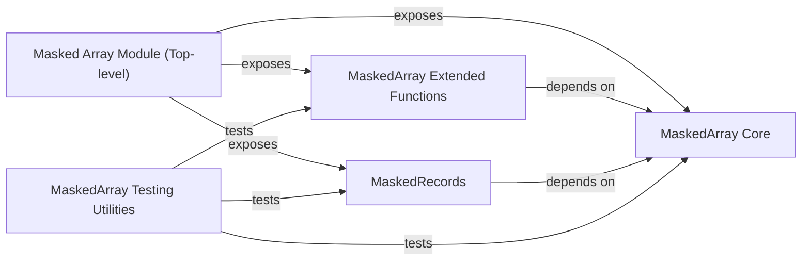

## Component Details

The Masked Array Module in NumPy extends standard array capabilities to handle data with missing or invalid entries. It provides a specialized `MaskedArray` class that wraps `ndarray` objects, along with a comprehensive set of functions for creating, manipulating, and performing computations on these masked arrays. The module ensures that operations correctly propagate masks, allowing for robust data analysis even with incomplete datasets. It is structured into core functionalities, extended operations, and specialized handling for structured arrays, all exposed through a unified top-level interface.

### Masked Array Module (Top-level)
This module serves as the primary interface for NumPy's masked array functionalities. It integrates and exposes core masked array classes, extended functions, and record handling, providing a unified API for working with data containing missing or invalid entries. It acts as an orchestrator, bringing together the specialized capabilities of its sub-modules.

**Related Classes/Methods**:

- `numpy.ma` (1:1000)

### MaskedArray Core
This component is the foundation of the masked array system. It defines the `MaskedArray` class, which is a subclass of `ndarray`, enabling array operations while respecting masked values. It also includes fundamental functions for mask creation (`make_mask`, `getmaskarray`), fill value management (`default_fill_value`, `set_fill_value`), and masked versions of universal functions (ufuncs) like `add`, `subtract`, `sqrt`, and `log`, ensuring proper mask propagation during calculations.

**Related Classes/Methods**:

- <a href="https://github.com/numpy/numpy/blob/master/numpy/ma/core.py#L1-L2000" target="_blank" rel="noopener noreferrer">`numpy.ma.core` (1:2000)</a>

### MaskedArray Extended Functions
This component extends the core `MaskedArray` functionality with a rich set of higher-level operations. It provides functions for statistical computations (`average`, `median`, `cov`, `corrcoef`), array manipulation (`apply_along_axis`, `hstack`, `vstack`), and utilities for identifying contiguous masked/unmasked regions (`clump_masked`, `clump_unmasked`). These functions build upon the `MaskedArray` class and its mask handling mechanisms.

**Related Classes/Methods**:

- <a href="https://github.com/numpy/numpy/blob/master/numpy/ma/extras.py#L1-L1000" target="_blank" rel="noopener noreferrer">`numpy.ma.extras` (1:1000)</a>

### MaskedRecords
This component specializes in handling structured arrays with masked fields. It defines the `MaskedRecords` class, which allows individual fields within a record to be masked. It provides constructors like `fromarrays` and `fromrecords` to create masked structured arrays and methods for field-specific masking and data access.

**Related Classes/Methods**:

- <a href="https://github.com/numpy/numpy/blob/master/numpy/ma/mrecords.py#L1-L1000" target="_blank" rel="noopener noreferrer">`numpy.ma.mrecords` (1:1000)</a>

### MaskedArray Testing Utilities
This component provides a dedicated set of utilities for testing the correctness and behavior of `MaskedArray` objects. It includes various assertion functions (`assert_equal`, `assert_almost_equal`, `assert_mask_equal`) that compare masked arrays, their data, and their masks, ensuring robust testing of masked array operations.

**Related Classes/Methods**:

- <a href="https://github.com/numpy/numpy/blob/master/numpy/ma/testutils.py#L1-L1000" target="_blank" rel="noopener noreferrer">`numpy.ma.testutils` (1:1000)</a>

### [FAQ](https://github.com/CodeBoarding/GeneratedOnBoardings/tree/main?tab=readme-ov-file#faq)