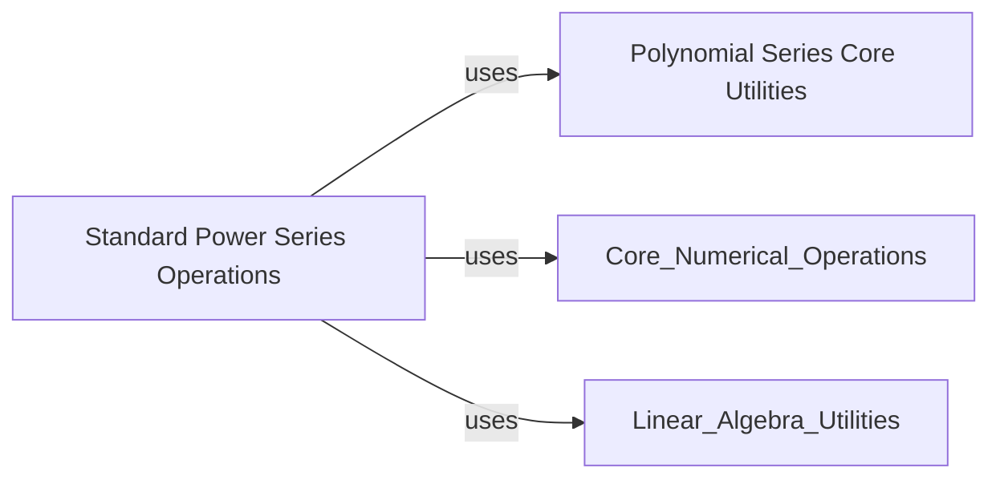

## Component Details

This graph illustrates the structure and interactions within the Polynomial Module, which provides a comprehensive framework for handling various polynomial series, including standard power series. The module is divided into core utility functions for basic polynomial operations and a dedicated component for standard power series, encompassing arithmetic, calculus, evaluation, root finding, and fitting functionalities. The main flow involves the Standard Power Series Operations component leveraging the Polynomial Series Core Utilities for fundamental coefficient manipulations, and also interacting with general numerical and linear algebra utilities from NumPy for advanced computations.

### Polynomial Series Core Utilities
This component provides fundamental utility functions for handling polynomial series coefficients, including conversion to standard series format, trimming trailing zeros, and basic arithmetic operations like addition, subtraction, and exponentiation at a lower level. It also includes functions for N-dimensional evaluation and Vandermonde matrix generation helpers, which are generic across polynomial types.

**Related Classes/Methods**:

- <a href="https://github.com/numpy/numpy/blob/master/numpy/polynomial/polyutils.py#L65-L143" target="_blank" rel="noopener noreferrer">`numpy.numpy.polynomial.polyutils.as_series` (65:143)</a>
- <a href="https://github.com/numpy/numpy/blob/master/numpy/polynomial/polyutils.py#L36-L62" target="_blank" rel="noopener noreferrer">`numpy.numpy.polynomial.polyutils.trimseq` (36:62)</a>
- <a href="https://github.com/numpy/numpy/blob/master/numpy/polynomial/polyutils.py#L557-L567" target="_blank" rel="noopener noreferrer">`numpy.numpy.polynomial.polyutils._add` (557:567)</a>
- <a href="https://github.com/numpy/numpy/blob/master/numpy/polynomial/polyutils.py#L570-L581" target="_blank" rel="noopener noreferrer">`numpy.numpy.polynomial.polyutils._sub` (570:581)</a>
- <a href="https://github.com/numpy/numpy/blob/master/numpy/polynomial/polyutils.py#L672-L702" target="_blank" rel="noopener noreferrer">`numpy.numpy.polynomial.polyutils._pow` (672:702)</a>
- <a href="https://github.com/numpy/numpy/blob/master/numpy/polynomial/polyutils.py#L705-L724" target="_blank" rel="noopener noreferrer">`numpy.numpy.polynomial.polyutils._as_int` (705:724)</a>
- <a href="https://github.com/numpy/numpy/blob/master/numpy/polynomial/polyutils.py#L445-L472" target="_blank" rel="noopener noreferrer">`numpy.numpy.polynomial.polyutils._fromroots` (445:472)</a>
- <a href="https://github.com/numpy/numpy/blob/master/numpy/polynomial/polyutils.py#L475-L502" target="_blank" rel="noopener noreferrer">`numpy.numpy.polynomial.polyutils._valnd` (475:502)</a>
- <a href="https://github.com/numpy/numpy/blob/master/numpy/polynomial/polyutils.py#L505-L518" target="_blank" rel="noopener noreferrer">`numpy.numpy.polynomial.polyutils._gridnd` (505:518)</a>
- <a href="https://github.com/numpy/numpy/blob/master/numpy/polynomial/polyutils.py#L435-L442" target="_blank" rel="noopener noreferrer">`numpy.numpy.polynomial.polyutils._vander_nd_flat` (435:442)</a>
- <a href="https://github.com/numpy/numpy/blob/master/numpy/polynomial/polyutils.py#L584-L669" target="_blank" rel="noopener noreferrer">`numpy.numpy.polynomial.polyutils._fit` (584:669)</a>

### Standard Power Series Operations
This component encapsulates the core `Polynomial` class and all its associated functionalities for standard power series, including arithmetic operations (addition, subtraction, multiplication, division, exponentiation), calculus operations (differentiation, integration), evaluation at various points (1D, 2D, 3D grids), construction from and finding of roots, and fitting polynomials to data using least squares.

**Related Classes/Methods**:

- <a href="https://github.com/numpy/numpy/blob/master/numpy/polynomial/polynomial.py#L1555-L1623" target="_blank" rel="noopener noreferrer">`numpy.numpy.polynomial.polynomial.Polynomial` (1555:1623)</a>
- <a href="https://github.com/numpy/numpy/blob/master/numpy/polynomial/polynomial.py#L217-L250" target="_blank" rel="noopener noreferrer">`numpy.numpy.polynomial.polynomial.polyadd` (217:250)</a>
- <a href="https://github.com/numpy/numpy/blob/master/numpy/polynomial/polynomial.py#L253-L287" target="_blank" rel="noopener noreferrer">`numpy.numpy.polynomial.polynomial.polysub` (253:287)</a>
- <a href="https://github.com/numpy/numpy/blob/master/numpy/polynomial/polynomial.py#L290-L329" target="_blank" rel="noopener noreferrer">`numpy.numpy.polynomial.polynomial.polymulx` (290:329)</a>
- <a href="https://github.com/numpy/numpy/blob/master/numpy/polynomial/polynomial.py#L332-L367" target="_blank" rel="noopener noreferrer">`numpy.numpy.polynomial.polynomial.polymul` (332:367)</a>
- <a href="https://github.com/numpy/numpy/blob/master/numpy/polynomial/polynomial.py#L370-L425" target="_blank" rel="noopener noreferrer">`numpy.numpy.polynomial.polynomial.polydiv` (370:425)</a>
- <a href="https://github.com/numpy/numpy/blob/master/numpy/polynomial/polynomial.py#L428-L464" target="_blank" rel="noopener noreferrer">`numpy.numpy.polynomial.polynomial.polypow` (428:464)</a>
- <a href="https://github.com/numpy/numpy/blob/master/numpy/polynomial/polynomial.py#L467-L544" target="_blank" rel="noopener noreferrer">`numpy.numpy.polynomial.polynomial.polyder` (467:544)</a>
- <a href="https://github.com/numpy/numpy/blob/master/numpy/polynomial/polynomial.py#L547-L661" target="_blank" rel="noopener noreferrer">`numpy.numpy.polynomial.polynomial.polyint` (547:661)</a>
- <a href="https://github.com/numpy/numpy/blob/master/numpy/polynomial/polynomial.py#L153-L214" target="_blank" rel="noopener noreferrer">`numpy.numpy.polynomial.polynomial.polyfromroots` (153:214)</a>
- <a href="https://github.com/numpy/numpy/blob/master/numpy/polynomial/polynomial.py#L759-L843" target="_blank" rel="noopener noreferrer">`numpy.numpy.polynomial.polynomial.polyvalfromroots` (759:843)</a>
- <a href="https://github.com/numpy/numpy/blob/master/numpy/polynomial/polynomial.py#L852-L901" target="_blank" rel="noopener noreferrer">`numpy.numpy.polynomial.polynomial.polyval2d` (852:901)</a>
- <a href="https://github.com/numpy/numpy/blob/master/numpy/polynomial/polynomial.py#L904-L957" target="_blank" rel="noopener noreferrer">`numpy.numpy.polynomial.polynomial.polygrid2d` (904:957)</a>
- <a href="https://github.com/numpy/numpy/blob/master/numpy/polynomial/polynomial.py#L960-L1010" target="_blank" rel="noopener noreferrer">`numpy.numpy.polynomial.polynomial.polyval3d` (960:1010)</a>
- <a href="https://github.com/numpy/numpy/blob/master/numpy/polynomial/polynomial.py#L1013-L1069" target="_blank" rel="noopener noreferrer">`numpy.numpy.polynomial.polynomial.polygrid3d` (1013:1069)</a>
- <a href="https://github.com/numpy/numpy/blob/master/numpy/polynomial/polynomial.py#L1072-L1136" target="_blank" rel="noopener noreferrer">`numpy.numpy.polynomial.polynomial.polyvander` (1072:1136)</a>
- <a href="https://github.com/numpy/numpy/blob/master/numpy/polynomial/polynomial.py#L1139-L1215" target="_blank" rel="noopener noreferrer">`numpy.numpy.polynomial.polynomial.polyvander2d` (1139:1215)</a>
- <a href="https://github.com/numpy/numpy/blob/master/numpy/polynomial/polynomial.py#L1218-L1289" target="_blank" rel="noopener noreferrer">`numpy.numpy.polynomial.polynomial.polyvander3d` (1218:1289)</a>
- <a href="https://github.com/numpy/numpy/blob/master/numpy/polynomial/polynomial.py#L1446-L1486" target="_blank" rel="noopener noreferrer">`numpy.numpy.polynomial.polynomial.polycompanion` (1446:1486)</a>
- <a href="https://github.com/numpy/numpy/blob/master/numpy/polynomial/polynomial.py#L1489-L1548" target="_blank" rel="noopener noreferrer">`numpy.numpy.polynomial.polynomial.polyroots` (1489:1548)</a>
- <a href="https://github.com/numpy/numpy/blob/master/numpy/polynomial/polynomial.py#L1292-L1443" target="_blank" rel="noopener noreferrer">`numpy.numpy.polynomial.polynomial.polyfit` (1292:1443)</a>
- <a href="https://github.com/numpy/numpy/blob/master/numpy/_core/numeric.py#L807-L903" target="_blank" rel="noopener noreferrer">`numpy._core.numeric.convolve` (807:903)</a>
- <a href="https://github.com/numpy/numpy/blob/master/numpy/_core/numeric.py#L1483-L1549" target="_blank" rel="noopener noreferrer">`numpy._core.numeric.moveaxis` (1483:1549)</a>
- <a href="https://github.com/numpy/numpy/blob/master/numpy/_core/fromnumeric.py#L3523-L3558" target="_blank" rel="noopener noreferrer">`numpy._core.fromnumeric.ndim` (3523:3558)</a>
- <a href="https://github.com/numpy/numpy/blob/master/numpy/_core/fromnumeric.py#L2589-L2675" target="_blank" rel="noopener noreferrer">`numpy._core.fromnumeric.all` (2589:2675)</a>
- <a href="https://github.com/numpy/numpy/blob/master/numpy/lib/_function_base_impl.py#L359-L401" target="_blank" rel="noopener noreferrer">`numpy.lib._function_base_impl.iterable` (359:401)</a>
- <a href="https://github.com/numpy/numpy/blob/master/numpy/_core/fromnumeric.py#L3328-L3445" target="_blank" rel="noopener noreferrer">`numpy._core.fromnumeric.prod` (3328:3445)</a>
- <a href="https://github.com/numpy/numpy/blob/master/numpy/linalg/_linalg.py#L1192-L1279" target="_blank" rel="noopener noreferrer">`numpy.linalg._linalg.eigvals` (1192:1279)</a>
- <a href="https://github.com/numpy/numpy/blob/master/numpy/polynomial/polynomial.py#L1-L800" target="_blank" rel="noopener noreferrer">`numpy.numpy.polynomial.polynomial` (1:800)</a>

### [FAQ](https://github.com/CodeBoarding/GeneratedOnBoardings/tree/main?tab=readme-ov-file#faq)