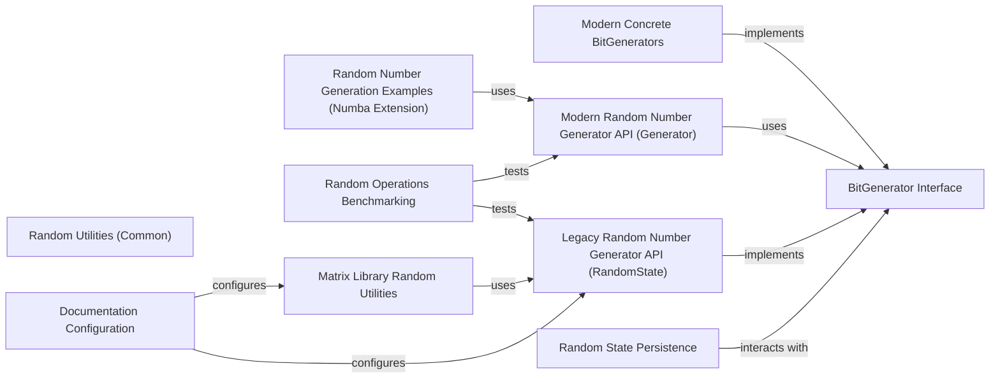

## Component Details

This subsystem provides comprehensive tools for generating pseudo-random numbers, supporting both a modern BitGenerator-based architecture for enhanced reproducibility and statistical quality, and a legacy API for backward compatibility. It encompasses the core interfaces for random number generation, concrete implementations of various algorithms, high-level APIs for user interaction, mechanisms for state persistence, and utilities for common random operations, including benchmarking and examples for extension.

### BitGenerator Interface
This component defines the abstract interface (BitGenerator class) and core seeding mechanisms (SeedSequence, SeedlessSeedSequence) that all random number generators in NumPy adhere to, ensuring a consistent foundation for reproducibility and statistical quality.

**Related Classes/Methods**:

- `numpy.random.bit_generator.BitGenerator` (full file reference)
- `numpy.random.bit_generator.SeedSequence` (full file reference)
- `numpy.random.bit_generator.SeedlessSeedSequence` (full file reference)

### Modern Concrete BitGenerators
This component provides the specific implementations of various modern pseudo-random number generation algorithms, all of which inherit from the BitGenerator interface.

**Related Classes/Methods**:

- `numpy.random._mt19937.MT19937` (full file reference)
- `numpy.random._pcg64.PCG64` (full file reference)
- `numpy.random._pcg64.PCG64DXSM` (full file reference)
- `numpy.random._philox.Philox` (full file reference)
- `numpy.random._sfc64.SFC64` (full file reference)

### Modern Random Number Generator API (Generator)
This component offers a high-level, user-friendly interface for generating random numbers, built upon the BitGenerator interface. It provides methods for drawing from various statistical distributions and a default generator instance.

**Related Classes/Methods**:

- `numpy.random._generator.Generator` (full file reference)
- `numpy.random._generator.default_rng` (full file reference)

### Legacy Random Number Generator API (RandomState)
This component provides the older, mtrand-based API for random number generation. While it offers similar functionalities to the modern Generator, its core RandomState class is also a BitGenerator, indicating its integration into the newer architecture for internal consistency.

**Related Classes/Methods**:

- `numpy.random.mtrand.RandomState` (full file reference)
- `numpy.random.mtrand.rand` (full file reference)
- `numpy.random.mtrand.randn` (full file reference)
- `numpy.random.mtrand.choice` (full file reference)
- `numpy.random.mtrand.randint` (full file reference)
- `numpy.random.mtrand.shuffle` (full file reference)
- `numpy.random.mtrand.permutation` (full file reference)
- `numpy.random.mtrand.uniform` (full file reference)
- `numpy.random.mtrand.seed` (full file reference)
- `numpy.random.mtrand.random` (full file reference)
- `numpy.random.mtrand.random_integers` (full file reference)
- `numpy.random.mtrand.standard_normal` (full file reference)

### Random State Persistence
This component handles the serialization and deserialization (pickling) of random number generator states, ensuring reproducibility across sessions for both legacy and modern generators.

**Related Classes/Methods**:

- <a href="https://github.com/numpy/numpy/blob/master/numpy/random/_pickle.py#L43-L65" target="_blank" rel="noopener noreferrer">`numpy.random._pickle.__generator_ctor` (43:65)</a>
- <a href="https://github.com/numpy/numpy/blob/master/numpy/random/_pickle.py#L68-L88" target="_blank" rel="noopener noreferrer">`numpy.random._pickle.__randomstate_ctor` (68:88)</a>
- <a href="https://github.com/numpy/numpy/blob/master/numpy/random/_pickle.py#L17-L40" target="_blank" rel="noopener noreferrer">`numpy.random._pickle.__bit_generator_ctor` (17:40)</a>

### Random Utilities (Common)
This component contains common utility functions or helper methods used across different random number generation modules.

**Related Classes/Methods**:

- `numpy.random._common` (full file reference)

### Random Number Generation Examples (Numba Extension)
This component provides example code demonstrating how to extend NumPy's random number generation capabilities using Numba.

**Related Classes/Methods**:

- <a href="https://github.com/numpy/numpy/blob/master/numpy/random/_examples/numba/extending.py#L40-L41" target="_blank" rel="noopener noreferrer">`numpy.random._examples.numba.extending:numpycall` (40:41)</a>
- <a href="https://github.com/numpy/numpy/blob/master/numpy/random/_examples/numba/extending.py#L80-L83" target="_blank" rel="noopener noreferrer">`numpy.random._examples.numba.extending:bounded_uints` (80:83)</a>
- <a href="https://github.com/numpy/numpy/blob/master/numpy/random/_examples/numba/extending.py#L61-L73" target="_blank" rel="noopener noreferrer">`numpy.random._examples.numba.extending:bounded_uint` (61:73)</a>

### Random Operations Benchmarking
This component comprises various benchmark tests designed to measure the performance of different random number generation functions and related operations within NumPy.

**Related Classes/Methods**:

- <a href="https://github.com/numpy/numpy/blob/master/benchmarks/benchmarks/bench_random.py#L31-L32" target="_blank" rel="noopener noreferrer">`numpy.benchmarks.benchmarks.bench_random.Shuffle:time_100000` (31:32)</a>
- <a href="https://github.com/numpy/numpy/blob/master/benchmarks/benchmarks/bench_random.py#L37-L39" target="_blank" rel="noopener noreferrer">`numpy.benchmarks.benchmarks.bench_random.Randint:time_randint_fast` (37:39)</a>
- <a href="https://github.com/numpy/numpy/blob/master/benchmarks/benchmarks/bench_random.py#L41-L43" target="_blank" rel="noopener noreferrer">`numpy.benchmarks.benchmarks.bench_random.Randint:time_randint_slow` (41:43)</a>
- `numpy.benchmarks.benchmarks.Randint_dtype:time_randint_fast` (full file reference)
- `numpy.benchmarks.benchmarks.Randint_dtype:time_randint_slow` (full file reference)
- <a href="https://github.com/numpy/numpy/blob/master/benchmarks/benchmarks/bench_random.py#L73-L76" target="_blank" rel="noopener noreferrer">`numpy.benchmarks.benchmarks.bench_random.Permutation:setup` (73:76)</a>
- <a href="https://github.com/numpy/numpy/blob/master/benchmarks/benchmarks/bench_random.py#L78-L79" target="_blank" rel="noopener noreferrer">`numpy.benchmarks.benchmarks.bench_random.Permutation:time_permutation_1d` (78:79)</a>
- <a href="https://github.com/numpy/numpy/blob/master/benchmarks/benchmarks/bench_random.py#L81-L82" target="_blank" rel="noopener noreferrer">`numpy.benchmarks.benchmarks.bench_random.Permutation:time_permutation_2d` (81:82)</a>
- <a href="https://github.com/numpy/numpy/blob/master/benchmarks/benchmarks/bench_random.py#L84-L85" target="_blank" rel="noopener noreferrer">`numpy.benchmarks.benchmarks.bench_random.Permutation:time_permutation_int` (84:85)</a>
- <a href="https://github.com/numpy/numpy/blob/master/benchmarks/benchmarks/bench_random.py#L94-L102" target="_blank" rel="noopener noreferrer">`numpy.benchmarks.benchmarks.bench_random.RNG:setup` (94:102)</a>
- <a href="https://github.com/numpy/numpy/blob/master/benchmarks/benchmarks/bench_random.py#L104-L108" target="_blank" rel="noopener noreferrer">`numpy.benchmarks.benchmarks.bench_random.RNG:time_raw` (104:108)</a>
- <a href="https://github.com/numpy/numpy/blob/master/benchmarks/benchmarks/bench_random.py#L110-L115" target="_blank" rel="noopener noreferrer">`numpy.benchmarks.benchmarks.bench_random.RNG:time_32bit` (110:115)</a>
- <a href="https://github.com/numpy/numpy/blob/master/benchmarks/benchmarks/bench_random.py#L117-L122" target="_blank" rel="noopener noreferrer">`numpy.benchmarks.benchmarks.bench_random.RNG:time_64bit` (117:122)</a>
- <a href="https://github.com/numpy/numpy/blob/master/benchmarks/benchmarks/bench_random.py#L124-L125" target="_blank" rel="noopener noreferrer">`numpy.benchmarks.benchmarks.bench_random.RNG:time_normal_zig` (124:125)</a>
- <a href="https://github.com/numpy/numpy/blob/master/benchmarks/benchmarks/bench_random.py#L150-L156" target="_blank" rel="noopener noreferrer">`numpy.benchmarks.benchmarks.bench_random.Bounded:setup` (150:156)</a>
- <a href="https://github.com/numpy/numpy/blob/master/benchmarks/benchmarks/bench_random.py#L158-L173" target="_blank" rel="noopener noreferrer">`numpy.benchmarks.benchmarks.bench_random.Bounded:time_bounded` (158:173)</a>
- <a href="https://github.com/numpy/numpy/blob/master/benchmarks/benchmarks/bench_random.py#L178-L180" target="_blank" rel="noopener noreferrer">`numpy.benchmarks.benchmarks.bench_random.Choice:setup` (178:180)</a>
- <a href="https://github.com/numpy/numpy/blob/master/benchmarks/benchmarks/bench_random.py#L182-L183" target="_blank" rel="noopener noreferrer">`numpy.benchmarks.benchmarks.bench_random.Choice:time_legacy_choice` (182:183)</a>

### Matrix Library Random Utilities
This component provides convenience functions for generating random matrices, often by delegating to the underlying random number generation facilities.

**Related Classes/Methods**:

- <a href="https://github.com/numpy/numpy/blob/master/numpy/matlib.py#L233-L277" target="_blank" rel="noopener noreferrer">`numpy.numpy.matlib:rand` (233:277)</a>
- <a href="https://github.com/numpy/numpy/blob/master/numpy/matlib.py#L279-L330" target="_blank" rel="noopener noreferrer">`numpy.numpy.matlib:randn` (279:330)</a>

### Documentation Configuration
This component includes configuration settings used during the documentation generation process, specifically related to NumPy's functionalities.

**Related Classes/Methods**:

- <a href="https://github.com/numpy/numpy/blob/master/doc/conftest.py#L31-L33" target="_blank" rel="noopener noreferrer">`numpy.doc.conftest:add_np` (31:33)</a>

### [FAQ](https://github.com/CodeBoarding/GeneratedOnBoardings/tree/main?tab=readme-ov-file#faq)