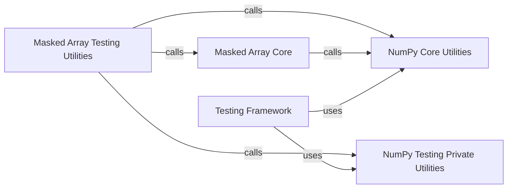

## Component Details

The Testing Framework subsystem in NumPy provides a robust set of tools for validating NumPy code, particularly focusing on array comparisons and handling of masked data. It is built upon core NumPy array operations and specialized masked array functionalities, ensuring the correctness and quality of numerical computations, especially in the presence of missing or invalid data.

### Testing Framework
This component provides a comprehensive set of utilities and assertions specifically designed for testing NumPy code. It includes functions for comparing arrays with various tolerances, managing warnings, and tools for performance and memory profiling, crucial for maintaining code quality and correctness.

**Related Classes/Methods**:

- <a href="https://github.com/numpy/numpy/blob/master/numpy/testing/_private/utils.py#L1-L1000" target="_blank" rel="noopener noreferrer">`numpy.testing._private.utils` (1:1000)</a>

### Masked Array Core
This component is the heart of the `numpy.ma` subsystem. It defines the `MaskedArray` class, which is a subclass of `numpy.ndarray` designed to handle arrays with missing or invalid data. It provides fundamental functionalities for creating, manipulating, and managing the data and associated boolean masks, including operations like retrieving data (`getdata`), retrieving masks (`getmask`), combining masks (`mask_or`), and filling masked values (`filled`). It also defines various masked versions of universal functions (ufuncs) and array methods.

**Related Classes/Methods**:

- <a href="https://github.com/numpy/numpy/blob/master/numpy/ma/core.py#L2771-L6532" target="_blank" rel="noopener noreferrer">`numpy.ma.core.MaskedArray` (2771:6532)</a>
- <a href="https://github.com/numpy/numpy/blob/master/numpy/ma/core.py#L1411-L1468" target="_blank" rel="noopener noreferrer">`numpy.ma.core.getmask` (1411:1468)</a>
- <a href="https://github.com/numpy/numpy/blob/master/numpy/ma/core.py#L1759-L1813" target="_blank" rel="noopener noreferrer">`numpy.ma.core.mask_or` (1759:1813)</a>
- <a href="https://github.com/numpy/numpy/blob/master/numpy/ma/core.py#L630-L689" target="_blank" rel="noopener noreferrer">`numpy.ma.core.filled` (630:689)</a>
- <a href="https://github.com/numpy/numpy/blob/master/numpy/ma/core.py#L719-L768" target="_blank" rel="noopener noreferrer">`numpy.ma.core.getdata` (719:768)</a>
- <a href="https://github.com/numpy/numpy/blob/master/numpy/ma/core.py#L1607-L1695" target="_blank" rel="noopener noreferrer">`numpy.ma.core.make_mask` (1607:1695)</a>
- <a href="https://github.com/numpy/numpy/blob/master/numpy/ma/core.py#L1698-L1746" target="_blank" rel="noopener noreferrer">`numpy.ma.core.make_mask_none` (1698:1746)</a>
- <a href="https://github.com/numpy/numpy/blob/master/numpy/ma/core.py#L1528-L1594" target="_blank" rel="noopener noreferrer">`numpy.ma.core.is_mask` (1528:1594)</a>
- `numpy.ma.core.masked_array` (full file reference)
- `numpy.ma.core.masked` (full file reference)
- <a href="https://github.com/numpy/numpy/blob/master/numpy/ma/core.py#L260-L313" target="_blank" rel="noopener noreferrer">`numpy.ma.core.default_fill_value` (260:313)</a>
- <a href="https://github.com/numpy/numpy/blob/master/numpy/ma/core.py#L330-L379" target="_blank" rel="noopener noreferrer">`numpy.ma.core.minimum_fill_value` (330:379)</a>
- <a href="https://github.com/numpy/numpy/blob/master/numpy/ma/core.py#L382-L431" target="_blank" rel="noopener noreferrer">`numpy.ma.core.maximum_fill_value` (382:431)</a>
- <a href="https://github.com/numpy/numpy/blob/master/numpy/ma/core.py#L519-L581" target="_blank" rel="noopener noreferrer">`numpy.ma.core.set_fill_value` (519:581)</a>
- <a href="https://github.com/numpy/numpy/blob/master/numpy/ma/core.py#L584-L594" target="_blank" rel="noopener noreferrer">`numpy.ma.core.get_fill_value` (584:594)</a>
- <a href="https://github.com/numpy/numpy/blob/master/numpy/ma/core.py#L597-L627" target="_blank" rel="noopener noreferrer">`numpy.ma.core.common_fill_value` (597:627)</a>
- <a href="https://github.com/numpy/numpy/blob/master/numpy/ma/core.py#L774-L831" target="_blank" rel="noopener noreferrer">`numpy.ma.core.fix_invalid` (774:831)</a>
- <a href="https://github.com/numpy/numpy/blob/master/numpy/ma/core.py#L1885-L2005" target="_blank" rel="noopener noreferrer">`numpy.ma.core.masked_where` (1885:2005)</a>
- <a href="https://github.com/numpy/numpy/blob/master/numpy/ma/core.py#L2008-L2032" target="_blank" rel="noopener noreferrer">`numpy.ma.core.masked_greater` (2008:2032)</a>
- <a href="https://github.com/numpy/numpy/blob/master/numpy/ma/core.py#L2035-L2059" target="_blank" rel="noopener noreferrer">`numpy.ma.core.masked_greater_equal` (2035:2059)</a>
- <a href="https://github.com/numpy/numpy/blob/master/numpy/ma/core.py#L2062-L2086" target="_blank" rel="noopener noreferrer">`numpy.ma.core.masked_less` (2062:2086)</a>
- <a href="https://github.com/numpy/numpy/blob/master/numpy/ma/core.py#L2089-L2113" target="_blank" rel="noopener noreferrer">`numpy.ma.core.masked_less_equal` (2089:2113)</a>
- <a href="https://github.com/numpy/numpy/blob/master/numpy/ma/core.py#L2116-L2140" target="_blank" rel="noopener noreferrer">`numpy.ma.core.masked_not_equal` (2116:2140)</a>
- <a href="https://github.com/numpy/numpy/blob/master/numpy/ma/core.py#L2143-L2173" target="_blank" rel="noopener noreferrer">`numpy.ma.core.masked_equal` (2143:2173)</a>
- <a href="https://github.com/numpy/numpy/blob/master/numpy/ma/core.py#L2176-L2214" target="_blank" rel="noopener noreferrer">`numpy.ma.core.masked_inside` (2176:2214)</a>
- <a href="https://github.com/numpy/numpy/blob/master/numpy/ma/core.py#L2217-L2255" target="_blank" rel="noopener noreferrer">`numpy.ma.core.masked_outside` (2217:2255)</a>
- <a href="https://github.com/numpy/numpy/blob/master/numpy/ma/core.py#L2258-L2324" target="_blank" rel="noopener noreferrer">`numpy.ma.core.masked_object` (2258:2324)</a>
- <a href="https://github.com/numpy/numpy/blob/master/numpy/ma/core.py#L2327-L2397" target="_blank" rel="noopener noreferrer">`numpy.ma.core.masked_values` (2327:2397)</a>
- <a href="https://github.com/numpy/numpy/blob/master/numpy/ma/core.py#L2400-L2434" target="_blank" rel="noopener noreferrer">`numpy.ma.core.masked_invalid` (2400:2434)</a>
- <a href="https://github.com/numpy/numpy/blob/master/numpy/ma/core.py#L6686-L6735" target="_blank" rel="noopener noreferrer">`numpy.ma.core.isMaskedArray` (6686:6735)</a>
- <a href="https://github.com/numpy/numpy/blob/master/numpy/ma/core.py#L6879-L6930" target="_blank" rel="noopener noreferrer">`numpy.ma.core.is_masked` (6879:6930)</a>
- <a href="https://github.com/numpy/numpy/blob/master/numpy/ma/core.py#L6860-L6873" target="_blank" rel="noopener noreferrer">`numpy.ma.core.array` (6860:6873)</a>
- <a href="https://github.com/numpy/numpy/blob/master/numpy/ma/core.py#L7931-L8020" target="_blank" rel="noopener noreferrer">`numpy.ma.core.where` (7931:8020)</a>
- <a href="https://github.com/numpy/numpy/blob/master/numpy/ma/core.py#L8023-L8096" target="_blank" rel="noopener noreferrer">`numpy.ma.core.choose` (8023:8096)</a>
- <a href="https://github.com/numpy/numpy/blob/master/numpy/ma/core.py#L7133-L7209" target="_blank" rel="noopener noreferrer">`numpy.ma.core.power` (7133:7209)</a>
- <a href="https://github.com/numpy/numpy/blob/master/numpy/ma/core.py#L8176-L8254" target="_blank" rel="noopener noreferrer">`numpy.ma.core.dot` (8176:8254)</a>
- <a href="https://github.com/numpy/numpy/blob/master/numpy/ma/core.py#L8257-L8271" target="_blank" rel="noopener noreferrer">`numpy.ma.core.inner` (8257:8271)</a>
- <a href="https://github.com/numpy/numpy/blob/master/numpy/ma/core.py#L8279-L8291" target="_blank" rel="noopener noreferrer">`numpy.ma.core.outer` (8279:8291)</a>
- <a href="https://github.com/numpy/numpy/blob/master/numpy/ma/core.py#L8318-L8374" target="_blank" rel="noopener noreferrer">`numpy.ma.core.correlate` (8318:8374)</a>
- <a href="https://github.com/numpy/numpy/blob/master/numpy/ma/core.py#L8377-L8402" target="_blank" rel="noopener noreferrer">`numpy.ma.core.convolve` (8377:8402)</a>
- <a href="https://github.com/numpy/numpy/blob/master/numpy/ma/core.py#L8405-L8461" target="_blank" rel="noopener noreferrer">`numpy.ma.core.allequal` (8405:8461)</a>
- <a href="https://github.com/numpy/numpy/blob/master/numpy/ma/core.py#L8464-L8570" target="_blank" rel="noopener noreferrer">`numpy.ma.core.allclose` (8464:8570)</a>
- <a href="https://github.com/numpy/numpy/blob/master/numpy/ma/core.py#L8573-L8620" target="_blank" rel="noopener noreferrer">`numpy.ma.core.asarray` (8573:8620)</a>
- <a href="https://github.com/numpy/numpy/blob/master/numpy/ma/core.py#L8623-L8670" target="_blank" rel="noopener noreferrer">`numpy.ma.core.asanyarray` (8623:8670)</a>
- <a href="https://github.com/numpy/numpy/blob/master/numpy/ma/core.py#L8683-L8745" target="_blank" rel="noopener noreferrer">`numpy.ma.core.fromflex` (8683:8745)</a>
- `numpy.ma.core.arange` (full file reference)
- `numpy.ma.core.clip` (full file reference)
- `numpy.ma.core.empty` (full file reference)
- `numpy.ma.core.empty_like` (full file reference)
- `numpy.ma.core.frombuffer` (full file reference)
- `numpy.ma.core.fromfunction` (full file reference)
- `numpy.ma.core.identity` (full file reference)
- `numpy.ma.core.indices` (full file reference)
- `numpy.ma.core.ones` (full file reference)
- `numpy.ma.core.ones_like` (full file reference)
- `numpy.ma.core.squeeze` (full file reference)
- `numpy.ma.core.zeros` (full file reference)
- `numpy.ma.core.zeros_like` (full file reference)
- <a href="https://github.com/numpy/numpy/blob/master/numpy/ma/core.py#L8897-L8936" target="_blank" rel="noopener noreferrer">`numpy.ma.core.append` (8897:8936)</a>
- <a href="https://github.com/numpy/numpy/blob/master/numpy/ma/core.py#L7376-L7424" target="_blank" rel="noopener noreferrer">`numpy.ma.core.diag` (7376:7424)</a>
- <a href="https://github.com/numpy/numpy/blob/master/numpy/ma/core.py#L7427-L7472" target="_blank" rel="noopener noreferrer">`numpy.ma.core.left_shift` (7427:7472)</a>
- <a href="https://github.com/numpy/numpy/blob/master/numpy/ma/core.py#L7475-L7509" target="_blank" rel="noopener noreferrer">`numpy.ma.core.right_shift` (7475:7509)</a>
- <a href="https://github.com/numpy/numpy/blob/master/numpy/ma/core.py#L7512-L7550" target="_blank" rel="noopener noreferrer">`numpy.ma.core.put` (7512:7550)</a>
- <a href="https://github.com/numpy/numpy/blob/master/numpy/ma/core.py#L7553-L7606" target="_blank" rel="noopener noreferrer">`numpy.ma.core.putmask` (7553:7606)</a>
- <a href="https://github.com/numpy/numpy/blob/master/numpy/ma/core.py#L7609-L7645" target="_blank" rel="noopener noreferrer">`numpy.ma.core.transpose` (7609:7645)</a>
- <a href="https://github.com/numpy/numpy/blob/master/numpy/ma/core.py#L7648-L7695" target="_blank" rel="noopener noreferrer">`numpy.ma.core.reshape` (7648:7695)</a>
- <a href="https://github.com/numpy/numpy/blob/master/numpy/ma/core.py#L7698-L7760" target="_blank" rel="noopener noreferrer">`numpy.ma.core.resize` (7698:7760)</a>
- <a href="https://github.com/numpy/numpy/blob/master/numpy/ma/core.py#L7763-L7768" target="_blank" rel="noopener noreferrer">`numpy.ma.core.ndim` (7763:7768)</a>
- <a href="https://github.com/numpy/numpy/blob/master/numpy/ma/core.py#L7774-L7776" target="_blank" rel="noopener noreferrer">`numpy.ma.core.shape` (7774:7776)</a>
- <a href="https://github.com/numpy/numpy/blob/master/numpy/ma/core.py#L7782-L7784" target="_blank" rel="noopener noreferrer">`numpy.ma.core.size` (7782:7784)</a>
- <a href="https://github.com/numpy/numpy/blob/master/numpy/ma/core.py#L7790-L7923" target="_blank" rel="noopener noreferrer">`numpy.ma.core.diff` (7790:7923)</a>
- <a href="https://github.com/numpy/numpy/blob/master/numpy/ma/core.py#L8099-L8152" target="_blank" rel="noopener noreferrer">`numpy.ma.core.round_` (8099:8152)</a>
- `numpy.ma.core.round` (full file reference)
- `numpy.ma.core.around` (full file reference)
- `numpy.ma.core.all` (full file reference)
- `numpy.ma.core.any` (full file reference)
- `numpy.ma.core.cumsum` (full file reference)
- `numpy.ma.core.prod` (full file reference)
- `numpy.ma.core.cumprod` (full file reference)
- `numpy.ma.core.mean` (full file reference)
- `numpy.ma.core.anom` (full file reference)
- `numpy.ma.core.var` (full file reference)
- `numpy.ma.core.std` (full file reference)
- <a href="https://github.com/numpy/numpy/blob/master/numpy/ma/core.py#L7215-L7228" target="_blank" rel="noopener noreferrer">`numpy.ma.core.argsort` (7215:7228)</a>
- `numpy.ma.core.argmin` (full file reference)
- `numpy.ma.core.argmax` (full file reference)
- <a href="https://github.com/numpy/numpy/blob/master/numpy/ma/core.py#L7233-L7273" target="_blank" rel="noopener noreferrer">`numpy.ma.core.sort` (7233:7273)</a>
- <a href="https://github.com/numpy/numpy/blob/master/numpy/ma/core.py#L7006-L7015" target="_blank" rel="noopener noreferrer">`numpy.ma.core.min` (7006:7015)</a>
- <a href="https://github.com/numpy/numpy/blob/master/numpy/ma/core.py#L7020-L7029" target="_blank" rel="noopener noreferrer">`numpy.ma.core.max` (7020:7029)</a>
- <a href="https://github.com/numpy/numpy/blob/master/numpy/ma/core.py#L7035-L7043" target="_blank" rel="noopener noreferrer">`numpy.ma.core.ptp` (7035:7043)</a>
- <a href="https://github.com/numpy/numpy/blob/master/numpy/ma/core.py#L2660-L2767" target="_blank" rel="noopener noreferrer">`numpy.ma.core.MaskedIterator` (2660:2767)</a>
- <a href="https://github.com/numpy/numpy/blob/master/numpy/ma/core.py#L6545-L6678" target="_blank" rel="noopener noreferrer">`numpy.ma.core.mvoid` (6545:6678)</a>

### Masked Array Testing Utilities
This component provides specialized assertion functions for testing the correctness of `MaskedArray` operations. These functions extend standard NumPy testing utilities to account for masked values and provide detailed error messages specific to masked array comparisons.

**Related Classes/Methods**:

- <a href="https://github.com/numpy/numpy/blob/master/numpy/ma/testutils.py#L45-L66" target="_blank" rel="noopener noreferrer">`numpy.ma.testutils.approx` (45:66)</a>
- <a href="https://github.com/numpy/numpy/blob/master/numpy/ma/testutils.py#L69-L87" target="_blank" rel="noopener noreferrer">`numpy.ma.testutils.almost` (69:87)</a>
- <a href="https://github.com/numpy/numpy/blob/master/numpy/ma/testutils.py#L90-L97" target="_blank" rel="noopener noreferrer">`numpy.ma.testutils._assert_equal_on_sequences` (90:97)</a>
- <a href="https://github.com/numpy/numpy/blob/master/numpy/ma/testutils.py#L100-L111" target="_blank" rel="noopener noreferrer">`numpy.ma.testutils.assert_equal_records` (100:111)</a>
- <a href="https://github.com/numpy/numpy/blob/master/numpy/ma/testutils.py#L114-L150" target="_blank" rel="noopener noreferrer">`numpy.ma.testutils.assert_equal` (114:150)</a>
- <a href="https://github.com/numpy/numpy/blob/master/numpy/ma/testutils.py#L153-L176" target="_blank" rel="noopener noreferrer">`numpy.ma.testutils.fail_if_equal` (153:176)</a>
- <a href="https://github.com/numpy/numpy/blob/master/numpy/ma/testutils.py#L182-L195" target="_blank" rel="noopener noreferrer">`numpy.ma.testutils.assert_almost_equal` (182:195)</a>
- <a href="https://github.com/numpy/numpy/blob/master/numpy/ma/testutils.py#L201-L223" target="_blank" rel="noopener noreferrer">`numpy.ma.testutils.assert_array_compare` (201:223)</a>
- <a href="https://github.com/numpy/numpy/blob/master/numpy/ma/testutils.py#L226-L233" target="_blank" rel="noopener noreferrer">`numpy.ma.testutils.assert_array_equal` (226:233)</a>
- <a href="https://github.com/numpy/numpy/blob/master/numpy/ma/testutils.py#L236-L244" target="_blank" rel="noopener noreferrer">`numpy.ma.testutils.fail_if_array_equal` (236:244)</a>
- <a href="https://github.com/numpy/numpy/blob/master/numpy/ma/testutils.py#L247-L258" target="_blank" rel="noopener noreferrer">`numpy.ma.testutils.assert_array_approx_equal` (247:258)</a>
- <a href="https://github.com/numpy/numpy/blob/master/numpy/ma/testutils.py#L261-L272" target="_blank" rel="noopener noreferrer">`numpy.ma.testutils.assert_array_almost_equal` (261:272)</a>
- <a href="https://github.com/numpy/numpy/blob/master/numpy/ma/testutils.py#L275-L282" target="_blank" rel="noopener noreferrer">`numpy.ma.testutils.assert_array_less` (275:282)</a>
- <a href="https://github.com/numpy/numpy/blob/master/numpy/ma/testutils.py#L285-L294" target="_blank" rel="noopener noreferrer">`numpy.ma.testutils.assert_mask_equal` (285:294)</a>

### NumPy Core Utilities
This component encompasses a broad range of fundamental array operations and utility functions from the core NumPy library. These functions are often used as building blocks or underlying implementations for masked array operations, especially when dealing with the unmasked data portion of a `MaskedArray`.

**Related Classes/Methods**:

- <a href="https://github.com/numpy/numpy/blob/master/numpy/_core/fromnumeric.py#L3713-L3726" target="_blank" rel="noopener noreferrer">`numpy._core.fromnumeric.around` (3713:3726)</a>
- <a href="https://github.com/numpy/numpy/blob/master/numpy/_core/fromnumeric.py#L2589-L2675" target="_blank" rel="noopener noreferrer">`numpy._core.fromnumeric.all` (2589:2675)</a>
- <a href="https://github.com/numpy/numpy/blob/master/numpy/_core/fromnumeric.py#L110-L203" target="_blank" rel="noopener noreferrer">`numpy._core.fromnumeric.take` (110:203)</a>
- <a href="https://github.com/numpy/numpy/blob/master/numpy/_core/fromnumeric.py#L212-L324" target="_blank" rel="noopener noreferrer">`numpy._core.fromnumeric.reshape` (212:324)</a>
- <a href="https://github.com/numpy/numpy/blob/master/numpy/_core/fromnumeric.py#L334-L455" target="_blank" rel="noopener noreferrer">`numpy._core.fromnumeric.choose` (334:455)</a>
- <a href="https://github.com/numpy/numpy/blob/master/numpy/_core/fromnumeric.py#L463-L506" target="_blank" rel="noopener noreferrer">`numpy._core.fromnumeric.repeat` (463:506)</a>
- <a href="https://github.com/numpy/numpy/blob/master/numpy/_core/fromnumeric.py#L514-L570" target="_blank" rel="noopener noreferrer">`numpy._core.fromnumeric.put` (514:570)</a>
- <a href="https://github.com/numpy/numpy/blob/master/numpy/_core/fromnumeric.py#L578-L622" target="_blank" rel="noopener noreferrer">`numpy._core.fromnumeric.swapaxes` (578:622)</a>
- <a href="https://github.com/numpy/numpy/blob/master/numpy/_core/fromnumeric.py#L630-L702" target="_blank" rel="noopener noreferrer">`numpy._core.fromnumeric.transpose` (630:702)</a>
- <a href="https://github.com/numpy/numpy/blob/master/numpy/_core/fromnumeric.py#L709-L750" target="_blank" rel="noopener noreferrer">`numpy._core.fromnumeric.matrix_transpose` (709:750)</a>
- <a href="https://github.com/numpy/numpy/blob/master/numpy/_core/fromnumeric.py#L758-L868" target="_blank" rel="noopener noreferrer">`numpy._core.fromnumeric.partition` (758:868)</a>
- <a href="https://github.com/numpy/numpy/blob/master/numpy/_core/fromnumeric.py#L876-L961" target="_blank" rel="noopener noreferrer">`numpy._core.fromnumeric.argpartition` (876:961)</a>
- <a href="https://github.com/numpy/numpy/blob/master/numpy/_core/fromnumeric.py#L969-L1122" target="_blank" rel="noopener noreferrer">`numpy._core.fromnumeric.sort` (969:1122)</a>
- <a href="https://github.com/numpy/numpy/blob/master/numpy/_core/fromnumeric.py#L1130-L1244" target="_blank" rel="noopener noreferrer">`numpy._core.fromnumeric.argsort` (1130:1244)</a>
- <a href="https://github.com/numpy/numpy/blob/master/numpy/_core/fromnumeric.py#L1251-L1341" target="_blank" rel="noopener noreferrer">`numpy._core.fromnumeric.argmax` (1251:1341)</a>
- <a href="https://github.com/numpy/numpy/blob/master/numpy/_core/fromnumeric.py#L1349-L1439" target="_blank" rel="noopener noreferrer">`numpy._core.fromnumeric.argmin` (1349:1439)</a>
- <a href="https://github.com/numpy/numpy/blob/master/numpy/_core/fromnumeric.py#L1447-L1526" target="_blank" rel="noopener noreferrer">`numpy._core.fromnumeric.searchsorted` (1447:1526)</a>
- <a href="https://github.com/numpy/numpy/blob/master/numpy/_core/fromnumeric.py#L1534-L1613" target="_blank" rel="noopener noreferrer">`numpy._core.fromnumeric.resize` (1534:1613)</a>
- <a href="https://github.com/numpy/numpy/blob/master/numpy/_core/fromnumeric.py#L1621-L1687" target="_blank" rel="noopener noreferrer">`numpy._core.fromnumeric.squeeze` (1621:1687)</a>
- <a href="https://github.com/numpy/numpy/blob/master/numpy/_core/fromnumeric.py#L1695-L1822" target="_blank" rel="noopener noreferrer">`numpy._core.fromnumeric.diagonal` (1695:1822)</a>
- <a href="https://github.com/numpy/numpy/blob/master/numpy/_core/fromnumeric.py#L1831-L1896" target="_blank" rel="noopener noreferrer">`numpy._core.fromnumeric.trace` (1831:1896)</a>
- <a href="https://github.com/numpy/numpy/blob/master/numpy/_core/fromnumeric.py#L1904-L2010" target="_blank" rel="noopener noreferrer">`numpy._core.fromnumeric.ravel` (1904:2010)</a>
- <a href="https://github.com/numpy/numpy/blob/master/numpy/_core/fromnumeric.py#L2018-L2110" target="_blank" rel="noopener noreferrer">`numpy._core.fromnumeric.nonzero` (2018:2110)</a>
- <a href="https://github.com/numpy/numpy/blob/master/numpy/_core/fromnumeric.py#L2118-L2163" target="_blank" rel="noopener noreferrer">`numpy._core.fromnumeric.shape` (2118:2163)</a>
- <a href="https://github.com/numpy/numpy/blob/master/numpy/_core/fromnumeric.py#L2171-L2232" target="_blank" rel="noopener noreferrer">`numpy._core.fromnumeric.compress` (2171:2232)</a>
- <a href="https://github.com/numpy/numpy/blob/master/numpy/_core/fromnumeric.py#L2241-L2329" target="_blank" rel="noopener noreferrer">`numpy._core.fromnumeric.clip` (2241:2329)</a>
- <a href="https://github.com/numpy/numpy/blob/master/numpy/_core/fromnumeric.py#L2338-L2468" target="_blank" rel="noopener noreferrer">`numpy._core.fromnumeric.sum` (2338:2468)</a>
- <a href="https://github.com/numpy/numpy/blob/master/numpy/_core/fromnumeric.py#L2477-L2580" target="_blank" rel="noopener noreferrer">`numpy._core.fromnumeric.any` (2477:2580)</a>
- <a href="https://github.com/numpy/numpy/blob/master/numpy/_core/fromnumeric.py#L2713-L2781" target="_blank" rel="noopener noreferrer">`numpy._core.fromnumeric.cumulative_prod` (2713:2781)</a>
- <a href="https://github.com/numpy/numpy/blob/master/numpy/_core/fromnumeric.py#L2790-L2871" target="_blank" rel="noopener noreferrer">`numpy._core.fromnumeric.cumulative_sum` (2790:2871)</a>
- <a href="https://github.com/numpy/numpy/blob/master/numpy/_core/fromnumeric.py#L3453-L3515" target="_blank" rel="noopener noreferrer">`numpy._core.fromnumeric.cumprod` (3453:3515)</a>
- <a href="https://github.com/numpy/numpy/blob/master/numpy/_core/fromnumeric.py#L3735-L3860" target="_blank" rel="noopener noreferrer">`numpy._core.fromnumeric.mean` (3735:3860)</a>
- <a href="https://github.com/numpy/numpy/blob/master/numpy/_core/fromnumeric.py#L3869-L4064" target="_blank" rel="noopener noreferrer">`numpy._core.fromnumeric.std` (3869:4064)</a>
- <a href="https://github.com/numpy/numpy/blob/master/numpy/_core/fromnumeric.py#L4073-L4268" target="_blank" rel="noopener noreferrer">`numpy._core.fromnumeric.var` (4073:4268)</a>
- <a href="https://github.com/numpy/numpy/blob/master/numpy/_core/fromnumeric.py#L3328-L3445" target="_blank" rel="noopener noreferrer">`numpy._core.fromnumeric.prod` (3328:3445)</a>
- <a href="https://github.com/numpy/numpy/blob/master/numpy/_core/fromnumeric.py#L2962-L3043" target="_blank" rel="noopener noreferrer">`numpy._core.fromnumeric.ptp` (2962:3043)</a>
- <a href="https://github.com/numpy/numpy/blob/master/numpy/_core/fromnumeric.py#L3523-L3558" target="_blank" rel="noopener noreferrer">`numpy._core.fromnumeric.ndim` (3523:3558)</a>
- <a href="https://github.com/numpy/numpy/blob/master/numpy/_core/fromnumeric.py#L3566-L3610" target="_blank" rel="noopener noreferrer">`numpy._core.fromnumeric.size` (3566:3610)</a>
- <a href="https://github.com/numpy/numpy/blob/master/numpy/_core/fromnumeric.py#L3618-L3709" target="_blank" rel="noopener noreferrer">`numpy._core.fromnumeric.round` (3618:3709)</a>
- `numpy._core.fromnumeric.diff` (full file reference)

### NumPy Testing Private Utilities
This component contains internal utility functions used across NumPy's testing framework. It provides generic assertion mechanisms and error message formatting that are leveraged by more specific testing modules like `numpy.ma.testutils`.

**Related Classes/Methods**:

- <a href="https://github.com/numpy/numpy/blob/master/numpy/testing/_private/utils.py#L223-L249" target="_blank" rel="noopener noreferrer">`numpy.testing._private.utils.build_err_msg` (223:249)</a>
- <a href="https://github.com/numpy/numpy/blob/master/numpy/testing/_private/utils.py#L727-L924" target="_blank" rel="noopener noreferrer">`numpy.testing._private.utils.assert_array_compare` (727:924)</a>
- <a href="https://github.com/numpy/numpy/blob/master/numpy/testing/_private/utils.py#L106-L123" target="_blank" rel="noopener noreferrer">`numpy.testing._private.utils.assert_` (106:123)</a>
- <a href="https://github.com/numpy/numpy/blob/master/numpy/testing/_private/utils.py#L252-L459" target="_blank" rel="noopener noreferrer">`numpy.testing._private.utils.assert_equal` (252:459)</a>
- <a href="https://github.com/numpy/numpy/blob/master/numpy/testing/_private/utils.py#L503-L625" target="_blank" rel="noopener noreferrer">`numpy.testing._private.utils.assert_almost_equal` (503:625)</a>
- <a href="https://github.com/numpy/numpy/blob/master/numpy/testing/_private/utils.py#L628-L724" target="_blank" rel="noopener noreferrer">`numpy.testing._private.utils.assert_approx_equal` (628:724)</a>
- <a href="https://github.com/numpy/numpy/blob/master/numpy/testing/_private/utils.py#L927-L1053" target="_blank" rel="noopener noreferrer">`numpy.testing._private.utils.assert_array_equal` (927:1053)</a>
- <a href="https://github.com/numpy/numpy/blob/master/numpy/testing/_private/utils.py#L1056-L1168" target="_blank" rel="noopener noreferrer">`numpy.testing._private.utils.assert_array_almost_equal` (1056:1168)</a>
- <a href="https://github.com/numpy/numpy/blob/master/numpy/testing/_private/utils.py#L1171-L1283" target="_blank" rel="noopener noreferrer">`numpy.testing._private.utils.assert_array_less` (1171:1283)</a>
- <a href="https://github.com/numpy/numpy/blob/master/numpy/testing/_private/utils.py#L1290-L1358" target="_blank" rel="noopener noreferrer">`numpy.testing._private.utils.assert_string_equal` (1290:1358)</a>
- <a href="https://github.com/numpy/numpy/blob/master/numpy/testing/_private/utils.py#L1441-L1467" target="_blank" rel="noopener noreferrer">`numpy.testing._private.utils.assert_raises` (1441:1467)</a>
- <a href="https://github.com/numpy/numpy/blob/master/numpy/testing/_private/utils.py#L1470-L1483" target="_blank" rel="noopener noreferrer">`numpy.testing._private.utils.assert_raises_regex` (1470:1483)</a>
- <a href="https://github.com/numpy/numpy/blob/master/numpy/testing/_private/utils.py#L1929-L1985" target="_blank" rel="noopener noreferrer">`numpy.testing._private.utils.assert_warns` (1929:1985)</a>
- <a href="https://github.com/numpy/numpy/blob/master/numpy/testing/_private/utils.py#L1999-L2030" target="_blank" rel="noopener noreferrer">`numpy.testing._private.utils.assert_no_warnings` (1999:2030)</a>
- <a href="https://github.com/numpy/numpy/blob/master/numpy/testing/_private/utils.py#L1604-L1710" target="_blank" rel="noopener noreferrer">`numpy.testing._private.utils.assert_allclose` (1604:1710)</a>
- <a href="https://github.com/numpy/numpy/blob/master/numpy/testing/_private/utils.py#L1713-L1773" target="_blank" rel="noopener noreferrer">`numpy.testing._private.utils.assert_array_almost_equal_nulp` (1713:1773)</a>
- <a href="https://github.com/numpy/numpy/blob/master/numpy/testing/_private/utils.py#L1776-L1825" target="_blank" rel="noopener noreferrer">`numpy.testing._private.utils.assert_array_max_ulp` (1776:1825)</a>
- <a href="https://github.com/numpy/numpy/blob/master/numpy/testing/_private/utils.py#L2540-L2570" target="_blank" rel="noopener noreferrer">`numpy.testing._private.utils.assert_no_gc_cycles` (2540:2570)</a>
- <a href="https://github.com/numpy/numpy/blob/master/numpy/testing/_private/utils.py#L1286-L1287" target="_blank" rel="noopener noreferrer">`numpy.testing._private.utils.runstring` (1286:1287)</a>
- <a href="https://github.com/numpy/numpy/blob/master/numpy/testing/_private/utils.py#L1361-L1405" target="_blank" rel="noopener noreferrer">`numpy.testing._private.utils.rundocs` (1361:1405)</a>
- <a href="https://github.com/numpy/numpy/blob/master/numpy/testing/_private/utils.py#L1486-L1529" target="_blank" rel="noopener noreferrer">`numpy.testing._private.utils.decorate_methods` (1486:1529)</a>
- <a href="https://github.com/numpy/numpy/blob/master/numpy/testing/_private/utils.py#L1532-L1575" target="_blank" rel="noopener noreferrer">`numpy.testing._private.utils.measure` (1532:1575)</a>
- <a href="https://github.com/numpy/numpy/blob/master/numpy/testing/_private/utils.py#L130-L157" target="_blank" rel="noopener noreferrer">`numpy.testing._private.utils.jiffies` (130:157)</a>
- <a href="https://github.com/numpy/numpy/blob/master/numpy/testing/_private/utils.py#L90-L127" target="_blank" rel="noopener noreferrer">`numpy.testing._private.utils.memusage` (90:127)</a>
- <a href="https://github.com/numpy/numpy/blob/master/numpy/testing/_private/utils.py#L2210-L2485" target="_blank" rel="noopener noreferrer">`numpy.testing._private.utils.suppress_warnings` (2210:2485)</a>
- <a href="https://github.com/numpy/numpy/blob/master/numpy/testing/_private/utils.py#L2144-L2207" target="_blank" rel="noopener noreferrer">`numpy.testing._private.utils.clear_and_catch_warnings` (2144:2207)</a>
- <a href="https://github.com/numpy/numpy/blob/master/numpy/testing/_private/utils.py#L2123-L2141" target="_blank" rel="noopener noreferrer">`numpy.testing._private.utils.temppath` (2123:2141)</a>
- <a href="https://github.com/numpy/numpy/blob/master/numpy/testing/_private/utils.py#L2108-L2119" target="_blank" rel="noopener noreferrer">`numpy.testing._private.utils.tempdir` (2108:2119)</a>
- <a href="https://github.com/numpy/numpy/blob/master/numpy/testing/_private/utils.py#L48-L50" target="_blank" rel="noopener noreferrer">`numpy.testing._private.utils.KnownFailureException` (48:50)</a>

### [FAQ](https://github.com/CodeBoarding/GeneratedOnBoardings/tree/main?tab=readme-ov-file#faq)