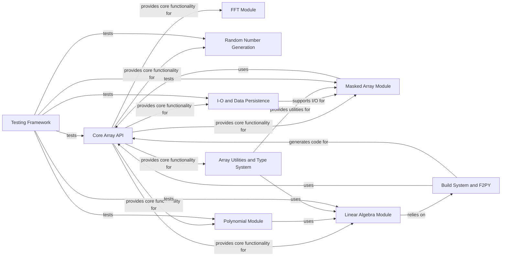

## Component Details

The NumPy project's architecture is centered around its highly optimized Core Array API, which provides the fundamental data structures and operations for numerical computing. Specialized modules like Masked Array, Linear Algebra, FFT, Random Number Generation, and Polynomials extend this core functionality for specific domains. A robust Build System and F2PY facilitate the integration of high-performance C/Fortran code, while I/O and Data Persistence handle data storage. Array Utilities and Type System provide essential array manipulation tools, and a comprehensive Testing Framework ensures code quality and correctness across all components.

### Core Array API
This component provides the fundamental building blocks for NumPy arrays, including array creation, basic element-wise operations, shape manipulation, and the underlying C-level array implementation. It forms the bedrock upon which most other NumPy functionalities are built, offering a high-level interface for common numerical operations.

**Related Classes/Methods**:

- <a href="https://github.com/numpy/numpy/blob/master/numpy/_core/multiarray.py#L1-L208" target="_blank" rel="noopener noreferrer">`numpy.numpy._core.multiarray` (1:208)</a>
- <a href="https://github.com/numpy/numpy/blob/master/numpy/_core/numeric.py#L1-L1000" target="_blank" rel="noopener noreferrer">`numpy.numpy._core.numeric` (1:1000)</a>

### Masked Array Module
This module extends NumPy's array capabilities to handle data with missing or invalid entries using a 'mask'. It provides specialized array types and functions for operations that respect these masks, ensuring calculations only involve valid data. It wraps many core NumPy functions to support masked arrays.

**Related Classes/Methods**:

- <a href="https://github.com/numpy/numpy/blob/master/numpy/ma/core.py#L1-L1900" target="_blank" rel="noopener noreferrer">`numpy.numpy.ma.core` (1:1900)</a>

### Linear Algebra Module
This component offers a comprehensive set of linear algebra functions, including matrix decompositions (Cholesky, SVD, QR), eigenvalue problems, solving linear equations, and various matrix norms. It relies on optimized underlying libraries for performance and integrates with the Core Array API.

**Related Classes/Methods**:

- <a href="https://github.com/numpy/numpy/blob/master/numpy/linalg/_linalg.py#L1-L1400" target="_blank" rel="noopener noreferrer">`numpy.numpy.linalg._linalg` (1:1400)</a>

### FFT Module
This module provides a collection of Fast Fourier Transform (FFT) and related functions for signal processing, including 1D, 2D, and N-dimensional FFTs, and helper functions for frequency manipulation. It leverages optimized C implementations for efficiency.

**Related Classes/Methods**:

- <a href="https://github.com/numpy/numpy/blob/master/numpy/fft/_pocketfft.py#L1-L700" target="_blank" rel="noopener noreferrer">`numpy.numpy.fft._pocketfft` (1:700)</a>

### Random Number Generation
This component provides tools for generating pseudo-random numbers from various statistical distributions, supporting both legacy and modern BitGenerator-based approaches for reproducibility and statistical quality.

**Related Classes/Methods**:

- `numpy.numpy.random.mtrand` (full file reference)
- `numpy.numpy.random._generator` (full file reference)
- `numpy.numpy.random.bit_generator` (full file reference)

### Polynomial Module
This module provides a robust framework for working with various polynomial series, including standard power series. It offers functions for arithmetic, differentiation, integration, root finding, and fitting.

**Related Classes/Methods**:

- <a href="https://github.com/numpy/numpy/blob/master/numpy/polynomial/polynomial.py#L1-L800" target="_blank" rel="noopener noreferrer">`numpy.numpy.polynomial.polynomial` (1:800)</a>

### I-O and Data Persistence
This component manages reading and writing array data to and from various file formats, including NumPy's native binary formats (.npy, .npz) and common text formats. It also provides utilities for data source management and text parsing.

**Related Classes/Methods**:

- <a href="https://github.com/numpy/numpy/blob/master/numpy/lib/_npyio_impl.py#L1-L1000" target="_blank" rel="noopener noreferrer">`numpy.numpy.lib._npyio_impl` (1:1000)</a>

### Array Utilities and Type System
This component provides essential utilities for inspecting and manipulating array types, handling non-finite numbers (NaN, Inf), and performing advanced memory-efficient array views through stride manipulation and broadcasting.

**Related Classes/Methods**:

- <a href="https://github.com/numpy/numpy/blob/master/numpy/lib/_type_check_impl.py#L1-L400" target="_blank" rel="noopener noreferrer">`numpy.numpy.lib._type_check_impl` (1:400)</a>
- <a href="https://github.com/numpy/numpy/blob/master/numpy/lib/_stride_tricks_impl.py#L1-L300" target="_blank" rel="noopener noreferrer">`numpy.numpy.lib._stride_tricks_impl` (1:300)</a>

### Build System and F2PY
This component provides NumPy's custom build system, extending standard Python distutils to compile C, C++, and Fortran extensions. It includes F2PY, a tool for generating Python interfaces to Fortran code, facilitating the integration of high-performance Fortran routines into NumPy.

**Related Classes/Methods**:

- <a href="https://github.com/numpy/numpy/blob/master/numpy/distutils/core.py#L1-L150" target="_blank" rel="noopener noreferrer">`numpy.numpy.distutils.core` (1:150)</a>
- <a href="https://github.com/numpy/numpy/blob/master/numpy/f2py/f2py2e.py#L1-L400" target="_blank" rel="noopener noreferrer">`numpy.numpy.f2py.f2py2e` (1:400)</a>

### Testing Framework
This component provides a comprehensive set of utilities and assertions specifically designed for testing NumPy code. It includes functions for comparing arrays with various tolerances, managing warnings, and tools for performance and memory profiling, crucial for maintaining code quality and correctness.

**Related Classes/Methods**:

- <a href="https://github.com/numpy/numpy/blob/master/numpy/testing/_private/utils.py#L1-L1000" target="_blank" rel="noopener noreferrer">`numpy.numpy.testing._private.utils` (1:1000)</a>

### [FAQ](https://github.com/CodeBoarding/GeneratedOnBoardings/tree/main?tab=readme-ov-file#faq)