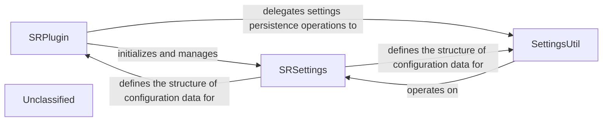

## Details

The core of the system revolves around the `SRPlugin`, which acts as the central orchestrator for the Obsidian plugin. It is responsible for the plugin's lifecycle and user interactions, including command registration. `SRPlugin` relies on `SRSettings` to define and store all user-configurable options, ensuring a structured approach to managing plugin configurations. For the actual persistence and retrieval of these settings, `SRPlugin` delegates to `SettingsUtil`, which provides the necessary utility functions to interact with Obsidian's data storage. This separation of concerns allows `SRPlugin` to focus on its primary role as the plugin's entry point, while `SettingsUtil` handles the intricacies of data management for `SRSettings`.

### SRPlugin
The primary entry point and orchestrator of the plugin. It extends Obsidian's `Plugin` class, managing the plugin's lifecycle (loading, unloading), registering commands, and coordinating interactions with other plugin components. It initializes and holds the plugin's settings.

**Related Classes/Methods**:

- <a href="https://github.com/st3v3nmw/obsidian-spaced-repetition/blob/mastersrc/main.ts#L45-L577" target="_blank" rel="noopener noreferrer">`SRPlugin`:45-577</a>

### SettingsUtil
A dedicated utility class responsible for the concrete operations of persisting and retrieving plugin settings. It handles the loading of settings from Obsidian's data store and saving modified settings back, ensuring data integrity.

**Related Classes/Methods**:

- <a href="https://github.com/st3v3nmw/obsidian-spaced-repetition/blob/mastersrc/settings.ts#L157-L198" target="_blank" rel="noopener noreferrer">`SettingsUtil`:157-198</a>

### SRSettings
A data model class that defines the structure, types, and default values for all user-configurable settings of the plugin. It acts as a blueprint for the plugin's configuration state.

**Related Classes/Methods**:

- <a href="https://github.com/st3v3nmw/obsidian-spaced-repetition/blob/mastersrc/settings.ts#L8-L66" target="_blank" rel="noopener noreferrer">`SRSettings`:8-66</a>

### Unclassified
Component for all unclassified files and utility functions (Utility functions/External Libraries/Dependencies)

**Related Classes/Methods**: _None_

### [FAQ](https://github.com/CodeBoarding/GeneratedOnBoardings/tree/main?tab=readme-ov-file#faq)