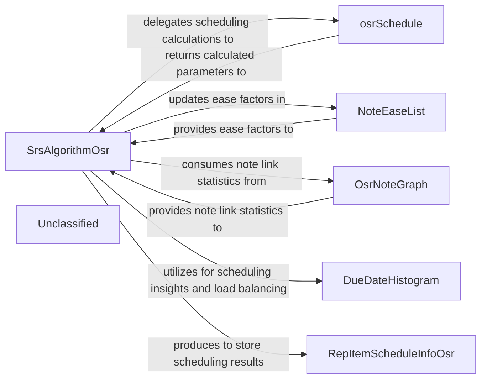

## Details

The core of the system revolves around the SrsAlgorithmOsr which orchestrates the scheduling of notes and flashcards. It leverages OsrNoteGraph to understand note relationships, NoteEaseList to manage ease factors, and DueDateHistogram (specifically its derived classes) for optimizing review intervals. The actual scheduling calculations are delegated to the osrSchedule function, and the results are encapsulated in RepItemScheduleInfoOsr objects. This design promotes modularity, allowing different aspects of the Spaced Repetition System (SRS) to be managed by specialized components.

### SrsAlgorithmOsr
The central component implementing the OSR algorithm. It orchestrates the scheduling process, taking user review responses and current scheduling data to calculate new intervals, due dates, and ease factors for both notes and individual flashcards. It coordinates with other internal components to gather necessary data and apply the OSR logic.

**Related Classes/Methods**:

- <a href="https://github.com/st3v3nmw/obsidian-spaced-repetition/blob/mastersrc/algorithms/osr/srs-algorithm-osr.ts#L16-L212" target="_blank" rel="noopener noreferrer">`SrsAlgorithmOsr`:16-212</a>

### osrSchedule
A core function that encapsulates the specific mathematical and logical steps for OSR scheduling calculations. It performs the detailed computations for intervals, ease, and due dates based on parameters provided by SrsAlgorithmOsr.

**Related Classes/Methods**:

- <a href="https://github.com/st3v3nmw/obsidian-spaced-repetition/blob/mastersrc/algorithms/osr/note-scheduling.ts#L11-L57" target="_blank" rel="noopener noreferrer">`osrSchedule`:11-57</a>

### NoteEaseList
Manages and persists the ease factors associated with individual notes. These ease factors are crucial inputs for the scheduling algorithm, influencing how frequently flashcards within a note are presented. It provides current ease values and accepts updates from the SrsAlgorithmOsr.

**Related Classes/Methods**:

- <a href="https://github.com/st3v3nmw/obsidian-spaced-repetition/blob/mastersrc/note-ease-list.ts#L3-L9" target="_blank" rel="noopener noreferrer">`NoteEaseList`:3-9</a>

### RepItemScheduleInfoOsr
A data model that defines the structure for encapsulating the scheduling information specific to the OSR algorithm. This includes properties like due date, interval, ease factor, and other OSR-specific parameters for a given review item (flashcard or note).

**Related Classes/Methods**:

- <a href="https://github.com/st3v3nmw/obsidian-spaced-repetition/blob/mastersrc/algorithms/osr/rep-item-schedule-info-osr.ts#L7-L62" target="_blank" rel="noopener noreferrer">`RepItemScheduleInfoOsr`:7-62</a>

### OsrNoteGraph
Responsible for analyzing the internal link structure of notes within the Obsidian vault. It calculates statistics related to note connectivity and relationships, which are then provided to SrsAlgorithmOsr to inform and influence the ease factor calculations for notes.

**Related Classes/Methods**:

- <a href="https://github.com/st3v3nmw/obsidian-spaced-repetition/blob/mastersrc/core.ts" target="_blank" rel="noopener noreferrer">`OsrNoteGraph`</a>

### DueDateHistogram
A utility or data structure used within the scheduling calculations, likely to manage, analyze, or optimize the distribution of due dates. It assists SrsAlgorithmOsr in ensuring a balanced review load or making informed scheduling decisions. This component represents the base class for both CardDueDateHistogram and NoteDueDateHistogram.

**Related Classes/Methods**:

- <a href="https://github.com/st3v3nmw/obsidian-spaced-repetition/blob/mastersrc/due-date-histogram.ts#L111-L137" target="_blank" rel="noopener noreferrer">`DueDateHistogram`:111-137</a>

### Unclassified
Component for all unclassified files and utility functions (Utility functions/External Libraries/Dependencies)

**Related Classes/Methods**: _None_

### [FAQ](https://github.com/CodeBoarding/GeneratedOnBoardings/tree/main?tab=readme-ov-file#faq)