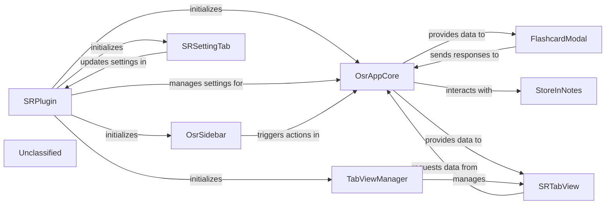

## Details

The Obsidian Spaced Repetition plugin employs a modular architecture centered around the `SRPlugin` as its main orchestrator. `SRPlugin` initializes and manages core components such as the `OsrAppCore`, `TabViewManager`, `OsrSidebar`, and `SRSettingTab`. The `OsrAppCore` serves as the central hub for application logic, handling review sessions, processing user responses, and interacting with `StoreInNotes` for all data persistence. User interfaces are provided by `SRTabView`, which orchestrates the display of review queues and statistics by interacting with `OsrAppCore`, and `FlashcardModal`, a dedicated component for interactive flashcard reviews. The `OsrSidebar` offers persistent access to plugin features, while `SRSettingTab` enables users to configure plugin behaviors, updating settings managed by `SRPlugin`. This design ensures a clear separation of concerns between UI, core logic, and data management, facilitating maintainability and extensibility.

### SRPlugin
The main plugin class, responsible for the overall lifecycle, initialization, and management of plugin data and settings. It acts as the central orchestrator for the entire Spaced Repetition system.

**Related Classes/Methods**:

- <a href="https://github.com/st3v3nmw/obsidian-spaced-repetition/blob/mastersrc/main.ts#L45-L577" target="_blank" rel="noopener noreferrer">`SRPlugin`:45-577</a>

### OsrAppCore
The core application logic component, managing review sessions, flashcard data, and interactions with the data persistence layer. It prepares data for UI components and processes review responses.

**Related Classes/Methods**:

- <a href="https://github.com/st3v3nmw/obsidian-spaced-repetition/blob/mastersrc/core.ts#L234-L275" target="_blank" rel="noopener noreferrer">`OsrAppCore`:234-275</a>

### StoreInNotes
Handles the persistence and retrieval of all spaced repetition data directly within Obsidian notes. It serves as the primary data storage mechanism for the plugin.

**Related Classes/Methods**:

- <a href="https://github.com/st3v3nmw/obsidian-spaced-repetition/blob/mastersrc/data-stores/notes/notes.ts#L13-L70" target="_blank" rel="noopener noreferrer">`StoreInNotes`:13-70</a>

### TabViewManager
Manages the creation, display, and lifecycle of different tab views within the Obsidian workspace, specifically orchestrating the `SRTabView`.

**Related Classes/Methods**:

- <a href="https://github.com/st3v3nmw/obsidian-spaced-repetition/blob/mastersrc/main.ts" target="_blank" rel="noopener noreferrer">`TabViewManager`</a>

### SRTabView
The main user interface tab for spaced repetition, responsible for orchestrating the display of various sub-views like statistics and the review queue. It provides the primary interactive space for users.

**Related Classes/Methods**:

- <a href="https://github.com/st3v3nmw/obsidian-spaced-repetition/blob/mastersrc/gui/sr-tab-view.tsx" target="_blank" rel="noopener noreferrer">`SRTabView`</a>

### FlashcardModal
A modal dialog dedicated to presenting individual flashcards for review, capturing user responses, and managing the immediate flow of a flashcard review session.

**Related Classes/Methods**:

- <a href="https://github.com/st3v3nmw/obsidian-spaced-repetition/blob/mastersrc/main.ts#L392-L411" target="_blank" rel="noopener noreferrer">`FlashcardModal`:392-411</a>

### OsrSidebar
A persistent sidebar panel within Obsidian that offers quick access to plugin features, displays summary information, and can trigger actions like opening the review queue.

**Related Classes/Methods**:

- <a href="https://github.com/st3v3nmw/obsidian-spaced-repetition/blob/mastersrc/main.ts" target="_blank" rel="noopener noreferrer">`OsrSidebar`</a>

### SRSettingTab
Provides the user interface for configuring plugin settings, allowing users to customize spaced repetition algorithms, display options, and other behaviors.

**Related Classes/Methods**:

- <a href="https://github.com/st3v3nmw/obsidian-spaced-repetition/blob/mastersrc/gui/settings.tsx" target="_blank" rel="noopener noreferrer">`SRSettingTab`</a>

### Unclassified
Component for all unclassified files and utility functions (Utility functions/External Libraries/Dependencies)

**Related Classes/Methods**: _None_

### [FAQ](https://github.com/CodeBoarding/GeneratedOnBoardings/tree/main?tab=readme-ov-file#faq)