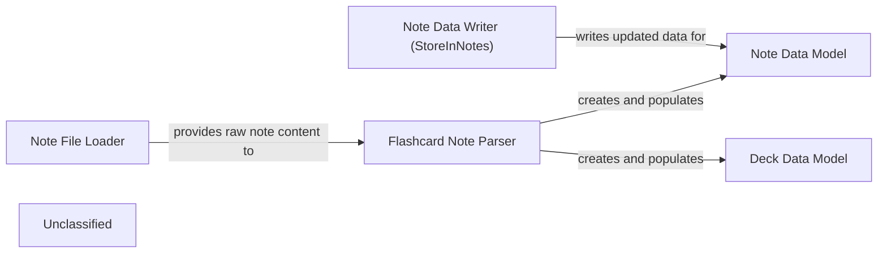

## Details

The core functionality revolves around loading, parsing, and persisting flashcard data within Obsidian notes. The Note File Loader initiates the process by reading raw note content. This content is then passed to the Flashcard Note Parser, which transforms it into structured Note and Deck data models. These data models represent the in-memory state of the flashcards and their organization. Finally, the Note Data Writer (StoreInNotes) is responsible for taking any changes to the Note Data Model (e.g., updated scheduling information) and writing them back to the Obsidian notes, ensuring data persistence.

### Note File Loader
This component is responsible for interacting with the Obsidian API to scan the vault, identify relevant notes, and load their raw content. It abstracts the underlying file system access within the Obsidian environment.

**Related Classes/Methods**:

- <a href="https://github.com/st3v3nmw/obsidian-spaced-repetition/blob/mastersrc/note-file-loader.ts#L9-L40" target="_blank" rel="noopener noreferrer">`NoteFileLoader`:9-40</a>

### Flashcard Note Parser
Takes the raw content of Obsidian notes and extracts structured flashcard data, including questions, answers, and metadata. It interprets the specific markdown and YAML formats used for defining flashcards within notes, creating Note and Deck objects.

**Related Classes/Methods**:

- <a href="https://github.com/st3v3nmw/obsidian-spaced-repetition/blob/mastersrc/note-parser.ts#L8-L32" target="_blank" rel="noopener noreferrer">`NoteParser`:8-32</a>

### Note Data Model
Represents a single Obsidian note and encapsulates its content, metadata, and the collection of flashcards parsed from it. It serves as the primary data structure for holding parsed information.

**Related Classes/Methods**:

- <a href="https://github.com/st3v3nmw/obsidian-spaced-repetition/blob/mastersrc/note.ts#L6-L53" target="_blank" rel="noopener noreferrer">`Note`:6-53</a>

### Deck Data Model
Defines the hierarchical structure for organizing flashcards, typically based on TopicPath. It allows for logical grouping and navigation of flashcards, crucial for review sessions and spaced repetition.

**Related Classes/Methods**:

- <a href="https://github.com/st3v3nmw/obsidian-spaced-repetition/blob/mastersrc/note.ts#L24-L30" target="_blank" rel="noopener noreferrer">`Deck`:24-30</a>
- <a href="https://github.com/st3v3nmw/obsidian-spaced-repetition/blob/mastersrc/core.ts" target="_blank" rel="noopener noreferrer">`TopicPath`</a>

### Note Data Writer (StoreInNotes)
Handles the persistence of updated flashcard scheduling information and other relevant data back into the Obsidian notes. It ensures that any changes made by the spaced repetition algorithm or user interactions are saved.

**Related Classes/Methods**:

- <a href="https://github.com/st3v3nmw/obsidian-spaced-repetition/blob/mastersrc/data-stores/notes/notes.ts#L13-L70" target="_blank" rel="noopener noreferrer">`StoreInNotes`:13-70</a>

### Unclassified
Component for all unclassified files and utility functions (Utility functions/External Libraries/Dependencies)

**Related Classes/Methods**: _None_

### [FAQ](https://github.com/CodeBoarding/GeneratedOnBoardings/tree/main?tab=readme-ov-file#faq)