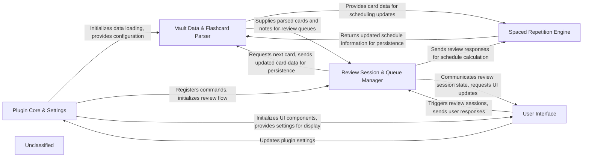

## Details

The project is an Obsidian plugin for spaced repetition, designed to manage flashcards and notes for review. The core functionality revolves around loading and parsing notes, applying spaced repetition algorithms, managing review queues, and providing a user interface for interaction. The `SRPlugin` class in `src/main.ts` acts as the central orchestrator, initializing various components like settings, data stores, review handlers, and UI elements. Data flow primarily involves the `Vault Data & Flashcard Parser` reading and writing note content, which is then processed by the `Spaced Repetition Engine` to update schedules. The `Review Session & Queue Manager` uses this data to present cards to the user via the `User Interface`, which in turn sends user responses back for schedule updates.

### Plugin Core & Settings [[Expand]](./Plugin_Core_Settings.md)
Manages the plugin's lifecycle within Obsidian, including initialization, command registration, and persistent settings management.

**Related Classes/Methods**:

- <a href="https://github.com/st3v3nmw/obsidian-spaced-repetition/blob/mastersrc/main.ts#L45-L577" target="_blank" rel="noopener noreferrer">`SRPlugin`:45-577</a>
- <a href="https://github.com/st3v3nmw/obsidian-spaced-repetition/blob/mastersrc/settings.ts#L157-L198" target="_blank" rel="noopener noreferrer">`SettingsUtil`:157-198</a>
- <a href="https://github.com/st3v3nmw/obsidian-spaced-repetition/blob/mastersrc/settings.ts#L8-L66" target="_blank" rel="noopener noreferrer">`SRSettings`:8-66</a>

### Vault Data & Flashcard Parser [[Expand]](./Vault_Data_Flashcard_Parser.md)
Responsible for scanning the Obsidian vault, loading notes, parsing flashcards from note content, organizing them into a hierarchical deck structure, and writing updated schedule information back to notes.

**Related Classes/Methods**:

- <a href="https://github.com/st3v3nmw/obsidian-spaced-repetition/blob/mastersrc/note-file-loader.ts#L9-L40" target="_blank" rel="noopener noreferrer">`NoteFileLoader`:9-40</a>
- <a href="https://github.com/st3v3nmw/obsidian-spaced-repetition/blob/mastersrc/data-stores/notes/notes.ts#L13-L70" target="_blank" rel="noopener noreferrer">`StoreInNotes`:13-70</a>
- <a href="https://github.com/st3v3nmw/obsidian-spaced-repetition/blob/mastersrc/note.ts#L6-L53" target="_blank" rel="noopener noreferrer">`Note`:6-53</a>
- <a href="https://github.com/st3v3nmw/obsidian-spaced-repetition/blob/mastersrc/note-parser.ts#L8-L32" target="_blank" rel="noopener noreferrer">`NoteParser`:8-32</a>
- <a href="https://github.com/st3v3nmw/obsidian-spaced-repetition/blob/mastersrc/note.ts#L24-L30" target="_blank" rel="noopener noreferrer">`Deck`:24-30</a>
- <a href="https://github.com/st3v3nmw/obsidian-spaced-repetition/blob/mastersrc/core.ts" target="_blank" rel="noopener noreferrer">`TopicPath`</a>

### Spaced Repetition Engine [[Expand]](./Spaced_Repetition_Engine.md)
Implements the core spaced repetition algorithms (e.g., OSR) to calculate and update flashcard schedules based on user review responses.

**Related Classes/Methods**:

- <a href="https://github.com/st3v3nmw/obsidian-spaced-repetition/blob/mastersrc/algorithms/osr/srs-algorithm-osr.ts#L16-L212" target="_blank" rel="noopener noreferrer">`SrsAlgorithmOsr`:16-212</a>

### Review Session & Queue Manager [[Expand]](./Review_Session_Queue_Manager.md)
Orchestrates the interactive flashcard review sessions, presents cards, processes user input, and manages the queue of notes and cards due for review, including opening the next note.

**Related Classes/Methods**:

- <a href="https://github.com/st3v3nmw/obsidian-spaced-repetition/blob/mastersrc/flashcard-review-sequencer.ts#L98-L332" target="_blank" rel="noopener noreferrer">`FlashcardReviewSequencer`:98-332</a>
- <a href="https://github.com/st3v3nmw/obsidian-spaced-repetition/blob/mastersrc/main.ts#L413-L424" target="_blank" rel="noopener noreferrer">`DeckTreeIterator`:413-424</a>
- <a href="https://github.com/st3v3nmw/obsidian-spaced-repetition/blob/mastersrc/next-note-review-handler.ts" target="_blank" rel="noopener noreferrer">`NoteReviewQueue`</a>
- <a href="https://github.com/st3v3nmw/obsidian-spaced-repetition/blob/mastersrc/next-note-review-handler.ts#L8-L77" target="_blank" rel="noopener noreferrer">`NextNoteReviewHandler`:8-77</a>

### User Interface [[Expand]](./User_Interface.md)
Provides all user-facing elements for interacting with the plugin, including the flashcard review modal, sidebar, and settings interface.

**Related Classes/Methods**:

- <a href="https://github.com/st3v3nmw/obsidian-spaced-repetition/blob/mastersrc/main.ts#L392-L411" target="_blank" rel="noopener noreferrer">`FlashcardModal`:392-411</a>
- `SRTabView`
- <a href="https://github.com/st3v3nmw/obsidian-spaced-repetition/blob/mastersrc/main.ts" target="_blank" rel="noopener noreferrer">`OsrSidebar`</a>
- `SRSettingTab`

### Unclassified
Component for all unclassified files and utility functions (Utility functions/External Libraries/Dependencies)

**Related Classes/Methods**: _None_

### [FAQ](https://github.com/CodeBoarding/GeneratedOnBoardings/tree/main?tab=readme-ov-file#faq)