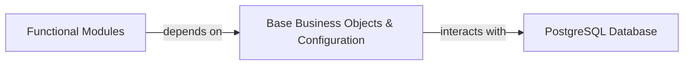

## Details

One paragraph explaining the functionality which is represented by this graph. What the main flow is and what is its purpose.

### Base Business Objects & Configuration [[Expand]](./Base_Business_Objects_Configuration.md)
This component is a fundamental part of the Odoo Core Framework, providing the essential business entities and system-wide configurations that are common and indispensable across all ERP modules. It encapsulates core concepts such as user management, partner (customer/vendor) management, company details, currency handling, and general system settings. It serves as the foundational data layer and logic for specific business applications like CRM, Accounting, and HR, ensuring data consistency and reusability throughout the system.

**Related Classes/Methods**:

- `odoo.addons.base.models.res_users.ResUsers`
- `odoo.addons.base.models.res_partner.ResPartner`
- `odoo.addons.base.models.res_company.ResCompany`
- `odoo.addons.base.models.res_currency.ResCurrency`
- <a href="https://github.com/odoo/odoo/blob/18.0/odoo/addons/base/models/ir_config_parameter.py#L28-L124" target="_blank" rel="noopener noreferrer">`odoo.addons.base.models.ir_config_parameter.IrConfigParameter` (28:124)</a>

### PostgreSQL Database
Persistent storage, retrieval, and management of all core business object data and system configuration parameters.

**Related Classes/Methods**: _None_

### Functional Modules
Specialized modules (e.g., CRM, Accounting, HR) that are built upon and heavily rely on the data models and services provided by the Base Business Objects & Configuration component.

**Related Classes/Methods**: _None_

### [FAQ](https://github.com/CodeBoarding/GeneratedOnBoardings/tree/main?tab=readme-ov-file#faq)