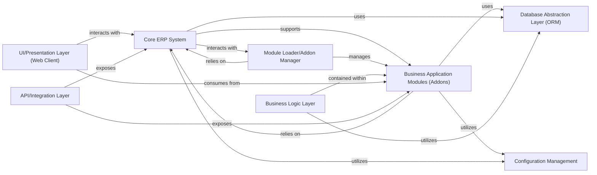

## Details

Abstract Components Overview of Odoo ERP System

### Core ERP System
Provides the foundational framework and essential services for the entire Odoo ERP. This includes core functionalities like user management, security, basic web server capabilities, and the underlying infrastructure upon which all other modules are built. It ensures system stability, extensibility, and manages global resources.

**Related Classes/Methods**:

- `odoo` (1:1)
- `odoo.http`
- `odoo.models`
- `odoo.fields`
- `odoo.tools` (1:1)
- `odoo.modules` (1:1)

### Module Loader/Addon Manager
Responsible for discovering, loading, and managing the lifecycle of Business Application Modules (Addons). It handles module dependencies, installation, updates, and uninstallation, ensuring that the correct business functionalities are available and properly integrated into the core system.

**Related Classes/Methods**:

- `odoo.modules` (1:1)

### Business Application Modules (Addons) [[Expand]](./Business_Application_Modules_Addons_.md)
Encapsulates specific business functionalities (e.g., CRM, Accounting, Inventory) as self-contained, pluggable modules. These addons extend the core Odoo framework by defining new models, views, and business logic, providing the comprehensive ERP features. Each module typically follows a layered structure internally.

**Related Classes/Methods**:

- `odoo.addons.account` (1:1)
- `odoo.addons.crm` (1:1)
- `odoo.addons.sale` (1:1)
- `odoo.addons.stock` (1:1)

### Database Abstraction Layer (ORM)
Provides an Object-Relational Mapping (ORM) that abstracts direct database interactions. It allows Business Application Modules (Addons) and the Core ERP System to interact with the PostgreSQL database using Python objects, handling data persistence, retrieval, and schema management, thus decoupling business logic from database specifics.

**Related Classes/Methods**:

- `odoo.models`
- `odoo.fields`

### Business Logic Layer
Encapsulates the domain-specific rules, processes, and computations for each Business Application Module (Addons). It defines how data is processed, validated, and transformed, ensuring that business operations adhere to defined policies and workflows. This layer is typically embedded within each addon.

**Related Classes/Methods**:

- `odoo.addons.account.models` (1:1)
- `odoo.addons.crm.models` (1:1)

### UI/Presentation Layer (Web Client)
Provides the web-based user interface for interacting with the Odoo ERP system. This client-side component renders views, handles user input, and communicates with the Business Application Modules (Addons) and Core ERP System to display information and trigger business processes.

**Related Classes/Methods**:

- `odoo.http`
- `odoo.addons.web` (1:1)

### API/Integration Layer
Exposes functionalities of the Core ERP System and Business Application Modules (Addons) to external systems and internal components through well-defined APIs (e.g., XML-RPC, JSON-RPC). It facilitates interoperability and allows for seamless integration with third-party services and other Odoo instances.

**Related Classes/Methods**:

- `odoo.http.controllers`
- `odoo.service.web_services` (1:1)

### Configuration Management
Manages system-wide and module-specific configurations, settings, and customizations. It provides mechanisms for administrators and users to tailor the ERP system's behavior without modifying core code, supporting the highly customizable and extensible nature of Odoo.

**Related Classes/Methods**:

- `odoo.tools.config`
- `odoo.modules.registry`

### [FAQ](https://github.com/CodeBoarding/GeneratedOnBoardings/tree/main?tab=readme-ov-file#faq)