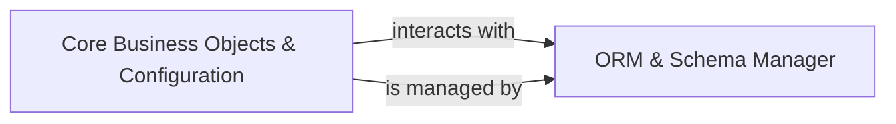

## Details

One paragraph explaining the functionality which is represented by this graph. What the main flow is and what is its purpose.

### Core Business Objects & Configuration [[Expand]](./Core_Business_Objects_Configuration.md)
Defines the fundamental, system-wide business entities and configurations (e.g., users, partners, companies, currencies, system parameters, actions, reports). These are the foundational base models that are extended and utilized by specific business modules across the ERP system, ensuring a consistent and centralized data model. This component is crucial for an ERP system as it establishes the core data integrity and common definitions shared across all business functions.

**Related Classes/Methods**: _None_

### ORM & Schema Manager
Manages the mapping between Python objects and the underlying relational database. This component is responsible for handling data persistence, object-relational mapping, database schema creation, migration, and updates. It provides the necessary interface for other components, particularly `Core Business Objects & Configuration`, to interact with the database without direct SQL manipulation, ensuring data integrity and consistency across the ERP system.

**Related Classes/Methods**: _None_

### [FAQ](https://github.com/CodeBoarding/GeneratedOnBoardings/tree/main?tab=readme-ov-file#faq)