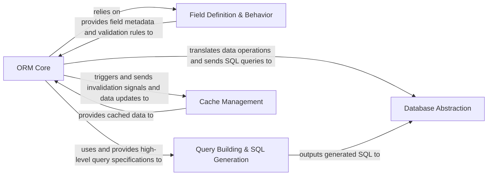

## Details

The `Core Data & ORM Layer` is a fundamental subsystem within the Odoo ERP, providing robust data persistence and retrieval. It abstracts complex database interactions, offering a high-level, object-oriented interface for the rest of the system.

### ORM Core
This is the central component of the data layer, providing the Object-Relational Mapping functionalities. It enables the interaction with database records as Python objects, orchestrates Create, Read, Update, and Delete (CRUD) operations, and manages recordsets. It serves as the primary interface for business logic to interact with the underlying data.

**Related Classes/Methods**:

- `odoo.models`

### Field Definition & Behavior
This component defines the metadata, validation rules, and data conversion logic for all fields within Odoo models. It dictates how data is stored, retrieved, displayed, and validated, ensuring data integrity and consistency across the application.

**Related Classes/Methods**:

- `odoo.fields`

### Database Abstraction
Manages low-level interactions with the PostgreSQL database, including connection pooling, transaction management (savepoints, commit, rollback), and direct SQL query execution. It isolates the ORM and other components from specific database driver details and ensures efficient resource utilization.

**Related Classes/Methods**:

- `odoo.sql_db`

### Query Building & SQL Generation
This component is responsible for translating Odoo's high-level query domains and field references into optimized SQL statements. It ensures that data retrieval and manipulation operations are performed efficiently and securely at the database level.

**Related Classes/Methods**:

- `odoo.models`

### Cache Management
Optimizes system performance by managing in-memory caching of model and record data. This includes mechanisms for cache invalidation, which reduces redundant database queries and significantly improves response times for frequently accessed data.

**Related Classes/Methods**:

- `odoo.models`

### [FAQ](https://github.com/CodeBoarding/GeneratedOnBoardings/tree/main?tab=readme-ov-file#faq)