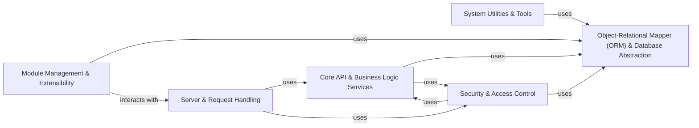

## Details

One paragraph explaining the functionality which is represented by this graph. What the main flow is and what is its purpose.

### Object-Relational Mapper (ORM) & Database Abstraction
This component provides the core Object-Relational Mapper, abstracting direct database interactions. It handles data persistence, retrieval, transaction management, and caching, allowing higher-level components to work with Python objects rather than raw SQL. It leverages psycopg2 for PostgreSQL connectivity.

**Related Classes/Methods**:

- <a href="https://github.com/odoo/odoo/blob/18.0/odoo/sql_db.py" target="_blank" rel="noopener noreferrer">`odoo/sql_db.py`</a>

### Core API & Business Logic Services
This component exposes the foundational programmatic interfaces and implements core business logic that is common across the entire ERP system. It provides services for fundamental operations like user management, basic record operations, and system-wide data validation.

**Related Classes/Methods**: _None_

### Server & Request Handling
This component manages the web server infrastructure, handling incoming HTTP requests, routing them to appropriate controllers, and managing the overall application runtime environment. It ensures the system is accessible and responsive, utilizing Werkzeug for WSGI capabilities.

**Related Classes/Methods**:

- `odoo/http.py`

### Module Management & Extensibility
This component is responsible for the lifecycle management of Odoo modules (addons), including their installation, uninstallation, upgrades, and loading. It provides the framework that enables the modular monolith architecture and allows for system extensibility.

**Related Classes/Methods**: _None_

### System Utilities & Tools
This component provides a collection of general-purpose utilities and command-line tools for system administration, debugging, profiling, data import/export, and other maintenance tasks. It supports various data formats using libraries like openpyxl, xlrd, XlsxWriter, xlwt, lxml, and reportlab.

**Related Classes/Methods**: _None_

### Security & Access Control [[Expand]](./Security_Access_Control.md)
This component enforces system-wide security policies, managing user authentication, authorization, and access rights to data and functionalities. It ensures that users can only access resources they are permitted to, leveraging libraries like passlib for password hashing and cryptography for secure operations.

**Related Classes/Methods**: _None_

### [FAQ](https://github.com/CodeBoarding/GeneratedOnBoardings/tree/main?tab=readme-ov-file#faq)