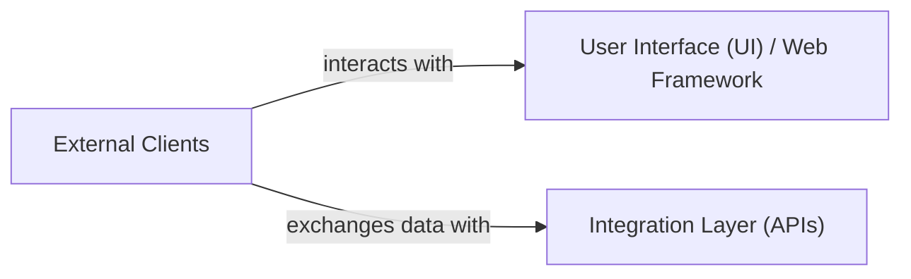

## Details

One paragraph explaining the functionality which is represented by this graph. What the main flow is and what is its purpose.

### External Clients [[Expand]](./External_Clients.md)
This component encapsulates all entities external to the Odoo system that initiate interactions. It primarily includes human users who access the Odoo web interface through their browsers and other external software systems (e.g., third-party applications, other ERPs, specialized tools) that integrate with Odoo programmatically.

**Related Classes/Methods**: _None_

### User Interface (UI) / Web Framework
This component is responsible for rendering the web-based user interface of Odoo, handling user interactions, and managing the presentation logic. It leverages Odoo's built-in web framework to serve dynamic content, process form submissions, and manage client-side state. It acts as the primary interface for human users to interact with the Odoo system.

**Related Classes/Methods**:

- `odoo.http`
- `odoo.addons.<module_name>.controllers`

### Integration Layer (APIs)
This component provides programmatic interfaces (APIs) for external systems and internal modules to interact with Odoo's business logic and data. It exposes various endpoints for data exchange, remote procedure calls, and integration with third-party applications. This layer ensures secure and structured communication with Odoo's core functionalities.

**Related Classes/Methods**:

- `odoo.http`
- `odoo.addons.<module_name>.controllers`

### [FAQ](https://github.com/CodeBoarding/GeneratedOnBoardings/tree/main?tab=readme-ov-file#faq)