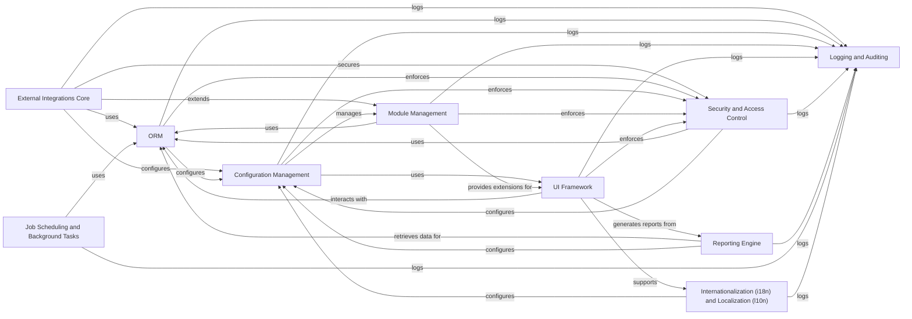

## Details

The Odoo project is a comprehensive suite of business management software tools, including CRM, e-commerce, accounting, manufacturing, warehouse, project management, and inventory management. It is an open-source solution that is highly modular and customizable, designed to help businesses of all sizes manage their operations efficiently. The core of Odoo is built around a powerful ORM (Object-Relational Mapping) and a flexible module system, allowing for extensive customization and integration with various external systems. The project emphasizes a user-friendly interface and a robust backend to support complex business processes.

### External Integrations Core
Handles all interactions with external systems, ensuring data consistency and secure communication. This includes APIs for third-party services and data exchange protocols.

**Related Classes/Methods**: _None_

### ORM
Manages database interactions, object-relational mapping, and data persistence. It provides an abstraction layer over the database, allowing developers to work with Python objects instead of raw SQL.

**Related Classes/Methods**: _None_

### Configuration Management
Centralized system for managing application settings, configurations, and dynamic parameters. It allows administrators to customize the application's behavior without code modifications.

**Related Classes/Methods**: _None_

### Module Management
Provides a robust and extensible module system, allowing developers to create, install, and manage custom modules. It ensures modularity and reusability of code.

**Related Classes/Methods**: _None_

### UI Framework [[Expand]](./UI_Framework.md)
Core framework for handling user interfaces, including web views, forms, and reports. It provides tools for building interactive and responsive user experiences.

**Related Classes/Methods**: _None_

### Security and Access Control
Manages user authentication, authorization, and access control. It ensures that only authorized users can access specific resources and perform certain actions.

**Related Classes/Methods**: _None_

### Reporting Engine
Provides a flexible reporting engine for generating various types of reports, including financial statements, analytical reports, and custom documents.

**Related Classes/Methods**: _None_

### Job Scheduling and Background Tasks
Manages scheduled tasks, background jobs, and asynchronous operations. It ensures efficient execution of long-running processes without blocking the main application thread.

**Related Classes/Methods**: _None_

### Internationalization (i18n) and Localization (l10n)
Handles internationalization and localization, allowing the application to support multiple languages and regional settings. It includes tools for translation management.

**Related Classes/Methods**: _None_

### Logging and Auditing
Provides a comprehensive logging and auditing system for tracking application events, user activities, and system errors. It helps in debugging and compliance.

**Related Classes/Methods**: _None_

### [FAQ](https://github.com/CodeBoarding/GeneratedOnBoardings/tree/main?tab=readme-ov-file#faq)