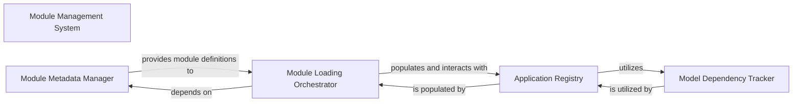

## Details

Manages the entire lifecycle of Odoo modules (addons), including installation, upgrade, and uninstallation. It builds and maintains the Odoo registry, ensuring proper module loading order and dependency resolution.

### Module Management System [[Expand]](./Module_Management_System.md)
Manages the entire lifecycle of Odoo modules (addons), including installation, upgrade, and uninstallation. It builds and maintains the Odoo registry, ensuring proper module loading order and dependency resolution.

**Related Classes/Methods**:

- `odoo/modules/module.py`
- `odoo/modules/loading.py`
- `odoo/modules/registry.py`

### Module Metadata Manager
Responsible for discovering, parsing, and validating module metadata (e.g., __manifest__.py files). It provides the Module Management System with essential information about available modules, their dependencies, and their structure, enabling proper installation, upgrade, and loading processes.

**Related Classes/Methods**:

- `odoo/modules/module.py`

### Module Loading Orchestrator
Orchestrates the dynamic loading and sequencing of Odoo modules at runtime. It resolves module dependencies, determines the correct loading order, and initiates the process of integrating module code and data into the application's runtime environment.

**Related Classes/Methods**:

- `odoo/modules/loading.py`

### Application Registry
Serves as the central runtime repository for all loaded Odoo modules, models, fields, and methods. It builds and maintains the Odoo registry, providing a unified and accessible data model and API for the entire application, reflecting the current state of all active modules.

**Related Classes/Methods**:

- `odoo/modules/registry.py`

### Model Dependency Tracker
A specialized utility within the Application Registry responsible for managing complex relationships, inheritance, and dependencies between Odoo models. It ensures the integrity and correct behavior of the data model by resolving inter-model constraints and ensuring proper data structure during runtime.

**Related Classes/Methods**:

- `odoo/modules/registry.py`

### [FAQ](https://github.com/CodeBoarding/GeneratedOnBoardings/tree/main?tab=readme-ov-file#faq)