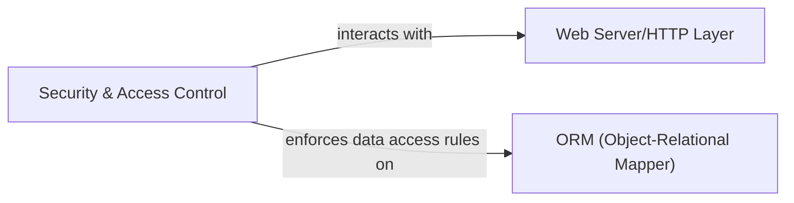

## Details

One paragraph explaining the functionality which is represented by this graph. What the main flow is and what is its purpose.

### Security & Access Control [[Expand]](./Security_Access_Control.md)
This critical, cross-cutting component enforces system-wide security policies. It manages user authentication, authorization, defines record-level access rules, and handles API key authentication to ensure data integrity and authorized access to the ERP system's resources and data.

**Related Classes/Methods**: _None_

### Web Server/HTTP Layer
This component is responsible for handling incoming HTTP requests, routing them to the appropriate handlers, and serving HTTP responses. It acts as the primary interface between external clients and the ERP system's backend, managing the communication protocol and initial request processing.

**Related Classes/Methods**: _None_

### ORM (Object-Relational Mapper)
This component provides an abstraction layer over the database, allowing the ERP system to interact with relational databases using object-oriented paradigms. It maps database tables to objects, handles data persistence, retrieval, and updates, and simplifies database operations for other components.

**Related Classes/Methods**: _None_

### [FAQ](https://github.com/CodeBoarding/GeneratedOnBoardings/tree/main?tab=readme-ov-file#faq)