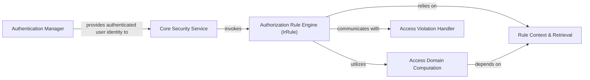

## Details

The `Security & Access Control` subsystem is critical for an ERP system, ensuring data integrity and user permissions. It is fundamentally composed of distinct yet interconnected components handling user identity, policy enforcement, and granular data access.

### Authentication Manager
Manages user login, session creation, and validation. It integrates various authentication mechanisms, including standard password-based login and external providers like OAuth and Passkey, establishing the user's identity within the system.

**Related Classes/Methods**:

- `odoo.service.security`
- `odoo.addons.auth_oauth`
- `odoo.addons.auth_passkey`

### Core Security Service
Acts as the central orchestrator for security operations. It receives authenticated user identities and coordinates with the Authorization Rule Engine to enforce security policies across the application, ensuring all operations adhere to defined access rules.

**Related Classes/Methods**:

- `odoo.service.security`

### Authorization Rule Engine (IrRule)
The core authorization component responsible for defining, storing, and orchestrating the evaluation of all data access rules (ir.rule records). It is the central authority for determining what data a user can access or modify based on configured policies.

**Related Classes/Methods**:

- `odoo.addons.base.models.ir_rule`

### Rule Context & Retrieval
Provides the dynamic operational context (e.g., current user, environment variables, specific record data) required for rule evaluation and efficiently retrieves all relevant access rules that apply to a specific model or operation.

**Related Classes/Methods**:

- `odoo.addons.base.models.ir_rule._eval_context`
- `odoo.addons.base.models.ir_rule._get_rules`

### Access Domain Computation
Computes and validates the final, effective data filtering domain that applies to a user's access request. It combines multiple ir.rule definitions to form the actual data visibility criteria and checks if a proposed data operation is permissible.

**Related Classes/Methods**:

- `odoo.addons.base.models.ir_rule._compute_domain`
- `odoo.addons.base.models.ir_rule._check_domain`

### Access Violation Handler
Generates and formats appropriate error messages when an access violation occurs. It provides clear feedback about the denied operation and potentially the reason for denial, crucial for user experience and debugging.

**Related Classes/Methods**:

- `odoo.addons.base.models.ir_rule._make_access_error`

### [FAQ](https://github.com/CodeBoarding/GeneratedOnBoardings/tree/main?tab=readme-ov-file#faq)