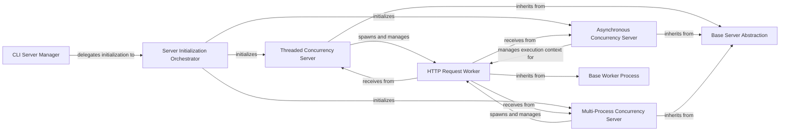

## Details

Abstract Components Overview

### CLI Server Manager
Serves as the primary command-line interface for initiating and managing the Odoo server. It handles initial setup, pre-startup validations (e.g., user permissions, PostgreSQL connectivity), configuration reporting, and translation management. It then delegates the initialization of the appropriate server type to the Server Initialization Orchestrator. This component is the user's direct interface to the server's operational control.

**Related Classes/Methods**:

- <a href="https://github.com/odoo/odoo/blob/18.0/odoo/cli/server.py#L177-L181" target="_blank" rel="noopener noreferrer">`odoo.cli.server.Server` (177:181)</a>
- <a href="https://github.com/odoo/odoo/blob/18.0/odoo/cli/command.py#L10-L14" target="_blank" rel="noopener noreferrer">`odoo.cli.command.Command` (10:14)</a>

### Server Initialization Orchestrator
Manages the overall server startup sequence after CLI invocation. This includes loading server-wide modules, initializing the selected server concurrency model, and setting up file system watchers for automatic reloads. It acts as the central coordinator for the server's initial setup.

**Related Classes/Methods**:

- <a href="https://github.com/odoo/odoo/blob/18.0/odoo/service/server.py#L1402-L1464" target="_blank" rel="noopener noreferrer">`odoo.service.server.start` (1402:1464)</a>

### Base Server Abstraction
Provides an abstract foundation for all concrete server implementations. It defines common lifecycle methods such as `stop`, ensuring a consistent interface for managing different concurrency models. This aligns with the "Modular Business Suite" pattern by providing a clear extension point for various server types, promoting code reusability and maintainability.

**Related Classes/Methods**:

- <a href="https://github.com/odoo/odoo/blob/18.0/odoo/service/server.py#L364-L407" target="_blank" rel="noopener noreferrer">`odoo.service.server.CommonServer` (364:407)</a>

### Threaded Concurrency Server
Implements a multi-threaded server model, handling HTTP requests and scheduling background cron jobs within dedicated threads. It also manages memory limits and server reloads. This model is suitable for general-purpose web application serving.

**Related Classes/Methods**:

- <a href="https://github.com/odoo/odoo/blob/18.0/odoo/service/server.py#L410-L672" target="_blank" rel="noopener noreferrer">`odoo.service.server.ThreadedServer` (410:672)</a>

### Asynchronous Concurrency Server
Implements an asynchronous server model using Gevent, optimized for I/O-bound operations. It efficiently manages HTTP connections and process limits within a non-blocking context, crucial for a "Web Application" handling many concurrent connections.

**Related Classes/Methods**:

- <a href="https://github.com/odoo/odoo/blob/18.0/odoo/service/server.py#L674-L783" target="_blank" rel="noopener noreferrer">`odoo.service.server.GeventServer` (674:783)</a>

### Multi-Process Concurrency Server
Implements a multi-process (preforking) server model, spawning and managing dedicated worker processes for HTTP requests and long-polling. It handles inter-process communication, signals, and the lifecycle management of its worker processes, contributing significantly to the scalability of the "Web Application".

**Related Classes/Methods**:

- <a href="https://github.com/odoo/odoo/blob/18.0/odoo/service/server.py#L785-L1031" target="_blank" rel="noopener noreferrer">`odoo.service.server.PreforkServer` (785:1031)</a>

### Base Worker Process
Serves as the abstract base class for all worker processes. It defines common behaviors such as checking resource limits, managing sleep cycles, and executing the main work loop for specific tasks. This abstraction is key to the "Modular Business Suite" pattern, allowing different types of work to be handled consistently.

**Related Classes/Methods**:

- <a href="https://github.com/odoo/odoo/blob/18.0/odoo/service/server.py#L1033-L1162" target="_blank" rel="noopener noreferrer">`odoo.service.server.Worker` (1033:1162)</a>

### HTTP Request Worker
A concrete worker implementation specifically designed to process incoming HTTP requests. These workers are typically spawned by `PreforkServer` or managed by `Threaded Concurrency Server`/`Asynchronous Concurrency Server`. They are the direct handlers of client interactions in the "Web Application" architecture.

**Related Classes/Methods**:

- <a href="https://github.com/odoo/odoo/blob/18.0/odoo/service/server.py#L1164-L1205" target="_blank" rel="noopener noreferrer">`odoo.service.server.WorkerHTTP` (1164:1205)</a>

### [FAQ](https://github.com/CodeBoarding/GeneratedOnBoardings/tree/main?tab=readme-ov-file#faq)