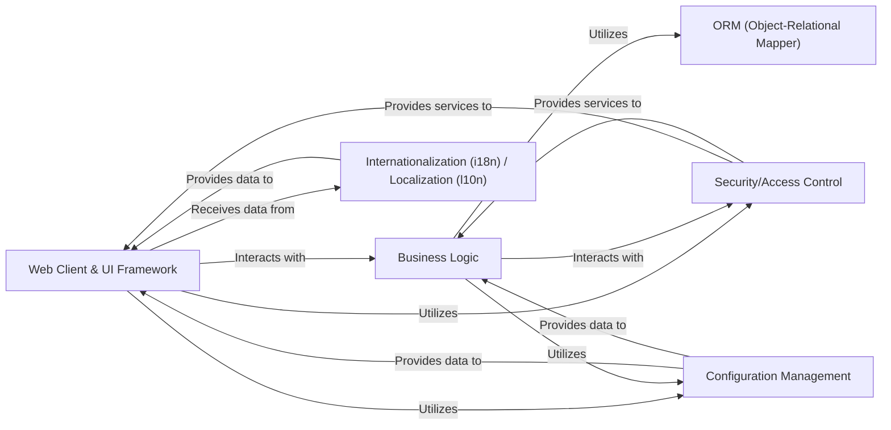

## Details

The "Web-facing Application Subsystem" is responsible for handling all user interactions through the web interface and processing these interactions through the core application logic. It encompasses the presentation layer, the application logic layer, and the data access layer, along with essential cross-cutting concerns like security, internationalization, and configuration, as they directly support the web application's functionality.

### Web Client & UI Framework [[Expand]](./Web_Client_UI_Framework.md)
This component serves as the primary interface for users, encompassing both the web server functionalities and the user interface rendering capabilities. It manages the entire HTTP request-response lifecycle, including routing incoming requests, handling user sessions, and serving static web assets (JavaScript, CSS, images). Furthermore, it is responsible for the definition and rendering of dynamic UI views (e.g., using XML/QWeb templates), managing client-side assets, structuring navigation menus, and processing various user interface actions. This integrated component provides the interactive front-end, enabling users to seamlessly interact with the ERP system.

**Related Classes/Methods**: _None_

### Business Logic
This component encapsulates the core business rules and processes of the ERP system. It receives requests from the Web Client & UI Framework, performs necessary operations, and interacts with the ORM to persist or retrieve data.

**Related Classes/Methods**: _None_

### ORM (Object-Relational Mapper)
This component provides an abstraction layer over the database. It maps Python objects to database tables and handles CRUD (Create, Read, Update, Delete) operations, allowing the Business Logic to interact with the database without writing raw SQL.

**Related Classes/Methods**: _None_

### Security/Access Control [[Expand]](./Security_Access_Control.md)
This component is responsible for authenticating users, authorizing their actions, and managing permissions. It ensures that users can only access resources and perform operations they are authorized for.

**Related Classes/Methods**: _None_

### Internationalization (i18n) / Localization (l10n)
This component manages the translation of text and adaptation of content to different languages and regional settings.

**Related Classes/Methods**: _None_

### Configuration Management
This component handles the loading, storage, and retrieval of application configurations and settings.

**Related Classes/Methods**: _None_

### [FAQ](https://github.com/CodeBoarding/GeneratedOnBoardings/tree/main?tab=readme-ov-file#faq)