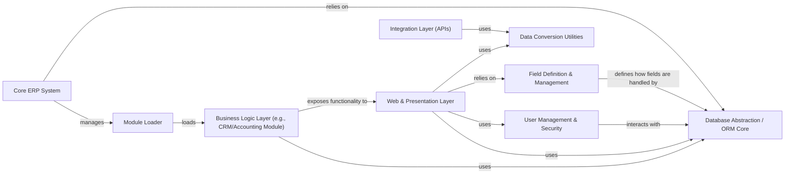

## Details

Abstract Components Overview of an ERP System

### Core ERP System
Provides the foundational services for the entire ERP, including user management, security, module loading, and core system configurations. It acts as the central orchestrator for all other modules.

**Related Classes/Methods**:

- `odoo.modules` (1:100)
- `odoo.tools` (1:100)

### Database Abstraction / ORM Core
Provides an Object-Relational Mapping (ORM) layer that abstracts database interactions, allowing other components to work with Python objects instead of raw SQL. It handles data persistence, retrieval, and relationships.

**Related Classes/Methods**:

- `odoo.models`
- `odoo.fields`

### Module Loader
Manages the discovery, loading, and lifecycle of Odoo modules (addons). It ensures that modules are correctly initialized and their dependencies are met, enabling the modular and extensible nature of the ERP system.

**Related Classes/Methods**:

- `odoo.modules.module`

### User Management & Security
Handles user authentication, authorization, access control, and security policies across the entire ERP system. It ensures that users have appropriate permissions to access data and functionalities.

**Related Classes/Methods**:

- `odoo.addons.base.models.res_users`
- `odoo.addons.base.models.ir_rule`

### Web & Presentation Layer [[Expand]](./Web_Presentation_Layer.md)
This layer is responsible for handling all client-side interactions, including processing HTTP requests, managing user sessions, facilitating RPC communication, and rendering dynamic user interfaces using QWeb. It also manages and serves static web assets. It acts as the primary interface between the user and the Odoo ERP system.

**Related Classes/Methods**:

- `odoo.http`
- <a href="https://github.com/odoo/odoo/blob/18.0/addons/web/controllers/main.py#L1-L100" target="_blank" rel="noopener noreferrer">`odoo.addons.web.controllers.main` (1:100)</a>
- `odoo.addons.web.models.ir_ui_view`
- `odoo.addons.website` (1:100)

### Field Definition & Management
Defines and manages the structure and behavior of data fields used across the system's models. It ensures data consistency and provides mechanisms for validation, serialization, and display properties of fields.

**Related Classes/Methods**:

- `odoo.fields`
- `odoo.addons.base.models.ir_model_fields` (1:100)

### Data Conversion Utilities
Provides a set of utility functions and classes for converting data between various formats (e.g., Python objects to JSON, XML, or specific data types for display). It ensures data integrity and proper formatting during data exchange.

**Related Classes/Methods**:

- `odoo.tools.misc`
- `odoo.tools.json`

### Business Logic Layer (e.g., CRM/Accounting Module)
Encapsulates the domain-specific business rules and processes for various functional areas (e.g., CRM, Accounting, Inventory). These modules define the core operations and workflows of the ERP system.

**Related Classes/Methods**:

- `odoo.addons.crm` (1:100)
- `odoo.addons.account` (1:100)

### Integration Layer (APIs)
Handles external integrations and provides APIs for other systems to interact with the ERP.

**Related Classes/Methods**:

- `odoo.addons.base.controllers.rpc`

### [FAQ](https://github.com/CodeBoarding/GeneratedOnBoardings/tree/main?tab=readme-ov-file#faq)