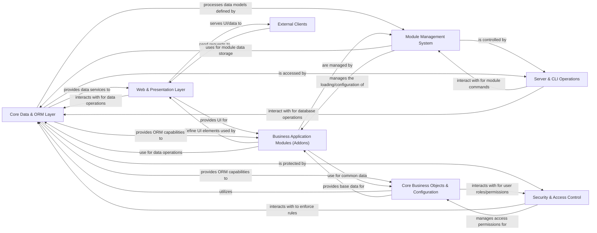

## Details

Abstract Components Overview of an Odoo-like system.

### Core Data & ORM Layer [[Expand]](./Core_Data_ORM_Layer.md)
Provides the foundational data persistence and retrieval mechanisms, including the ORM, database connection management, transaction handling, and caching. It abstracts database interactions for all other components.

**Related Classes/Methods**:

- `odoo/models.py`
- `odoo/fields.py`
- <a href="https://github.com/odoo/odoo/blob/18.0/odoo/sql_db.py#L1-L1" target="_blank" rel="noopener noreferrer">`odoo/sql_db.py` (1:1)</a>

### Web & Presentation Layer [[Expand]](./Web_Presentation_Layer.md)
Handles all client-side interactions, including HTTP request processing, session management, RPC communication, and rendering dynamic user interfaces using QWeb. It also manages and serves static web assets.

**Related Classes/Methods**:

- `odoo/http.py`
- <a href="https://github.com/odoo/odoo/blob/18.0/addons/web/controllers/main.py#L1-L1" target="_blank" rel="noopener noreferrer">`odoo/addons/web/controllers/main.py` (1:1)</a>
- <a href="https://github.com/odoo/odoo/blob/18.0/addons/web/models/ir_ui_view.py#L1-L1" target="_blank" rel="noopener noreferrer">`odoo/addons/web/models/ir_ui_view.py` (1:1)</a>
- `odoo/addons/website/` (1:1)

### Module Management System [[Expand]](./Module_Management_System.md)
Manages the entire lifecycle of Odoo modules (addons), including installation, upgrade, and uninstallation. It builds and maintains the Odoo registry, ensuring proper module loading order and dependency resolution.

**Related Classes/Methods**:

- `odoo/modules/module.py`
- `odoo/modules/loading.py`
- `odoo/modules/registry.py`

### Core Business Objects & Configuration [[Expand]](./Core_Business_Objects_Configuration.md)
Defines the fundamental, system-wide business entities and configurations (e.g., users, partners, companies, currencies, system parameters, actions, reports). These are the base models extended by specific business modules.

**Related Classes/Methods**:

- `odoo/addons/base/models/res_partner.py`
- `odoo/addons/base/models/res_users.py`
- `odoo/addons/base/models/res_company.py`
- `odoo/addons/base/models/ir_rule.py`

### Security & Access Control [[Expand]](./Security_Access_Control.md)
Enforces security policies, managing user authentication, authorization, and granular access rules (record rules, field access) for models and records across the entire application.

**Related Classes/Methods**:

- `odoo/service/security.py`
- `odoo/addons/base/models/ir_rule.py`
- `odoo/addons/auth_oauth/` (1:1)
- `odoo/addons/auth_passkey/` (1:1)

### Business Application Modules (Addons) [[Expand]](./Business_Application_Modules_Addons_.md)
Encapsulates specific business functionalities (e.g., CRM, Accounting, Inventory). These are self-contained modules that extend the core Odoo framework by defining new models, views, and business logic, providing the comprehensive ERP features.

**Related Classes/Methods**:

- `odoo/addons/account/` (1:1)
- `odoo/addons/crm/` (1:1)
- `odoo/addons/sale/` (1:1)
- `odoo/addons/stock/` (1:1)

### Server & CLI Operations [[Expand]](./Server_CLI_Operations.md)
Manages the Odoo server's runtime environment, including process management and different worker types. It also provides command-line interface tools for administrative tasks like database management, deployment, and testing.

**Related Classes/Methods**:

- `odoo/cli/server.py`
- `odoo/cli/command.py`
- `odoo/service/server.py`

### External Clients [[Expand]](./External_Clients.md)
Represents external users or systems interacting with the Odoo system.

**Related Classes/Methods**: _None_

### [FAQ](https://github.com/CodeBoarding/GeneratedOnBoardings/tree/main?tab=readme-ov-file#faq)