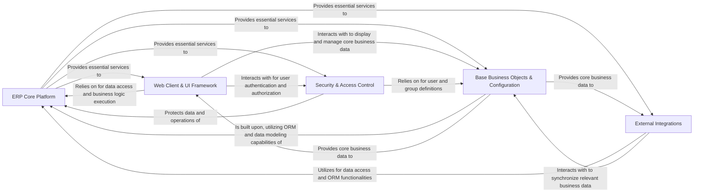

## Details

One paragraph explaining the functionality which is represented by this graph. What the main flow is and what is its purpose.

### ERP Core Platform [[Expand]](./ERP_Core_Platform.md)
This is the foundational technical layer of the Odoo ERP system. It provides the Object-Relational Mapper (ORM), API, transaction management, caching mechanisms, and abstracts database interactions. It also encompasses the server infrastructure, command-line tools, module lifecycle management, and general system utilities for profiling and data manipulation. This component forms the backbone upon which all business applications are built.

**Related Classes/Methods**: _None_

### Web Client & UI Framework [[Expand]](./Web_Client_UI_Framework.md)
This component manages the web-based user interface, handling incoming HTTP requests, user sessions, and dispatching requests to appropriate controllers. It is responsible for the definition and rendering of UI views (XML/QWeb), management of web assets (JavaScript, CSS), menu structures, and various user interface actions, providing the interactive front-end for users to interact with the ERP system.

**Related Classes/Methods**: _None_

### Security & Access Control [[Expand]](./Security_Access_Control.md)
This critical, cross-cutting component enforces system-wide security policies. It manages user authentication, authorization, defines record-level access rules, and handles API key authentication to ensure data integrity and authorized access to the ERP system's resources and data.

**Related Classes/Methods**: _None_

### Base Business Objects & Configuration [[Expand]](./Base_Business_Objects_Configuration.md)
This component provides the fundamental business entities and system-wide configurations that are common and essential across all ERP modules. This includes core concepts such as user management, partner (customer/vendor) management, company details, currency handling, and general system settings. It forms the bedrock for specific business applications like CRM, Accounting, and HR.

**Related Classes/Methods**: _None_

### External Integrations [[Expand]](./External_Integrations.md)
This component is responsible for facilitating connections and data synchronization with external third-party services. It enables the ERP system to extend its functionalities by integrating with specialized external systems, such as calendar applications (e.g., Google Calendar, Microsoft Calendar).

**Related Classes/Methods**: _None_

### [FAQ](https://github.com/CodeBoarding/GeneratedOnBoardings/tree/main?tab=readme-ov-file#faq)