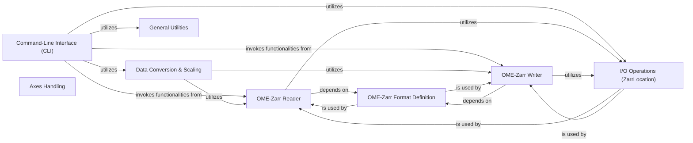

## Details

The Command-Line Interface (CLI) component, primarily encapsulated within the ome_zarr.cli module, serves as the user-facing facade for the ome-zarr-py library. It abstracts the underlying complexities of OME-Zarr operations, allowing users to interact with the library through simple command-line commands for tasks such as viewing, finding, downloading, and creating OME-Zarr files.

### Command-Line Interface (CLI) [[Expand]](./Command_Line_Interface_CLI_.md)
The primary user interface, responsible for parsing command-line arguments and orchestrating calls to other core library components to execute user-requested OME-Zarr operations. It acts as a facade, simplifying complex workflows.

**Related Classes/Methods**:

- <a href="https://github.com/ome/ome-zarr-py/blob/master/ome_zarr/cli.py#L1-L1" target="_blank" rel="noopener noreferrer">`ome_zarr.cli` (1:1)</a>

### OME-Zarr Reader
Handles the parsing and interpretation of existing OME-Zarr datasets. It provides functionalities to read image data, metadata, and associated structures (like labels, multiscales, OMERO metadata, plates, wells) from a Zarr store.

**Related Classes/Methods**:

- <a href="https://github.com/ome/ome-zarr-py/blob/master/ome_zarr/reader.py#L1-L1" target="_blank" rel="noopener noreferrer">`ome_zarr.reader` (1:1)</a>

### OME-Zarr Writer
Manages the creation and writing of new OME-Zarr datasets, ensuring adherence to the OME-NGFF specification. It handles the serialization of image data and metadata into the Zarr format.

**Related Classes/Methods**:

- <a href="https://github.com/ome/ome-zarr-py/blob/master/ome_zarr/writer.py#L1-L1" target="_blank" rel="noopener noreferrer">`ome_zarr.writer` (1:1)</a>

### Data Conversion & Scaling
Provides utilities for processing and transforming image data, including operations like scaling, type conversions, and potentially other image processing tasks required before writing or after reading OME-Zarr data.

**Related Classes/Methods**:

- <a href="https://github.com/ome/ome-zarr-py/blob/master/ome_zarr/scale.py#L1-L1" target="_blank" rel="noopener noreferrer">`ome_zarr.scale` (1:1)</a>
- `ome_zarr.napari` (1:1)

### OME-Zarr Format Definition
Encapsulates the OME-NGFF (Next Generation File Format) specification, defining the structure, metadata, and conventions for OME-Zarr files. This ensures consistency and interoperability.

**Related Classes/Methods**:

- <a href="https://github.com/ome/ome-zarr-py/blob/master/ome_zarr/format.py#L1-L1" target="_blank" rel="noopener noreferrer">`ome_zarr.format` (1:1)</a>

### I/O Operations (ZarrLocation)
Provides an abstraction layer for interacting with various Zarr storage backends (e.g., local filesystem, S3). It manages the low-level details of accessing and manipulating Zarr arrays and groups.

**Related Classes/Methods**:

- <a href="https://github.com/ome/ome-zarr-py/blob/master/ome_zarr/io.py#L1-L1" target="_blank" rel="noopener noreferrer">`ome_zarr.io` (1:1)</a>

### General Utilities
A collection of common helper functions and utilities used across different parts of the library, such as path manipulation, data validation, or other generic support functions.

**Related Classes/Methods**:

- <a href="https://github.com/ome/ome-zarr-py/blob/master/ome_zarr/utils.py#L1-L1" target="_blank" rel="noopener noreferrer">`ome_zarr.utils` (1:1)</a>

### Axes Handling
Manages the interpretation, validation, and manipulation of image dimensions (axes) within the OME-Zarr context, ensuring correct handling of spatial, temporal, and channel information.

**Related Classes/Methods**:

- <a href="https://github.com/ome/ome-zarr-py/blob/master/ome_zarr/axes.py#L1-L1" target="_blank" rel="noopener noreferrer">`ome_zarr.axes` (1:1)</a>

### [FAQ](https://github.com/CodeBoarding/GeneratedOnBoardings/tree/main?tab=readme-ov-file#faq)