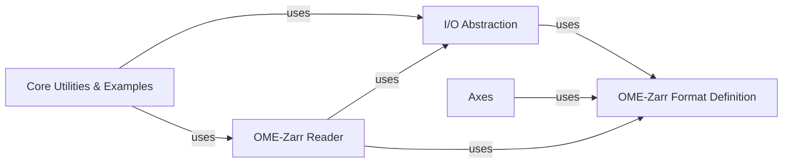

## Details

One paragraph explaining the functionality which is represented by this graph. What the main flow is and what is its purpose.

### OME-Zarr Format Definition
This component defines the various versions of the OME-Zarr specification, including FormatV01, FormatV02, FormatV03, and FormatV04. It establishes the structure and metadata requirements for OME-Zarr datasets, ensuring data consistency and interoperability. FormatV04 extends previous versions and integrates with ZarrLocation for handling data locations.

**Related Classes/Methods**:

- <a href="https://github.com/ome/ome-zarr-py/blob/master/ome_zarr/format.py#L1-L1" target="_blank" rel="noopener noreferrer">`ome_zarr.format` (1:1)</a>

### I/O Abstraction
This component provides an abstraction layer for interacting with Zarr data stores, represented by ZarrLocation. It handles the underlying file system operations, allowing the rest of the library to work with Zarr arrays and groups without needing to know the specifics of the storage backend (e.g., local disk, S3). It also serves as a base for Node and Reader components.

**Related Classes/Methods**:

- <a href="https://github.com/ome/ome-zarr-py/blob/master/ome_zarr/io.py#L1-L1" target="_blank" rel="noopener noreferrer">`ome_zarr.io` (1:1)</a>

### OME-Zarr Reader
This component is responsible for reading and interpreting OME-Zarr datasets. It includes classes like Spec, Label, Labels, Multiscales, OMERO, Plate, PlateLabels, and Well, each designed to parse specific parts of the OME-Zarr hierarchy. It builds upon the Node and Reader classes, which in turn rely on ZarrLocation for data access.

**Related Classes/Methods**:

- <a href="https://github.com/ome/ome-zarr-py/blob/master/ome_zarr/reader.py#L1-L1" target="_blank" rel="noopener noreferrer">`ome_zarr.reader` (1:1)</a>

### Axes
This component defines how axes (dimensions) are handled within the OME-Zarr format. It provides the Axes class, which is used by the Format classes to specify the properties and order of dimensions in the image data.

**Related Classes/Methods**:

- <a href="https://github.com/ome/ome-zarr-py/blob/master/ome_zarr/axes.py#L1-L1" target="_blank" rel="noopener noreferrer">`ome_zarr.axes` (1:1)</a>

### Core Utilities & Examples [[Expand]](./Core_Utilities_Examples.md)
This component is a collection of general helper functions, specialized data conversion tools, and modules for generating synthetic OME-Zarr datasets. It includes utilities for finding multiscales (find_multiscales), path manipulation (splitall), data information (info, view), CSV to OME-Zarr conversion (csv_to_zarr, parse_csv_value), and sample data generation (coins, astronaut, create_zarr).

**Related Classes/Methods**:

- <a href="https://github.com/ome/ome-zarr-py/blob/master/ome_zarr/utils.py#L1-L1" target="_blank" rel="noopener noreferrer">`ome_zarr.utils` (1:1)</a>
- <a href="https://github.com/ome/ome-zarr-py/blob/master/ome_zarr/csv.py#L1-L1" target="_blank" rel="noopener noreferrer">`ome_zarr.csv` (1:1)</a>
- <a href="https://github.com/ome/ome-zarr-py/blob/master/ome_zarr/data.py#L1-L1" target="_blank" rel="noopener noreferrer">`ome_zarr.data` (1:1)</a>

### [FAQ](https://github.com/CodeBoarding/GeneratedOnBoardings/tree/main?tab=readme-ov-file#faq)