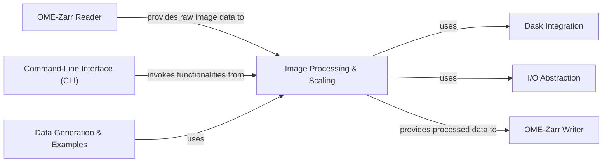

## Details

Overview of Image Processing & Scaling component and its relations within the bioimage informatics toolkit.

### Image Processing & Scaling [[Expand]](./Image_Processing_Scaling.md)
This component is central to handling data transformations within the bioimage informatics toolkit, primarily focusing on generating multiscale representations (image pyramids) of large bioimage datasets. It implements various downscaling and resizing algorithms, efficiently processing data by integrating with Dask for lazy computation. Additionally, it provides utility functions for specific data conversions, such as transforming integer labels into RGBA color formats, ensuring data compliance and proper visualization within the OME-Zarr specification.

**Related Classes/Methods**:

- <a href="https://github.com/ome/ome-zarr-py/blob/master/ome_zarr/scale.py" target="_blank" rel="noopener noreferrer">`ome_zarr.scale.Scaler`</a>
- <a href="https://github.com/ome/ome-zarr-py/blob/master/ome_zarr/conversions.py#L3-L10" target="_blank" rel="noopener noreferrer">`ome_zarr.conversions.int_to_rgba` (3:10)</a>
- <a href="https://github.com/ome/ome-zarr-py/blob/master/ome_zarr/conversions.py#L13-L20" target="_blank" rel="noopener noreferrer">`ome_zarr.conversions.int_to_rgba_255` (13:20)</a>
- <a href="https://github.com/ome/ome-zarr-py/blob/master/ome_zarr/conversions.py#L23-L31" target="_blank" rel="noopener noreferrer">`ome_zarr.conversions.rgba_to_int` (23:31)</a>

### Dask Integration
Handles integration with Dask for efficient, lazy processing of large datasets.

**Related Classes/Methods**: _None_

### I/O Abstraction
Manages input/output operations, including parsing URLs and creating Zarr stores.

**Related Classes/Methods**: _None_

### OME-Zarr Reader
Responsible for parsing and accessing OME-Zarr datasets.

**Related Classes/Methods**: _None_

### OME-Zarr Writer
Handles persistence of processed data into the OME-Zarr format.

**Related Classes/Methods**: _None_

### Command-Line Interface (CLI) [[Expand]](./Command_Line_Interface_CLI_.md)
Provides user-friendly access to the library's functionalities via command-line.

**Related Classes/Methods**: _None_

### Data Generation & Examples
Responsible for generating example OME-Zarr datasets for testing and demonstrations.

**Related Classes/Methods**: _None_

### [FAQ](https://github.com/CodeBoarding/GeneratedOnBoardings/tree/main?tab=readme-ov-file#faq)