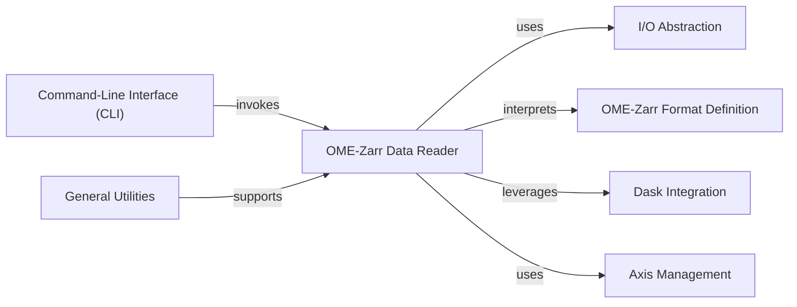

## Details

The OME-Zarr Data Reader component is fundamental to the ome-zarr-py library as it provides the core functionality for interpreting and navigating OME-Zarr datasets. It acts as the primary interface for consuming complex bioimage data stored in the OME-Zarr format.

### OME-Zarr Data Reader [[Expand]](./OME_Zarr_Data_Reader.md)
Responsible for interpreting and parsing complex OME-Zarr data structures (e.g., Plates, Wells, Images, Labels, Multiscales, OMERO metadata) from a Zarr store. It constructs a hierarchical, navigable representation of the Zarr content, making it accessible for consumption by other parts of the library. This component embodies the "Data Access Layer" and "Domain Model" patterns by providing structured access to the raw Zarr data and mapping it to meaningful OME-Zarr concepts.

**Related Classes/Methods**:

- <a href="https://github.com/ome/ome-zarr-py/blob/master/ome_zarr/reader.py#L609-L649" target="_blank" rel="noopener noreferrer">`ome_zarr.reader.Reader` (609:649)</a>
- <a href="https://github.com/ome/ome-zarr-py/blob/master/ome_zarr/reader.py#L19-L156" target="_blank" rel="noopener noreferrer">`ome_zarr.reader.Node` (19:156)</a>
- <a href="https://github.com/ome/ome-zarr-py/blob/master/ome_zarr/reader.py#L159-L179" target="_blank" rel="noopener noreferrer">`ome_zarr.reader.Spec` (159:179)</a>
- <a href="https://github.com/ome/ome-zarr-py/blob/master/ome_zarr/reader.py#L467-L561" target="_blank" rel="noopener noreferrer">`ome_zarr.reader.Plate` (467:561)</a>
- <a href="https://github.com/ome/ome-zarr-py/blob/master/ome_zarr/reader.py#L396-L464" target="_blank" rel="noopener noreferrer">`ome_zarr.reader.Well` (396:464)</a>
- <a href="https://github.com/ome/ome-zarr-py/blob/master/ome_zarr/reader.py#L269-L324" target="_blank" rel="noopener noreferrer">`ome_zarr.reader.Multiscales` (269:324)</a>
- <a href="https://github.com/ome/ome-zarr-py/blob/master/ome_zarr/reader.py#L201-L266" target="_blank" rel="noopener noreferrer">`ome_zarr.reader.Label` (201:266)</a>
- <a href="https://github.com/ome/ome-zarr-py/blob/master/ome_zarr/reader.py#L327-L393" target="_blank" rel="noopener noreferrer">`ome_zarr.reader.OMERO` (327:393)</a>
- <a href="https://github.com/ome/ome-zarr-py/blob/master/ome_zarr/reader.py#L1-L1" target="_blank" rel="noopener noreferrer">`ome_zarr.reader.parse_url` (1:1)</a>

### I/O Abstraction
Provides capabilities to interact with various Zarr storage backends (local, S3, etc.).

**Related Classes/Methods**:

- <a href="https://github.com/ome/ome-zarr-py/blob/master/ome_zarr/io.py#L1-L1" target="_blank" rel="noopener noreferrer">`ome_zarr.io.ZarrLocation` (1:1)</a>
- <a href="https://github.com/ome/ome-zarr-py/blob/master/ome_zarr/io.py#L1-L1" target="_blank" rel="noopener noreferrer">`ome_zarr.io.parse_url` (1:1)</a>

### OME-Zarr Format Definition
Defines the OME-Zarr specification, including structure and data types.

**Related Classes/Methods**: _None_

### Dask Integration
Enables lazy loading and efficient handling of large, multi-dimensional datasets using Dask arrays.

**Related Classes/Methods**: _None_

### Axis Management
Manages and applies axis metadata from the Zarr store for correct data interpretation.

**Related Classes/Methods**:

- <a href="https://github.com/ome/ome-zarr-py/blob/master/ome_zarr/axes.py#L1-L1" target="_blank" rel="noopener noreferrer">`ome_zarr.axes.get_axes_from_zarr` (1:1)</a>

### Command-Line Interface (CLI) [[Expand]](./Command_Line_Interface_CLI_.md)
Provides command-line tools to inspect and display OME-Zarr dataset information.

**Related Classes/Methods**:

- <a href="https://github.com/ome/ome-zarr-py/blob/master/ome_zarr/cli.py#L27-L30" target="_blank" rel="noopener noreferrer">`ome_zarr.cli.info` (27:30)</a>

### General Utilities
Contains helper functions for common operations and instantiation of components.

**Related Classes/Methods**:

- `get_reader` (1:1)

### [FAQ](https://github.com/CodeBoarding/GeneratedOnBoardings/tree/main?tab=readme-ov-file#faq)