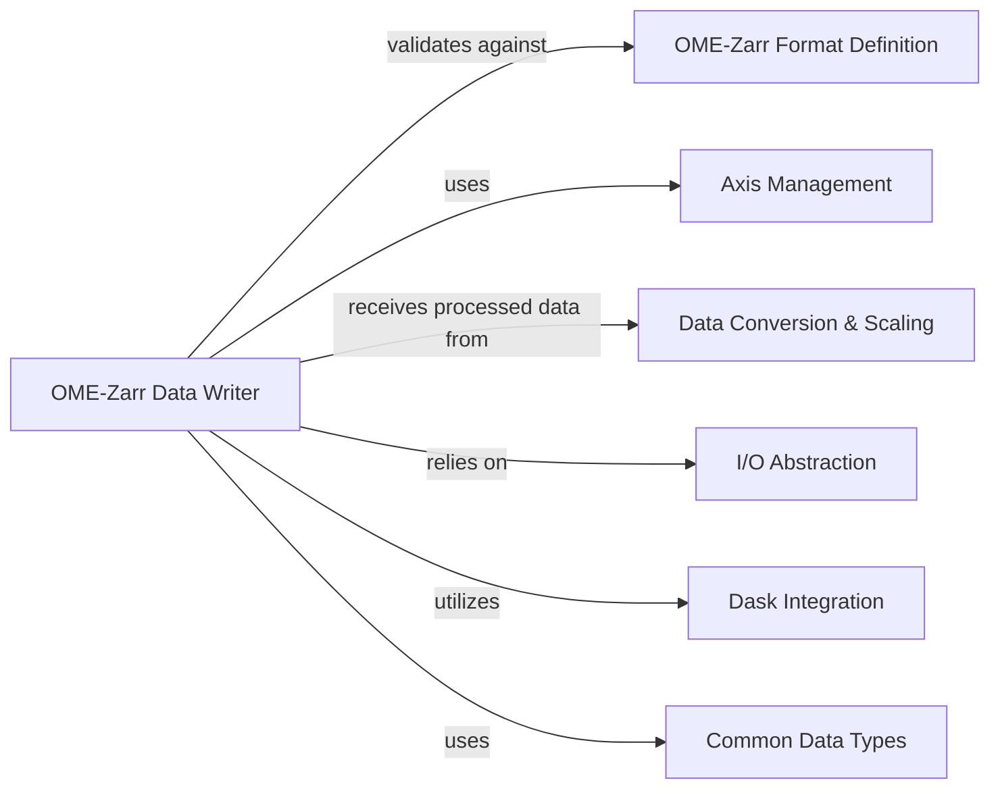

## Details

A specialized data library/toolkit for bioimage informatics, focusing on OME-Zarr data handling.

### OME-Zarr Data Writer [[Expand]](./OME_Zarr_Data_Writer.md)
The OME-Zarr Data Writer is the core component responsible for serializing image data and associated OME-Zarr metadata (such as multiscales, plates, wells, and labels) into a Zarr store. It orchestrates the entire writing process, ensuring that the output strictly complies with the OME-Zarr specification. This involves managing the creation of Zarr arrays and groups, embedding OME-Zarr attributes, and coordinating with other components for data validation, axis handling, and efficient data processing.

**Related Classes/Methods**:

- <a href="https://github.com/ome/ome-zarr-py/blob/master/ome_zarr/writer.py#L1-L1" target="_blank" rel="noopener noreferrer">`ome_zarr/writer.py` (1:1)</a>

### OME-Zarr Format Definition
This component defines and validates the structure and content required by different versions of the OME-Zarr specification. It provides the necessary rules and mechanisms to ensure that the data and metadata being written conform to the standard, which is critical for interoperability and data integrity across different tools and platforms.

**Related Classes/Methods**:

- <a href="https://github.com/ome/ome-zarr-py/blob/master/ome_zarr/format.py#L1-L1" target="_blank" rel="noopener noreferrer">`ome_zarr/format.py` (1:1)</a>

### Axis Management
This component is responsible for managing the definition, validation, and transformation of image axes (e.g., 't', 'c', 'z', 'y', 'x'). It ensures that axis metadata is correctly interpreted and embedded within the OME-Zarr structure, which is crucial for correctly interpreting the multi-dimensional image data.

**Related Classes/Methods**:

- <a href="https://github.com/ome/ome-zarr-py/blob/master/ome_zarr/axes.py#L1-L1" target="_blank" rel="noopener noreferrer">`ome_zarr/axes.py` (1:1)</a>

### Data Conversion & Scaling
This component handles the generation and management of multiscale image pyramids, a fundamental aspect of the OME-Zarr specification for efficient data access at various resolutions. It prepares the raw or processed image data into the appropriate multiscale representations required for serialization by the writer.

**Related Classes/Methods**:

- <a href="https://github.com/ome/ome-zarr-py/blob/master/ome_zarr/scale.py#L1-L1" target="_blank" rel="noopener noreferrer">`ome_zarr/scale.py` (1:1)</a>
- <a href="https://github.com/ome/ome-zarr-py/blob/master/ome_zarr/conversions.py#L1-L1" target="_blank" rel="noopener noreferrer">`ome_zarr/conversions.py` (1:1)</a>

### I/O Abstraction
This component provides an abstract layer for interacting with various Zarr storage backends (e.g., local filesystem, S3, HTTP). It encapsulates the low-level details of data persistence and retrieval, allowing the OME-Zarr Data Writer to focus solely on the data serialization logic without concern for the underlying storage mechanism.

**Related Classes/Methods**:

- <a href="https://github.com/ome/ome-zarr-py/blob/master/ome_zarr/io.py#L1-L1" target="_blank" rel="noopener noreferrer">`ome_zarr/io.py` (1:1)</a>

### Dask Integration
This component facilitates efficient, lazy processing and writing of large, out-of-core datasets by leveraging Dask arrays. It ensures that memory usage is optimized and computations are performed efficiently, which is crucial for handling the massive scale of bioimage data without loading everything into memory.

**Related Classes/Methods**:

- <a href="https://github.com/ome/ome-zarr-py/blob/master/ome_zarr/dask_utils.py#L1-L1" target="_blank" rel="noopener noreferrer">`ome_zarr/dask_utils.py` (1:1)</a>

### Common Data Types
This component defines and provides standardized data types and structures used throughout the library, such as dictionaries for JSON metadata (JSONDict). This ensures consistency, type safety, and clarity across different modules and functions, particularly when handling complex metadata structures.

**Related Classes/Methods**:

- <a href="https://github.com/ome/ome-zarr-py/blob/master/ome_zarr/types.py#L1-L1" target="_blank" rel="noopener noreferrer">`ome_zarr/types.py` (1:1)</a>

### [FAQ](https://github.com/CodeBoarding/GeneratedOnBoardings/tree/main?tab=readme-ov-file#faq)