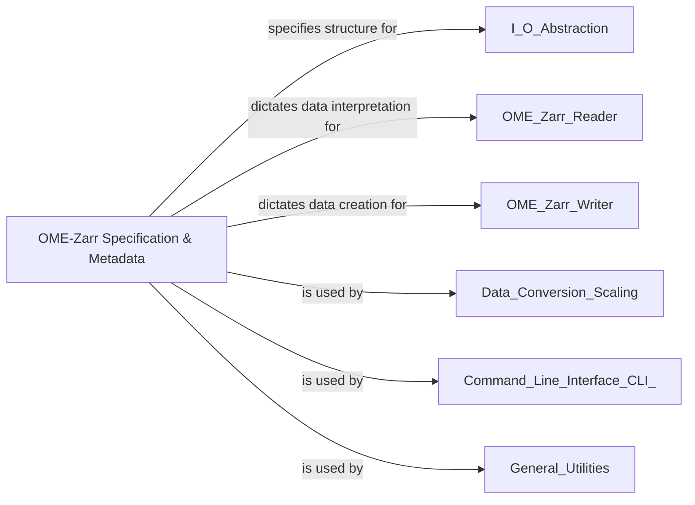

## Details

This component is the core of the `ome-zarr-py` library, acting as the authoritative source and enforcer of the OME-Zarr specification. It embodies the Domain Model architectural pattern, defining the structure, rules, and validation mechanisms for OME-Zarr datasets. Its fundamental role is to ensure data integrity and interoperability across all operations within the library. Without a robust and centralized definition of the specification, the library would lack the ability to: Read and Write Compliant Data, Ensure Data Integrity, Support Versioning, Provide a Consistent API.

### OME-Zarr Specification & Metadata [[Expand]](./OME_Zarr_Specification_Metadata.md)
This component is the core of the `ome-zarr-py` library, acting as the authoritative source and enforcer of the OME-Zarr specification. It embodies the Domain Model architectural pattern, defining the structure, rules, and validation mechanisms for OME-Zarr datasets. Its fundamental role is to ensure data integrity and interoperability across all operations within the library. It includes modules like `ome_zarr.format`, `ome_zarr.axes`, and `ome_zarr.types`.

**Related Classes/Methods**:

- <a href="https://github.com/ome/ome-zarr-py/blob/master/ome_zarr/format.py#L1-L1" target="_blank" rel="noopener noreferrer">`ome_zarr.format` (1:1)</a>
- <a href="https://github.com/ome/ome-zarr-py/blob/master/ome_zarr/format.py#L47-L117" target="_blank" rel="noopener noreferrer">`ome_zarr.format:Format` (47:117)</a>
- <a href="https://github.com/ome/ome-zarr-py/blob/master/ome_zarr/format.py#L120-L170" target="_blank" rel="noopener noreferrer">`ome_zarr.format:FormatV01` (120:170)</a>
- <a href="https://github.com/ome/ome-zarr-py/blob/master/ome_zarr/format.py#L173-L206" target="_blank" rel="noopener noreferrer">`ome_zarr.format:FormatV02` (173:206)</a>
- <a href="https://github.com/ome/ome-zarr-py/blob/master/ome_zarr/format.py#L209-L217" target="_blank" rel="noopener noreferrer">`ome_zarr.format:FormatV03` (209:217)</a>
- <a href="https://github.com/ome/ome-zarr-py/blob/master/ome_zarr/format.py#L220-L342" target="_blank" rel="noopener noreferrer">`ome_zarr.format:FormatV04` (220:342)</a>
- <a href="https://github.com/ome/ome-zarr-py/blob/master/ome_zarr/format.py#L1-L1" target="_blank" rel="noopener noreferrer">`ome_zarr.format:matches` (1:1)</a>
- <a href="https://github.com/ome/ome-zarr-py/blob/master/ome_zarr/format.py#L1-L1" target="_blank" rel="noopener noreferrer">`ome_zarr.format:validate_well_dict` (1:1)</a>
- <a href="https://github.com/ome/ome-zarr-py/blob/master/ome_zarr/format.py#L1-L1" target="_blank" rel="noopener noreferrer">`ome_zarr.format:validate_coordinate_transformations` (1:1)</a>
- <a href="https://github.com/ome/ome-zarr-py/blob/master/ome_zarr/format.py#L1-L1" target="_blank" rel="noopener noreferrer">`ome_zarr.format:init_store` (1:1)</a>
- <a href="https://github.com/ome/ome-zarr-py/blob/master/ome_zarr/axes.py#L1-L1" target="_blank" rel="noopener noreferrer">`ome_zarr.axes` (1:1)</a>
- <a href="https://github.com/ome/ome-zarr-py/blob/master/ome_zarr/axes.py#L1-L1" target="_blank" rel="noopener noreferrer">`ome_zarr.axes:Axes` (1:1)</a>
- <a href="https://github.com/ome/ome-zarr-py/blob/master/ome_zarr/types.py#L1-L1" target="_blank" rel="noopener noreferrer">`ome_zarr.types` (1:1)</a>

### [FAQ](https://github.com/CodeBoarding/GeneratedOnBoardings/tree/main?tab=readme-ov-file#faq)