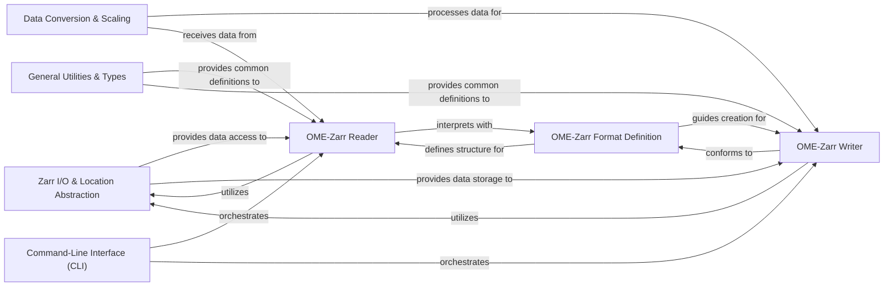

## Details

The `ome-zarr-py` library, designed as a specialized data library for bioimage informatics, is structured around several fundamental components that align with its core purpose of handling OME-Zarr data. The analysis of the `ome_zarr.io` package, particularly through its class hierarchy, reveals the central role of `ZarrLocation` and its relationships with format definitions and reader components.

### Zarr I/O & Location Abstraction [[Expand]](./Zarr_I_O_Location_Abstraction.md)
This foundational Data Access Layer (DAL), primarily embodied by the `ome_zarr.io.ZarrLocation` class, abstracts interactions with various Zarr stores, supporting both local file systems and remote locations (HTTP/S3). It handles path resolution, existence checks, and the low-level reading and writing of Zarr array metadata and raw JSON attributes, providing the primitives for higher-level components. It leverages `fsspec` for file system abstraction.

**Related Classes/Methods**:

- <a href="https://github.com/ome/ome-zarr-py/blob/master/ome_zarr/io.py#L1-L1" target="_blank" rel="noopener noreferrer">`ome_zarr.io.ZarrLocation` (1:1)</a>

### OME-Zarr Format Definition
This component defines the structure and specifications of OME-Zarr data, including different format versions (e.g., `FormatV04`). It ensures compliance with the OME-NGFF specification and provides methods for validating and interpreting Zarr metadata according to the OME-Zarr standard. It acts as the core Domain Model for the OME-Zarr structure.

**Related Classes/Methods**:

- <a href="https://github.com/ome/ome-zarr-py/blob/master/ome_zarr/format.py#L47-L117" target="_blank" rel="noopener noreferrer">`ome_zarr.format.Format` (47:117)</a>
- <a href="https://github.com/ome/ome-zarr-py/blob/master/ome_zarr/format.py#L220-L342" target="_blank" rel="noopener noreferrer">`ome_zarr.format.FormatV04` (220:342)</a>

### OME-Zarr Reader
Responsible for reading and interpreting OME-Zarr datasets. It uses the `Zarr I/O & Location Abstraction` to access Zarr stores and the `OME-Zarr Format Definition` to understand the data structure. It provides high-level interfaces for navigating the OME-Zarr hierarchy (e.g., multiscales, labels, plates, wells) and accessing array data.

**Related Classes/Methods**:

- <a href="https://github.com/ome/ome-zarr-py/blob/master/ome_zarr/reader.py#L19-L156" target="_blank" rel="noopener noreferrer">`ome_zarr.reader.Node` (19:156)</a>
- <a href="https://github.com/ome/ome-zarr-py/blob/master/ome_zarr/reader.py#L609-L649" target="_blank" rel="noopener noreferrer">`ome_zarr.reader.Reader` (609:649)</a>
- <a href="https://github.com/ome/ome-zarr-py/blob/master/ome_zarr/reader.py#L159-L179" target="_blank" rel="noopener noreferrer">`ome_zarr.reader.Spec` (159:179)</a>

### OME-Zarr Writer
Handles the creation and writing of OME-Zarr datasets. It utilizes the `Zarr I/O & Location Abstraction` to write data and metadata to Zarr stores, ensuring that the output conforms to the `OME-Zarr Format Definition`. This component provides functionalities for writing image data, labels, and associated metadata in the OME-Zarr structure.

**Related Classes/Methods**:

- <a href="https://github.com/ome/ome-zarr-py/blob/master/ome_zarr/writer.py#L1-L1" target="_blank" rel="noopener noreferrer">`ome_zarr.writer` (1:1)</a>

### Data Conversion & Scaling
This Processing/Transformation Layer component focuses on processing and transforming image data, including operations like generating multiscale representations (pyramids) and handling data type conversions. It works with numerical data (numpy, dask) and is crucial for preparing data for efficient storage and retrieval in the OME-Zarr format.

**Related Classes/Methods**:

- <a href="https://github.com/ome/ome-zarr-py/blob/master/ome_zarr/scale.py#L1-L1" target="_blank" rel="noopener noreferrer">`ome_zarr.scale` (1:1)</a>

### General Utilities & Types
Provides common utility functions, helper methods, and defines core data types used throughout the `ome-zarr-py` library. This includes definitions for array types, metadata structures, and general-purpose functions that support other components, ensuring consistency and reusability.

**Related Classes/Methods**:

- <a href="https://github.com/ome/ome-zarr-py/blob/master/ome_zarr/types.py#L1-L1" target="_blank" rel="noopener noreferrer">`ome_zarr.types` (1:1)</a>
- <a href="https://github.com/ome/ome-zarr-py/blob/master/ome_zarr/utils.py#L1-L1" target="_blank" rel="noopener noreferrer">`ome_zarr.utils` (1:1)</a>

### Command-Line Interface (CLI) [[Expand]](./Command_Line_Interface_CLI_.md)
Offers a user-friendly command-line interface for interacting with the `ome-zarr-py` library. It acts as a Facade, orchestrating calls to the `OME-Zarr Reader`, `OME-Zarr Writer`, and `Data Conversion & Scaling` components to perform common tasks like converting image formats to OME-Zarr or inspecting existing datasets.

**Related Classes/Methods**:

- <a href="https://github.com/ome/ome-zarr-py/blob/master/ome_zarr/cli.py#L1-L1" target="_blank" rel="noopener noreferrer">`ome_zarr.cli` (1:1)</a>

### [FAQ](https://github.com/CodeBoarding/GeneratedOnBoardings/tree/main?tab=readme-ov-file#faq)