```mermaid
graph LR
    OME_Zarr_Specification_Metadata["OME-Zarr Specification & Metadata"]
    Zarr_I_O_Location_Abstraction["Zarr I/O & Location Abstraction"]
    OME_Zarr_Data_Reader["OME-Zarr Data Reader"]
    OME_Zarr_Data_Writer["OME-Zarr Data Writer"]
    Image_Processing_Scaling["Image Processing & Scaling"]
    Command_Line_Interface_CLI_["Command-Line Interface (CLI)"]
    Core_Utilities_Examples["Core Utilities & Examples"]
    OME_Zarr_Specification_Metadata -- "Informs" --> OME_Zarr_Data_Reader
    OME_Zarr_Specification_Metadata -- "Informs" --> OME_Zarr_Data_Writer
    OME_Zarr_Specification_Metadata -- "Utilizes" --> Zarr_I_O_Location_Abstraction
    Zarr_I_O_Location_Abstraction -- "Provides access to" --> OME_Zarr_Data_Reader
    Zarr_I_O_Location_Abstraction -- "Provides access to" --> OME_Zarr_Data_Writer
    Zarr_I_O_Location_Abstraction -- "Provides access to" --> Image_Processing_Scaling
    Zarr_I_O_Location_Abstraction -- "Provides access to" --> Core_Utilities_Examples
    OME_Zarr_Data_Reader -- "Reads from" --> Zarr_I_O_Location_Abstraction
    OME_Zarr_Data_Reader -- "Guided by" --> OME_Zarr_Specification_Metadata
    OME_Zarr_Data_Reader -- "Consumed by" --> Command_Line_Interface_CLI_
    OME_Zarr_Data_Reader -- "Consumed by" --> Core_Utilities_Examples
    OME_Zarr_Data_Writer -- "Writes to" --> Zarr_I_O_Location_Abstraction
    OME_Zarr_Data_Writer -- "Adheres to" --> OME_Zarr_Specification_Metadata
    OME_Zarr_Data_Writer -- "Integrates with" --> Image_Processing_Scaling
    OME_Zarr_Data_Writer -- "Invoked by" --> Command_Line_Interface_CLI_
    OME_Zarr_Data_Writer -- "Invoked by" --> Core_Utilities_Examples
    Image_Processing_Scaling -- "Reads/Writes data via" --> Zarr_I_O_Location_Abstraction
    Image_Processing_Scaling -- "Provides processed data to" --> OME_Zarr_Data_Writer
    Image_Processing_Scaling -- "Used by" --> Core_Utilities_Examples
    Command_Line_Interface_CLI_ -- "Orchestrates operations by invoking" --> OME_Zarr_Data_Reader
    Command_Line_Interface_CLI_ -- "Orchestrates operations by invoking" --> OME_Zarr_Data_Writer
    Command_Line_Interface_CLI_ -- "Orchestrates operations by invoking" --> Core_Utilities_Examples
    Core_Utilities_Examples -- "Supports" --> Command_Line_Interface_CLI_
    Core_Utilities_Examples -- "Utilizes" --> Zarr_I_O_Location_Abstraction
    Core_Utilities_Examples -- "Leverages" --> Image_Processing_Scaling
    Core_Utilities_Examples -- "Leverages" --> OME_Zarr_Data_Writer
    Core_Utilities_Examples -- "Leverages" --> OME_Zarr_Data_Reader
    click OME_Zarr_Specification_Metadata href "https://github.com/CodeBoarding/GeneratedOnBoardings/blob/main/ome-zarr-py/OME_Zarr_Specification_Metadata.md" "Details"
    click Zarr_I_O_Location_Abstraction href "https://github.com/CodeBoarding/GeneratedOnBoardings/blob/main/ome-zarr-py/Zarr_I_O_Location_Abstraction.md" "Details"
    click OME_Zarr_Data_Reader href "https://github.com/CodeBoarding/GeneratedOnBoardings/blob/main/ome-zarr-py/OME_Zarr_Data_Reader.md" "Details"
    click OME_Zarr_Data_Writer href "https://github.com/CodeBoarding/GeneratedOnBoardings/blob/main/ome-zarr-py/OME_Zarr_Data_Writer.md" "Details"
    click Image_Processing_Scaling href "https://github.com/CodeBoarding/GeneratedOnBoardings/blob/main/ome-zarr-py/Image_Processing_Scaling.md" "Details"
    click Command_Line_Interface_CLI_ href "https://github.com/CodeBoarding/GeneratedOnBoardings/blob/main/ome-zarr-py/Command_Line_Interface_CLI_.md" "Details"
    click Core_Utilities_Examples href "https://github.com/CodeBoarding/GeneratedOnBoardings/blob/main/ome-zarr-py/Core_Utilities_Examples.md" "Details"
```

## Details

The `ome-zarr-py` project is structured as a specialized data library for bioimage informatics, emphasizing modularity, testability, and adherence to the OME-Zarr specification. Its architecture facilitates efficient I/O, data transformation, and user interaction for large-scale bioimage data.

### OME-Zarr Specification & Metadata [[Expand]](./OME_Zarr_Specification_Metadata.md)
This component serves as the authoritative source for the OME-Zarr specification. It defines and manages different OME-Zarr versions, provides mechanisms for format detection, validates metadata structures, and handles image axes (dimensions). It ensures all data operations strictly adhere to the defined standard.

**Related Classes/Methods**:

- `OME-Zarr Specification & Metadata`
- `OME-Zarr Specification & Metadata`

### Zarr I/O & Location Abstraction [[Expand]](./Zarr_I_O_Location_Abstraction.md)
This foundational data access layer abstracts interactions with various Zarr stores, supporting both local file systems and remote locations (HTTP/S3). It handles path resolution, existence checks, and the low-level reading and writing of Zarr array metadata and raw JSON attributes, providing the primitives for higher-level components.

**Related Classes/Methods**:

- `Zarr I/O & Location Abstraction`

### OME-Zarr Data Reader [[Expand]](./OME_Zarr_Data_Reader.md)
Responsible for interpreting and parsing complex OME-Zarr data structures (e.g., Plates, Wells, Images, Labels, Multiscales, OMERO metadata) from a Zarr store. It constructs a hierarchical, navigable representation of the Zarr content, making it accessible for consumption by other parts of the library.

**Related Classes/Methods**:

- `OME-Zarr Data Reader`

### OME-Zarr Data Writer [[Expand]](./OME_Zarr_Data_Writer.md)
Handles the serialization of image data and associated OME-Zarr metadata (multiscales, plates, wells, labels) into a Zarr store. It ensures that the written data strictly complies with the OME-Zarr specification, managing the creation of Zarr arrays and their associated attributes.

**Related Classes/Methods**:

- `OME-Zarr Data Writer`

### Image Processing & Scaling [[Expand]](./Image_Processing_Scaling.md)
Implements data transformation logic, specifically for generating multiscale representations of image data. It handles operations like downscaling and resizing, integrating with Dask for efficient, lazy computation to process large bioimages.

**Related Classes/Methods**:

- `Image Processing & Scaling`

### Command-Line Interface (CLI) [[Expand]](./Command_Line_Interface_CLI_.md)
Serves as the primary user-facing facade, providing a convenient command-line interface for common OME-Zarr operations. Users can interact with the library to view information, find data, download, and create Zarr files without writing Python code.

**Related Classes/Methods**:

- `Command-Line Interface (CLI)`

### Core Utilities & Examples [[Expand]](./Core_Utilities_Examples.md)
A collection of general helper functions and modules that support various operations across the library. This includes utilities for finding multiscales within a Zarr hierarchy, path manipulation, specialized data conversions (e.g., CSV to OME-Zarr), and modules for generating sample OME-Zarr datasets for testing, demonstration, and reproducible examples.

**Related Classes/Methods**:

- `Core Utilities & Examples`
- `Core Utilities & Examples`
- `Core Utilities & Examples`

### [FAQ](https://github.com/CodeBoarding/GeneratedOnBoardings/tree/main?tab=readme-ov-file#faq)