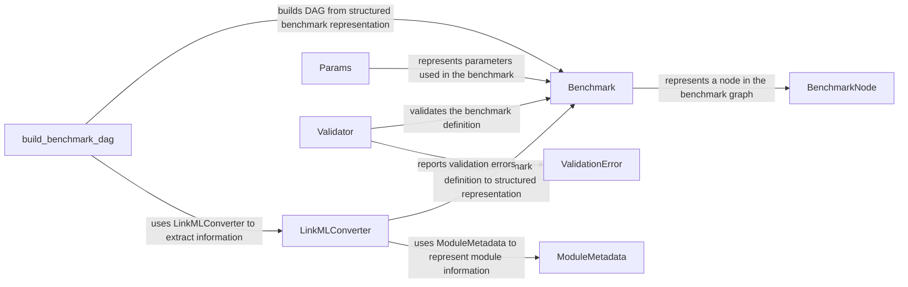

## Component Details

The Benchmark Definition and Validation subsystem is responsible for defining the structure of a benchmark, loading benchmark metadata, validating it against a defined schema, and representing the benchmark as a graph. It ensures that the benchmark is well-formed and meets the required specifications before execution. The core components work together to convert a benchmark definition into a structured and validated representation that can be used for execution.

### Benchmark
Represents a benchmark, encapsulating its metadata, stages, and execution paths. It provides methods to access benchmark information, generate execution paths, and export the benchmark structure.
- **Related Classes/Methods**: `omnibenchmark.benchmark.benchmark.Benchmark`

### BenchmarkNode
Represents a node in the benchmark graph, providing basic information about the node. It is a fundamental building block for constructing the benchmark's execution flow.
- **Related Classes/Methods**: `omnibenchmark.benchmark.benchmark_node.BenchmarkNode`

### LinkMLConverter
Converts a benchmark definition (likely in LinkML format) into a structured representation that can be used to build the benchmark DAG. It extracts information about stages, modules, inputs, and outputs from the LinkML definition.
- **Related Classes/Methods**: `omnibenchmark.benchmark.converter.LinkMLConverter`

### Params
Represents parameters used in the benchmark, providing methods for serialization, deserialization, and comparison. It allows for easy management and manipulation of benchmark parameters.
- **Related Classes/Methods**: `omnibenchmark.benchmark.params.Params`

### Validator
Validates the benchmark definition and environment, ensuring that it conforms to the expected structure and requirements. It identifies potential issues early in the process.
- **Related Classes/Methods**: `omnibenchmark.benchmark.validation.validator.Validator`

### ModuleMetadata
Represents metadata for a module within a benchmark, loaded from a YAML file. It provides a structured way to access module-specific information.
- **Related Classes/Methods**: `omnibenchmark.model.module.ModuleMetadata`

### ValidationError
Represents validation errors encountered during the benchmark validation process. It provides detailed information about the errors to facilitate debugging.
- **Related Classes/Methods**: `omnibenchmark.benchmark.validation.error.ValidationError`

### build_benchmark_dag
Constructs a directed acyclic graph (DAG) representing the benchmark's execution flow. It uses the information extracted by the LinkMLConverter to create the graph structure.
- **Related Classes/Methods**: `omnibenchmark.benchmark.dag`
