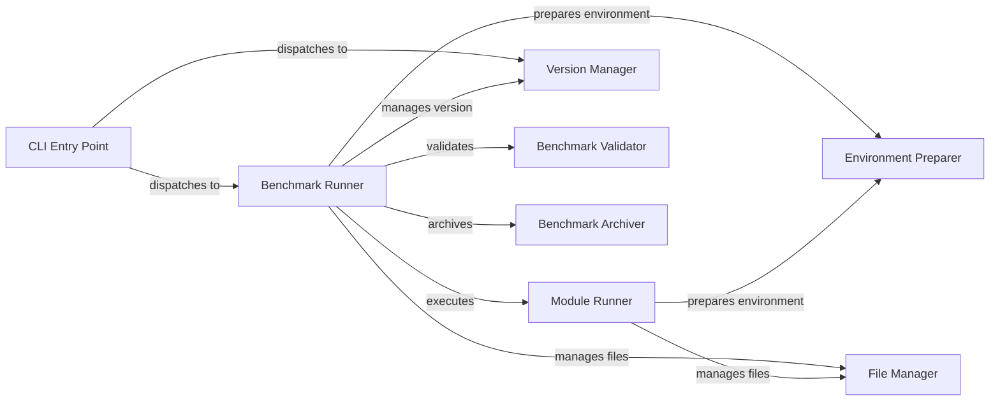

## Component Details

The Command Line Interface (CLI) provides the entry point for users to interact with the omnibenchmark framework. It parses user commands, orchestrates benchmark execution, manages benchmark versions, and handles environment preparation. The CLI streamlines the process of running, managing, and archiving benchmarks, ensuring reproducibility and ease of use.

### CLI Entry Point
The CLI Entry Point is the initial point of contact for users. It uses `click` to define and parse command-line arguments, then dispatches control to the appropriate functions based on the user's input. This component is responsible for setting up the overall execution context and handling top-level commands.
- **Related Classes/Methods**: `omnibenchmark.cli.run`

### Benchmark Runner
The Benchmark Runner orchestrates the execution of a complete benchmark. It manages the lifecycle of the benchmark, including setting up the environment, running individual modules, and collecting results. It interacts with other components to prepare the environment, validate the benchmark configuration, and archive the results.
- **Related Classes/Methods**: `omnibenchmark.cli.run:run_benchmark`

### Module Runner
The Module Runner executes a single module within a benchmark. It handles the setup, execution, and result processing for a specific module. This component is responsible for preparing the environment for the module, running the module's code, and collecting the module's output.
- **Related Classes/Methods**: `omnibenchmark.cli.run:run_module`

### Version Manager
The Version Manager creates and manages different versions of a benchmark. It is responsible for snapshotting the code, data, and configurations associated with a benchmark to ensure reproducibility. This component allows users to track changes and revert to previous states of a benchmark.
- **Related Classes/Methods**: `omnibenchmark.cli.io:create_benchmark_version`

### Environment Preparer
The Environment Preparer is an abstract component responsible for setting up the execution environment for a benchmark or module. It includes specialized components for Conda, environment modules, and Singularity containers. This component ensures that the necessary dependencies and configurations are in place before running the benchmark or module.
- **Related Classes/Methods**: `omnibenchmark.cli.soft:conda_prepare`, `omnibenchmark.cli.soft:envmodules_prepare`, `omnibenchmark.cli.soft:singularity_prepare`

### Benchmark Validator
The Benchmark Validator checks the structure and configuration of a benchmark to ensure it adheres to the required specifications. It validates the benchmark's metadata, dependencies, and input/output definitions. This component helps to prevent errors and ensure that the benchmark runs correctly.
- **Related Classes/Methods**: `omnibenchmark.cli.utils.validation:validate_benchmark`

### File Manager
The File Manager provides functionalities for listing, downloading, and calculating checksums of files associated with a benchmark or module. It allows users to inspect the files, retrieve them from remote sources, and verify their integrity. This component is essential for managing the data and code associated with a benchmark.
- **Related Classes/Methods**: `omnibenchmark.cli.io:list_all_files`, `omnibenchmark.cli.io:download_all_files`, `omnibenchmark.cli.io:checksum_all_files`

### Benchmark Archiver
The Benchmark Archiver creates an archive of a benchmark for long-term storage or reproducibility. It packages all the necessary files, data, and configurations into a single archive file. This component ensures that the benchmark can be easily shared and reproduced in the future.
- **Related Classes/Methods**: `omnibenchmark.cli.io:archive_benchmark`
