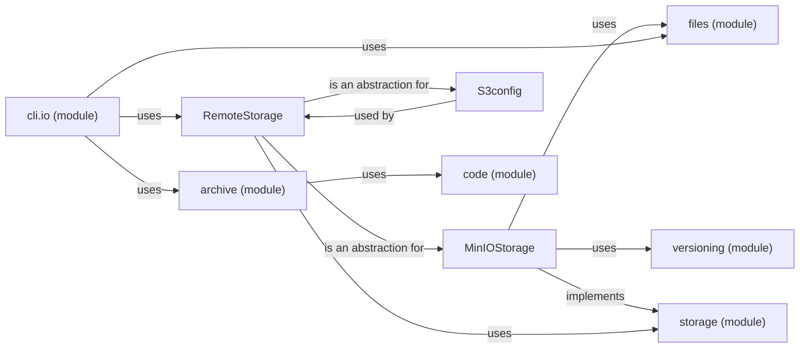

## Component Details

The Data Management component in OmniBenchmark handles the storage and retrieval of benchmark data and code on remote storage systems. It provides an abstraction layer for interacting with different storage backends like MinIO and S3, ensuring data persistence and accessibility. The component manages tasks such as creating new benchmark versions, downloading files, and archiving results. It also includes functionalities for configuring storage connections, managing file versions, and handling code archives.

### RemoteStorage
This abstract class provides a unified interface for interacting with different remote storage systems. It defines the common methods for storage operations and handles the configuration and authentication aspects. It serves as a base class for specific storage implementations like MinIOStorage and S3config.
- **Related Classes/Methods**: `omnibenchmark.io.RemoteStorage.RemoteStorage`

### MinIOStorage
This class implements the RemoteStorage interface for MinIO storage. It provides the specific logic for interacting with a MinIO storage system, including creating benchmarks, creating new versions, downloading objects, archiving versions, and setting bucket policies. It utilizes the files and versioning modules for file management and version control.
- **Related Classes/Methods**: `omnibenchmark.io.MinIOStorage.MinIOStorage`

### S3config
This class handles the configuration and authentication for S3 storage. It is responsible for setting up the necessary credentials and parameters for interacting with an S3 bucket. It inherits from RemoteStorage and provides S3-specific configuration options.
- **Related Classes/Methods**: `omnibenchmark.io.S3config`

### storage (module)
This module acts as a factory for creating different types of storage objects based on the provided configuration. It provides functions for retrieving storage instances and parsing storage arguments. It encapsulates the logic for selecting and instantiating the appropriate storage backend.
- **Related Classes/Methods**: `omnibenchmark.io.storage`

### archive (module)
This module provides functions for preparing and archiving benchmark data, including code, software, and results. It handles the creation of archives for different components of a benchmark and utilizes the code module for managing code archives.
- **Related Classes/Methods**: `omnibenchmark.io.archive`

### files (module)
This module provides utility functions for interacting with the file system, including listing, downloading, and checksumming files. It offers functionalities for managing files within the storage system.
- **Related Classes/Methods**: `omnibenchmark.io.files`

### versioning (module)
This module provides functions for managing versions of benchmark data. It handles tasks such as retrieving objects to tag, filtering objects, and retrieving remote versions. It is used by storage implementations to manage different versions of benchmark data.
- **Related Classes/Methods**: `omnibenchmark.io.versioning`

### code (module)
This module provides functions for retrieving code archives and cloning modules. It is responsible for managing the code component of a benchmark and is used by the archive module for archiving code.
- **Related Classes/Methods**: `omnibenchmark.io.code`

### cli.io (module)
This module provides command-line interface functions for interacting with the storage system. It includes functions for creating benchmark versions, listing files, downloading files, checksumming files, creating policies, and archiving benchmarks. It serves as the entry point for user interactions with the storage system.
- **Related Classes/Methods**: `omnibenchmark.cli.io`
