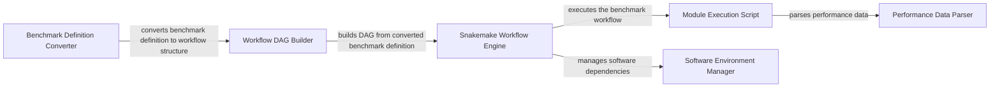

## Component Details

The Workflow Management component orchestrates the execution of benchmarks defined in a declarative format. It converts the benchmark definition into an executable workflow represented as a directed acyclic graph (DAG). The workflow is then executed using Snakemake, which manages dependencies, parallel execution, and resource allocation. The component also handles software environment provisioning using Conda, Singularity, and EasyBuild to ensure reproducibility. Finally, it collects and parses performance data generated during the benchmark execution, producing a unified performance report.

### Benchmark Definition Converter
This component is responsible for converting the benchmark definition, typically in a structured format like LinkML, into an internal representation that can be used to construct the workflow DAG. It parses the definition, extracts information about stages, inputs, outputs, parameters, and dependencies, and transforms it into a format suitable for subsequent processing.
- **Related Classes/Methods**: `omnibenchmark.benchmark.converter.LinkMLConverter`

### Workflow DAG Builder
The Workflow DAG Builder constructs a directed acyclic graph (DAG) representing the benchmark workflow. It takes the structured representation produced by the Benchmark Definition Converter and uses it to define the nodes (stages) and edges (dependencies) of the DAG. This DAG represents the execution order and data flow of the benchmark.
- **Related Classes/Methods**: `omnibenchmark.benchmark.dag`

### Snakemake Workflow Engine
The Snakemake Workflow Engine is responsible for executing the benchmark workflow defined by the DAG. It translates the DAG into a Snakemake workflow definition (Snakefile) and uses the Snakemake engine to manage the execution of the workflow. This includes dependency resolution, parallel execution, resource allocation, and error handling. It also interacts with software dependency management systems to ensure that the required software environments are available.
- **Related Classes/Methods**: `omnibenchmark.workflow.snakemake.snakemake.SnakemakeEngine`

### Module Execution Script
The Module Execution Script contains the core logic for executing individual modules within the Snakemake workflow. It receives inputs, executes the benchmark code, and generates outputs and performance data. This script is often a template that is populated with module-specific code and parameters.
- **Related Classes/Methods**: `omnibenchmark.workflow.snakemake.scripts.execution`

### Performance Data Parser
The Performance Data Parser is responsible for parsing the performance data generated by the Module Execution Script and combining it into a unified performance report. It handles different performance metrics, output formats, and aggregation methods to produce a comprehensive overview of the benchmark results.
- **Related Classes/Methods**: `omnibenchmark.workflow.snakemake.scripts.parse_performance`

### Software Environment Manager
The Software Environment Manager provides functionality for checking the availability and status of software dependency management systems like Conda, Singularity, and EasyBuild. It ensures that the required software environments are available before executing the workflow and can also be used to install or update software dependencies.
- **Related Classes/Methods**: `omnibenchmark.software.common`, `omnibenchmark.software.easybuild_backend`
