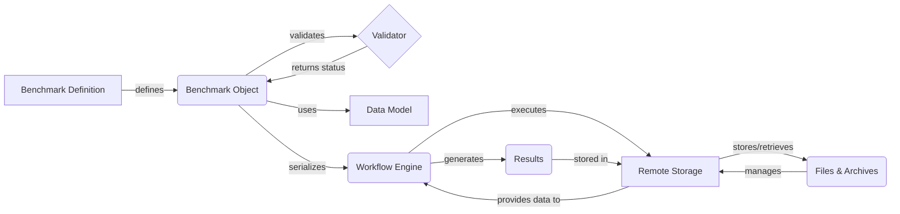

Okay, I will generate an onboarding document for the `omnibenchmark` project based on the provided information.

**1. Project Description**

Omnibenchmark is a framework designed to streamline and standardize the benchmarking process for computational biology tools and workflows. It provides a structured environment for defining, executing, and evaluating benchmarks, ensuring reproducibility and facilitating comparisons across different tools and methods. The framework leverages a modular architecture, allowing for flexible integration of various workflow engines, remote storage solutions, and data models.

**2. Flow Diagram (Mermaid)**

**3. Component Descriptions**

*   **Benchmark Definition:** This component represents the initial specification of a benchmark, typically defined using a structured format like YAML and adhering to a schema defined using LinkML. It includes metadata, input data specifications, and the workflow to be executed.

*   **Benchmark Object:** This component is the in-memory representation of a benchmark, loaded from the Benchmark Definition. It provides access to the benchmark's metadata, structure, and validation status.

*   **Validator:** This component is responsible for validating the Benchmark Object against a set of rules and constraints, ensuring that the benchmark definition is consistent and adheres to the defined schema.

*   **Data Model:** This component defines the structure and types of data used within the benchmark, including modules, software, and other components. It provides a consistent way to represent and manage benchmark-related information.

*   **Workflow Engine:** This component is responsible for executing the benchmark workflow, typically using Snakemake. It manages the serialization, execution, and monitoring of workflows at both the benchmark and individual node levels.

*   **Remote Storage:** This component provides an abstraction layer for interacting with remote storage systems like MinIO and S3. It supports versioning, uploading, downloading, and archiving benchmark-related files.

*   **Files & Archives:** This component handles file-related operations such as listing, downloading, checksumming, and archiving benchmark data, code, software, and results. It ensures data integrity and facilitates versioning and reproducibility.

*   **Results:** This component represents the output generated by the execution of the benchmark workflow. These results are then stored in the Remote Storage for later analysis and comparison.