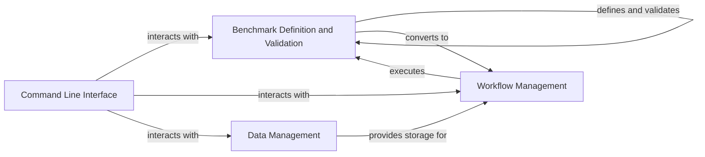

## Component Details

The omnibenchmark framework automates and standardizes the benchmarking of bioinformatics tools and workflows. It defines benchmarks using a structured schema, converts them into executable workflows (Snakemake), manages software environments (Conda, Singularity), and provides a command-line interface for users to run and interact with benchmarks. The framework also supports remote storage for data and results, ensuring reproducibility and accessibility.

### Benchmark Definition and Validation
This component defines the structure of a benchmark using a structured schema (likely LinkML). It handles loading benchmark metadata, validating it against the schema to ensure it is well-formed and meets the required specifications. It provides classes for representing benchmarks, benchmark nodes, and parameters, and includes error handling for validation failures.
- **Related Classes/Methods**: `omnibenchmark.benchmark.benchmark.Benchmark`, `omnibenchmark.benchmark.benchmark_node.BenchmarkNode`, `omnibenchmark.benchmark.params.Params`, `omnibenchmark.model.module.ModuleMetadata`, `omnibenchmark.benchmark.validation.validator.Validator`, `omnibenchmark.benchmark.validation.error.ValidationError`

### Workflow Management
This component converts the benchmark definition into an executable workflow, builds a directed acyclic graph (DAG) representing the workflow, and executes the workflow using Snakemake. It manages the execution of individual nodes in the workflow, collects results, and handles software environment provisioning (Conda, Singularity) to ensure reproducibility.
- **Related Classes/Methods**: `omnibenchmark.benchmark.converter.LinkMLConverter`, `omnibenchmark.benchmark.dag`, `omnibenchmark.workflow.snakemake.snakemake.SnakemakeEngine`, `omnibenchmark.workflow.snakemake.scripts.execution`, `omnibenchmark.workflow.snakemake.scripts.parse_performance`, `omnibenchmark.software.common`, `omnibenchmark.software.easybuild_backend`

### Data Management
This component manages the storage of benchmark data and code on remote storage systems like MinIO and S3. It handles tasks such as creating new benchmark versions, downloading files, and archiving results. It provides an abstraction layer for interacting with different storage backends, ensuring data persistence and accessibility.
- **Related Classes/Methods**: `omnibenchmark.io.RemoteStorage.RemoteStorage`, `omnibenchmark.io.MinIOStorage.MinIOStorage`, `omnibenchmark.io.S3config`, `omnibenchmark.io.archive`, `omnibenchmark.io.files`, `omnibenchmark.io.versioning`

### Command Line Interface
This component provides the command-line interface for interacting with the omnibenchmark framework. It handles tasks such as running benchmarks, listing versions, and creating archives. It serves as the entry point for users to interact with the system.
- **Related Classes/Methods**: `omnibenchmark.cli.run`, `omnibenchmark.cli.io`, `omnibenchmark.cli.benchmark`, `omnibenchmark.cli.soft`