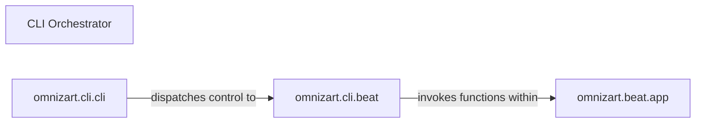

## Details

The `CLI Orchestrator` subsystem is the primary user interface and control hub for the `omnizart` toolkit, responsible for initiating and coordinating all major operations. It acts as the central orchestrator for various workflows, bridging user commands to the core application logic.

### CLI Orchestrator [[Expand]](./CLI_Orchestrator.md)
The overarching component that serves as the primary user interface and control hub. It coordinates the initiation of major operations (feature generation, training, transcription) by dispatching commands to appropriate handlers. It embodies the "CLI as Orchestrator" architectural bias.

**Related Classes/Methods**:

- <a href="https://github.com/Music-and-Culture-Technology-Lab/omnizart/blob/master/omnizart/cli/cli.py#L1-L9999" target="_blank" rel="noopener noreferrer">`omnizart.cli.cli`:1-9999</a>
- <a href="https://github.com/Music-and-Culture-Technology-Lab/omnizart/blob/master/omnizart/cli/beat#L1-L9999" target="_blank" rel="noopener noreferrer">`omnizart.cli.beat`:1-9999</a>

### omnizart.cli.cli
The main CLI entry point and command dispatcher. Implemented using a CLI framework (e.g., Click), it defines the top-level CLI structure, parses root commands (e.g., `omnizart beat`), and dispatches control to the relevant sub-command groups. This component is fundamental to the "CLI Interface" pattern.

**Related Classes/Methods**:

- <a href="https://github.com/Music-and-Culture-Technology-Lab/omnizart/blob/master/omnizart/cli/cli.py#L1-L9999" target="_blank" rel="noopener noreferrer">`omnizart.cli.cli`:1-9999</a>

### omnizart.cli.beat
Contains specific command handlers for the "beat" domain, including functions for feature generation, model training, and transcription. Each function within this module is responsible for parsing domain-specific arguments, performing basic validation, translating CLI parameters into arguments for core logic, and invoking the corresponding core application functions. This aligns with the "Application Modules" pattern for CLI commands.

**Related Classes/Methods**:

- <a href="https://github.com/Music-and-Culture-Technology-Lab/omnizart/blob/master/omnizart/cli/beat#L1-L9999" target="_blank" rel="noopener noreferrer">`omnizart.cli.beat`:1-9999</a>

### omnizart.beat.app
Encapsulates the core business logic for beat processing. This includes the actual implementation of feature generation, model training, and transcription algorithms for beat detection. It represents the "Core Transcription Engine" and "Application Modules" for the beat domain, decoupled from the CLI specifics.

**Related Classes/Methods**:

- <a href="https://github.com/Music-and-Culture-Technology-Lab/omnizart/blob/master/omnizart/beat/app.py#L1-L9999" target="_blank" rel="noopener noreferrer">`omnizart.beat.app`:1-9999</a>

### [FAQ](https://github.com/CodeBoarding/GeneratedOnBoardings/tree/main?tab=readme-ov-file#faq)