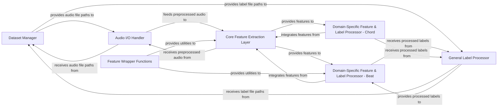

## Details

The `Data Preparation & Feature Extraction` subsystem is responsible for transforming raw audio and ground truth labels into a structured format suitable for machine learning models. It encompasses the entire workflow from initial data loading and preprocessing to the extraction of various domain-specific musical features and the preparation of corresponding labels.

### Dataset Manager
Manages dataset paths, provides utilities for accessing audio-label pairs, and includes functionality for dataset download. It serves as the primary source for data paths.

**Related Classes/Methods**:

- <a href="https://github.com/Music-and-Culture-Technology-Lab/omnizart/blob/master/omnizart/constants/datasets.py" target="_blank" rel="noopener noreferrer">`omnizart.constants.datasets`</a>

### Audio I/O Handler
Handles the loading of raw audio files from disk and performs initial signal preprocessing (e.g., resampling, normalization).

**Related Classes/Methods**:

- <a href="https://github.com/Music-and-Culture-Technology-Lab/omnizart/blob/master/omnizart/io.py" target="_blank" rel="noopener noreferrer">`omnizart.io`</a>

### Core Feature Extraction Layer
Encompasses the extraction of various fundamental musical features such as Constant-Q Cepstral Coefficients (CFP), Constant Q Transform (CQT), Harmonic-Percussive Features (HCFP), and beat/downbeat information. These are generic feature representations derived directly from preprocessed audio.

**Related Classes/Methods**:

- <a href="https://github.com/Music-and-Culture-Technology-Lab/omnizart/blob/master/omnizart/feature/cfp.py" target="_blank" rel="noopener noreferrer">`omnizart.feature.cfp`</a>
- <a href="https://github.com/Music-and-Culture-Technology-Lab/omnizart/blob/master/omnizart/feature/cqt.py" target="_blank" rel="noopener noreferrer">`omnizart.feature.cqt`</a>
- <a href="https://github.com/Music-and-Culture-Technology-Lab/omnizart/blob/master/omnizart/feature/hcfp.py" target="_blank" rel="noopener noreferrer">`omnizart.feature.hcfp`</a>
- <a href="https://github.com/Music-and-Culture-Technology-Lab/omnizart/blob/master/omnizart/feature/beat_for_drum.py" target="_blank" rel="noopener noreferrer">`omnizart.feature.beat_for_drum`</a>

### General Label Processor
Loads and transforms general music ground truth labels into a format consumable by machine learning models.

**Related Classes/Methods**:

- <a href="https://github.com/Music-and-Culture-Technology-Lab/omnizart/blob/master/omnizart/music/labels.py" target="_blank" rel="noopener noreferrer">`omnizart.music.labels`</a>

### Domain-Specific Feature & Label Processor - Beat
Extracts and processes features and ground truth labels specifically for beat tracking tasks, often combining outputs from core feature extractors with label data.

**Related Classes/Methods**:

- <a href="https://github.com/Music-and-Culture-Technology-Lab/omnizart/blob/master/omnizart/beat/features.py" target="_blank" rel="noopener noreferrer">`omnizart.beat.features`</a>

### Domain-Specific Feature & Label Processor - Chord
Manages feature and label extraction for chord recognition, including data augmentation and segmentation, integrating core features with chord-specific label processing.

**Related Classes/Methods**:

- <a href="https://github.com/Music-and-Culture-Technology-Lab/omnizart/blob/master/omnizart/chord/features.py" target="_blank" rel="noopener noreferrer">`omnizart.chord.features`</a>

### Feature Wrapper Functions
Provides utility functions that support various feature extraction processes, such as patching and converting between frame-based and time-based representations.

**Related Classes/Methods**:

- <a href="https://github.com/Music-and-Culture-Technology-Lab/omnizart/blob/master/omnizart/feature/wrapper_func.py" target="_blank" rel="noopener noreferrer">`omnizart.feature.wrapper_func`</a>

### [FAQ](https://github.com/CodeBoarding/GeneratedOnBoardings/tree/main?tab=readme-ov-file#faq)