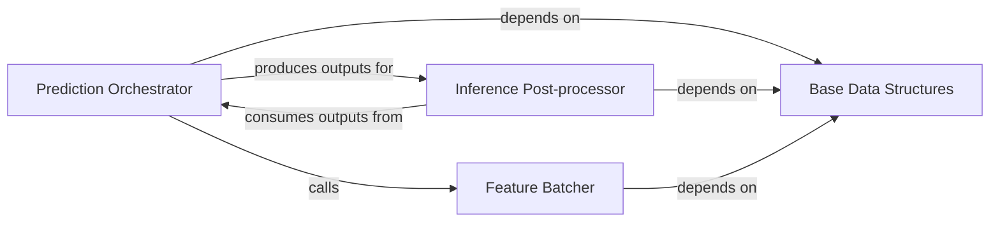

## Details

The `Inference & Post-processing` subsystem is crucial for transforming raw model outputs into meaningful musical data. It embodies the core logic for interpreting machine learning predictions within the `omnizart` framework.

### Prediction Orchestrator
Manages the overall prediction workflow, including preparing input data, invoking the machine learning model, and generating raw model outputs. It acts as the control center for the inference phase.

**Related Classes/Methods**:

- <a href="https://github.com/Music-and-Culture-Technology-Lab/omnizart/blob/master/omnizart/beat/prediction.py#L63-L95" target="_blank" rel="noopener noreferrer">`omnizart.beat.prediction.predict`:63-95</a>

### Inference Post-processor
Applies domain-specific algorithms to refine raw model outputs into structured, human-readable musical data (e.g., beat timings, note events). This component is responsible for the "intelligence" of the musical interpretation.

**Related Classes/Methods**:

- <a href="https://github.com/Music-and-Culture-Technology-Lab/omnizart/blob/master/omnizart/beat/inference.py" target="_blank" rel="noopener noreferrer">`omnizart.beat.inference`</a>

### Feature Batcher
Handles the preparation and organization of input features into batches suitable for efficient model consumption. This optimizes the data flow to the prediction model.

**Related Classes/Methods**:

- <a href="https://github.com/Music-and-Culture-Technology-Lab/omnizart/blob/master/omnizart/beat/prediction.py#L13-L46" target="_blank" rel="noopener noreferrer">`omnizart.beat.prediction.create_batches`:13-46</a>

### Base Data Structures
Provides fundamental data types and structures for representing core musical elements (e.g., notes, velocities, beat timings). These structures ensure consistency across the system, especially for inputs and outputs of the inference and post-processing stages.

**Related Classes/Methods**:

- <a href="https://github.com/Music-and-Culture-Technology-Lab/omnizart/blob/master/omnizart/base.py#L223-L233" target="_blank" rel="noopener noreferrer">`omnizart.base.note`:223-233</a>
- <a href="https://github.com/Music-and-Culture-Technology-Lab/omnizart/blob/master/omnizart/base.py#L239-L242" target="_blank" rel="noopener noreferrer">`omnizart.base.velocity`:239-242</a>

### [FAQ](https://github.com/CodeBoarding/GeneratedOnBoardings/tree/main?tab=readme-ov-file#faq)